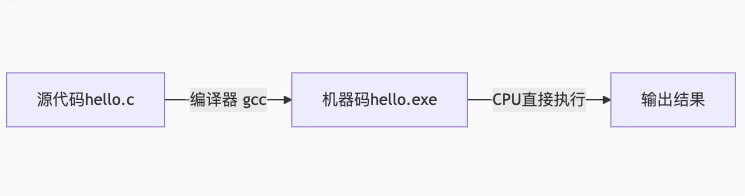
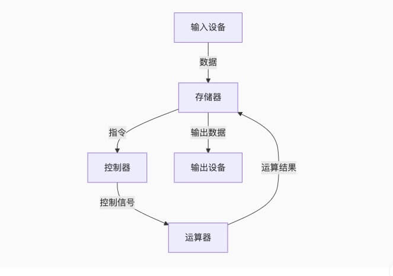

## 进程和线程的区别

::: details 参考答案
- 进程：是`操作系统资源分配的基本单位`，是程序的一次执行实例。每个进程拥有独立的地址空间、代码、数据和系统资源（如文件、内存等）。

    🌰例如：运行中的浏览器、Word 程序等都是一个独立的进程。

- 线程：是`CPU调度的基本单位`，是进程内的一个执行单元（或称为“轻量级进程”）。一个进程可以包含多个线程，所有线程共享进程的资源（如内存、文件等）。

    🌰例如：浏览器中的一个标签页可能由一个线程处理渲染，另一个线程处理网络请求。

| **特性**         | **进程**                                      | **线程**                                      |
|------------------|----------------------------------------------|----------------------------------------------|
| **定义**         | 操作系统资源分配的基本单位，独立执行实例       | CPU调度的基本单位，进程内的一个执行单元        |
| **资源分配**     | 独立内存空间、文件描述符等系统资源             | 共享进程的资源（堆、全局变量、文件句柄等）     |
| **切换开销**     | 高（需保存完整的地址空间、寄存器等上下文）     | 低（仅保存栈、寄存器等线程私有状态）           |
| **通信方式**     | IPC（管道、消息队列、共享内存等）              | 直接读写共享内存（需同步机制如锁、信号量）     |
| **隔离性**       | 高（一个进程崩溃不影响其他进程）               | 低（线程崩溃可能导致整个进程崩溃）             |
| **创建/销毁**    | 慢（需分配或释放独立资源）                     | 快（仅需分配栈和少量寄存器状态）               |
| **并发性**       | 多进程可并行运行在多核CPU上                    | 多线程可并发（单核）或并行（多核）执行         |
| **使用场景**     | 高隔离性需求（如浏览器多标签页、沙箱环境）     | 高并发、低延迟通信（如Web服务器、实时计算）    |

**关键总结**
1. **进程是资源容器，线程是执行单元**。  
2. **进程隔离性强，线程共享性强**。  
3. **线程切换更快，但需处理同步问题**。  
4. 多进程适合**安全性优先**的场景，多线程适合**性能优先**的场景。
:::

## 进程间的通信
::: details 参考答案
进程间通信（IPC，Interprocess Communication）是指在不同进程之间传递数据或信号的机制。由于进程之间是相互隔离的（每个进程有独立的地址空间），操作系统提供了多种 IPC 方式来实现进程间通信。

- 进程间通信（IPC）方式对比指南

| IPC 方式          | 数据传输方向 | 适用场景                          | 性能  | 复杂度 | 关键特点                                                                 |
|-------------------|--------------|-----------------------------------|-------|--------|--------------------------------------------------------------------------|
| **匿名管道**      | 单向         | Shell 命令、父子进程通信          | 低    | 低     | 基于文件描述符，仅限亲属进程                                              |
| **命名管道(FIFO)**| 单向/双向    | 无亲缘关系进程通信                | 低-中 | 中     | 文件系统可见，支持多读者/写者                                            |
| **消息队列**      | 结构化消息   | 异步任务调度、日志系统            | 中    | 中     | 内核持久化，支持消息类型过滤                                              |
| **共享内存**      | 直接访问     | 高性能计算、大数据交换            | ★★★★★ | 高     | 零拷贝，但需额外同步机制（如信号量）                                      |
| **信号量**        | 无数据       | 进程同步、资源竞争控制            | 中    | 中     | 可解决生产者-消费者问题                                                  |
| **信号(Signal)**  | 无数据       | 进程控制、异常处理                | 低    | 低     | 异步通知，可靠性低（可能丢失信号）                                        |
| **套接字(Socket)**| 双向         | 跨机器通信、本地高性能IPC         | 中-高 | 高     | 支持TCP/UDP，Unix Domain Socket性能接近共享内存                           |
| **文件锁**        | 无数据       | 文件访问互斥                      | 低    | 低     | `flock()`/`fcntl()`，适合简单同步场景                                    |

---

- 快速选择建议
1. **需要最高性能** → **共享内存**（配合信号量）
2. **简单通信** → **管道**（亲属进程）/**FIFO**（非亲属进程）
3. **结构化消息** → **消息队列**
4. **跨机器通信** → **套接字**
5. **进程同步** → **信号量**/**文件锁**
6. **紧急控制** → **信号**（但避免关键逻辑依赖信号）

- 注意事项
- **共享内存**最快但需要自行处理同步问题
- **消息队列**和**管道**有容量限制（检查`/proc/sys/fs/pipe-max-size`）
- **Unix Domain Socket**比网络套接字快30%以上（本地通信优选）
- 所有IPC方式在进程崩溃后需手动清理（除匿名管道）
:::

## 单核 CPU 如何实现并发

::: details 参考答案
在单核 CPU 上，虽然同一时刻`只能执行一个线程或进程`，但通过操作系统的`任务调度`和`时间片轮转`机制，可以实现并发（Concurrency）。

1. 时间片轮转（Time-Sharing）
- 操作系统为每个任务（进程/线程）分配一个极短的时间片（如 10-100ms）。
- CPU 在每个时间片结束时强制切换任务（通过时钟中断触发）。
- 快速切换任务，让用户感觉多个任务在“同时运行”。

2. 上下文切换

- 保存当前任务状态（寄存器、栈等），加载下一个任务状态

3. 注意事项
- 并行是`同一时刻`有多个任务在`同时进行`，并发是`同一时间段`内有多个任务在`交替进行`。
- `并发 ≠ 并行`: 单核是并发（逻辑并行），多核是并行（物理并行）。
- 单核 CPU 的并发本质是`任务快速切换+资源`高效复用，而多核 CPU 才能实现真正的并行。
:::

## CPU 调度算法有哪些？

::: details 参考答案
CPU 调度算法对比总结

| **调度算法**               | **中文名**                 | **特点**                                  | **优点**                | **缺点**                  | **适用场景**               |
|----------------------------|----------------------------|------------------------------------------|-------------------------|---------------------------|---------------------------|
| **FCFS**                   | 先来先服务                 | 非抢占，按任务到达顺序执行               | 实现简单                | 长任务阻塞短任务          | 批处理系统                |
| **SJF/SRTN**               | 短作业优先/最短剩余时间优先 | 优先执行耗时最短的任务                   | 平均等待时间最短        | 需预知任务耗时            | 理论优化场景              |
| **RR**                     | 时间片轮转                 | 固定时间片轮流执行任务                   | 公平，响应快            | 上下文切换开销大          | 分时系统（如桌面OS）      |
| **Priority Scheduling**     | 优先级调度                 | 按优先级分配CPU                          | 灵活性高                | 低优先级任务可能饥饿      | 实时系统/游戏引擎         |
| **Multilevel Queue**       | 多级队列调度               | 不同优先级队列使用不同策略               | 分类管理任务            | 配置复杂                  | 混合负载环境              |
| **MLFQ**                   | 多级反馈队列               | 动态调整任务优先级（根据行为）           | 平衡响应和吞吐量        | 实现复杂度高              | 通用操作系统（如Linux）   |
| **CFS**                    | 完全公平调度               | 按`vruntime`公平分配CPU时间              | 极致公平性              | 计算开销稍大              | Linux默认调度器           |
| **EDF**                    | 最早截止时间优先           | 优先执行截止时间最近的任务               | 实时性最优              | 需严格时间约束            | 硬实时系统（如航天控制）  |
| **RMS**                    | 速率单调调度               | 周期越短的任务优先级越高                 | 适合周期性任务          | CPU利用率≤69%的理论限制   | 嵌入式实时系统            |

---

**关键说明**
1. **抢占式 vs 非抢占式**  
   - 抢占式（如RR、SRTN）：允许中断当前任务。  
   - 非抢占式（如FCFS）：任务必须主动释放CPU。

2. **适用场景选择**  
   - **交互式系统** → RR 或 MLFQ（响应速度快）  
   - **批处理系统** → SJF 或 FCFS（高吞吐量）  
   - **实时系统** → EDF 或 RMS（严格截止时间）  

3. **现代操作系统实践**  
   - Linux：默认采用 **CFS**（完全公平调度） + **实时补丁**（支持EDF）。  
   - Windows：基于 **多级反馈队列（MLFQ）** 的变种。

扩展阅读
- Linux调度参数调整：`/proc/sys/kernel/sched_*`  
- 实时任务优先级设置：`chrt -f 99 <command>`
:::

## linux 如何查找你的进程占用的那个端口

::: details 参考答案
1. 使用 netstat 命令（经典方法）
```bash
# 查询所有端口占用情况
netstat -tulnp

# 查询特定端口占用情况
netstat -tulnp | grep <进程名或端口号>
```
选项说明：
- -t：显示 TCP 端口
- -u：显示 UDP 端口
- -l：仅显示监听（LISTEN）状态的端口
- -n：以数字形式显示端口（不解析服务名）
- -p：显示进程 PID 和名称（需要 sudo）

示例
```bash
# 查找 nginx 进程占用的端口
sudo netstat -tulnp | grep nginx

# 查找 80 端口被哪个进程占用
sudo netstat -tulnp | grep ":80"
```

2. 使用 ss 命令（netstat 的现代替代）
```bash
# ss 比 netstat 更快，语法类似
sudo ss -tulnp | grep <进程名或端口号>
```

3. 使用 lsof 命令（查看进程打开的文件和端口）
```bash
sudo lsof -i :<端口号>  # 查看指定端口
sudo lsof -i -P -n | grep <进程名>  # 查看指定进程
```
选项说明：
- -i：显示网络连接
- -P：以数字形式显示端口（不解析服务名）
- -n：以数字形式显示 IP（不解析主机名）

示例
```bash
# 查找 22 端口（SSH）的占用进程
sudo lsof -i :22

# 查找 nginx 进程的所有网络连接
sudo lsof -i -P -n | grep nginx
```
:::

## 单核服务器连接数超载了怎么办
::: details 参考答案
- 优化代码和查询

    确保应用程序代码和数据库查询是高效的，以减少每个连接的资源消耗

- 使用负载均衡

    将流量分配到多个服务器上，以分散负载

- 增加连接池

    使用连接池来管理数据库连接，减少连接的创建和销毁开销

- 限制连接数

    配置服务器以限制每个客户端的最大连接数，以防止单个客户端占用过多资源

- 使用缓存

    利用缓存机制（如 Redis，Memcached）来减少对数据库的访问次数
:::

## 请简述一个编译器的执行过程。前端有哪些常见的编译工具？
::: details 参考答案
编译器的执行过程

1. 词法分析

    将源代码转换为一系列的标记（tokens，如`if`, `(`, `x`），这些标记是编程语言的基本语法单位
2. 语法分析

    根据语言的语法规则，将标记序列转换为语法书（parse tree），也称为抽象语法树（AST），检查语法是否正确
3. 语义分析

    检查语法树是否符合语言的语义规则，例如类型检查，作用域检查等
4. 中间代码生成

    将语法树转换为中间代码，这种代码通常独立于机器
5. 代码优化

    对中间代码进行优化，以提高程序的执行效率，如删除冗余代码、循环优化等
6. 目标代码生成

将中间代码转换为目标机器代码

7. 代码生成后优化 - 对生成的目标代码进行进一步优化


前端常见的编译工具
- Babel

    用于将现代 JavaScript 代码转换为向后兼容的版本
- TypeScript Compiler

    将 TypeScript 代码转换为 JavaScript
- Sass/SCSS

    将 Sass/SCSS 代码转换为 CSS
- Webpack

    用于打包 JavaScript 模块，并支持多种编译和转换插件
:::

## 什么是编译型语言和解释型语言，他们有什么区别？
::: details 参考答案
编译型语言 vs 解释型语言

| **特性**         | 编译型语言                                     | 解释型语言                                     |
|------------------|-----------------------------------------------|-----------------------------------------------|
| **执行方式**     | 源代码编译为机器码后直接执行                   | 源代码由解释器逐行翻译执行                     |
| **编译过程**     | 需要提前编译（生成二进制文件）                 | 无需编译，直接运行                             |
| **运行依赖**     | 仅需可执行文件                                | 需安装解释器（如Python需`python`环境）         |
| **执行速度**     | ⚡️ 快（直接运行机器码）                        | 🐢 慢（实时翻译额外开销）                       |
| **跨平台性**     | ❌ 需针对不同平台编译                          | ✅ 一次编写，跨平台运行（解释器适配底层）        |
| **调试便利性**   | ❌ 调试需符号表，修改后需重新编译               | ✅ 支持逐行调试，动态修改代码                   |
| **代码安全性**   | ✅ 二进制文件难以反编译                        | ❌ 源代码通常直接分发（如`.py`文件）            |
| **典型代表**     | C、C++、Go、Rust                              | Python、JavaScript、Ruby、PHP                 |

工作流程示例
- 编译型语言（以C为例）


- 解释型语言（以Python为例）


:::

## 简述 JS 垃圾回收的过程。用什么算法？

::: details 参考答案
- 核心目标

    自动释放程序中不再使用的内存，防止内存泄漏。
- 垃圾回收过程

1. 标记阶段（Marking）
    - 从根对象（Roots）出发（如全局变量、当前调用栈中的变量），递归遍历所有可达对象。
    - 被访问到的对象标记为“可达”（活动对象）。

2. 清除阶段（Sweeping）
    - 遍历堆内存，回收所有未被标记为“可达”的对象占用的内存。
    - 未被标记的对象视为“不可达”（垃圾）。

3. 整理阶段（Compacting，可选）
    - 部分引擎（如V8）会整理内存碎片，提升后续内存分配效率。

- 垃圾回收算法

1. 标记-清除算法（Mark-and-Sweep）
    - 原理：先标记所有活动对象，再清除未标记的对象。
    - 优点：解决循环引用问题（旧版IE的引用计数算法无法处理）。
    - 缺点：内存碎片化，可能引发后续分配性能下降。
2. 引用计数算法（Reference Counting）
    - 原理：每个对象维护一个引用计数器，归零时立即回收。
    - 缺点：无法处理循环引用（如两个对象相互引用但已无外部访问）。
    - 现状：现代JS引擎已弃用，仅旧版IE使用。
3. 分代收集（Generational Collection），原理（V8引擎采用）：
    - 新生代（Young Generation）：使用 Scavenge算法（复制算法），将内存分为From和To空间，存活对象从From复制到To，清空From。
    - 老生代（Old Generation）：存活较久的对象晋升至此，使用 标记-清除 + 标记-整理 组合算法。
4. 增量标记（Incremental Marking）与惰性清理（Lazy Sweeping），优化策略：
    - 将标记阶段分解为多个小任务，穿插在JS执行中，避免长时间停顿（Stop-The-World）。
    - 惰性清理延迟内存释放，减少对主线程的阻塞。
:::

## 冯·诺依曼架构是什么？

::: details 参考答案
由数学家冯·诺依曼于1945年提出，核心思想是将`程序和数据`存储在同一个存储器中，通过`共享总线`进行交互。

1. 五大核心组件
- `运算器 (ALU)`	执行算术和逻辑运算（如加减乘除、与或非）。
- `控制器 (CU)`	从内存读取指令，解码并控制其他部件协同工作（如指挥ALU运算）。
- `存储器 (Memory)`	存储程序和数据（统一存储，区别于哈佛架构）。
- `输入设备`	接收外部数据（如键盘、鼠标）。
- `输出设备`	输出计算结果（如显示器、打印机）。

2. 工作流程


:::

## 计算机内部为何使用二进制？

::: details 参考答案
1. 硬件层面：物理实现的天然适配
- `二态器件稳定性` 
    电子元件（如晶体管）只有两种明确状态：开（1）：高电压（如5V）； 关（0）：低电压（如0V）

    模拟信号易受噪声干扰，而二进制抗干扰能力极强
- `制造工艺简单`
- `错误率低`  二进制信号的容错范围大（如0-0.8V判为0，2.4-5V判为1），降低误判风险。

2. 数学与逻辑层面：完美契合布尔代数
- `布尔代数的直接映射` 二进制与布尔逻辑（AND、OR、NOT）完全对应：1 = 真（True）; 0 = 假（False）
- `算术运算的统一性` 二进制简化了加减乘除的实现

3. 工程与历史因素
- `早期计算机的继承`
- `标准化与扩展性`	二进制可轻松扩展为更高层的数据表示（如ASCII字符、浮点数）和存储单位（字节、字长）。
- `与存储介质的兼容性`	存储设备（硬盘、内存）的磁极方向或电荷有无天然对应二进制的0/1。
:::

## 二进制如何表示负数和小数？

::: details 参考答案
计算机中的有符号数有三种表示方法，即原码、反码和补码。三种表示方法均有`符号位`和`数值位`两部分，符号位都是`在最高位用0表示“正”，用1表示“负”`

- 8位二进制能表示 $2^8 = 256$ 个数
    - 正数和0：0000 0000 (0) 到 0111 1111 (`127`)
    - 负数：1000 0000 (`-128`) 到 1111 1111 (-1)
- `数值一律用补码`来表示和存储
- 正数的反码、补码和原码相同
- `1 0000 0000` (最高位的1溢出被丢弃，结果为0)


1. 负数的表示：补码（Two's Complement）
    - 解决“0”的表示问题：原码和反码中，+0 (0000) 和 -0 (1000) 有两种表示，补码中“0”只有一种表示 (0000)。
    - 最高位的1溢出被丢弃，结果为0
    - 求一个负数的补码步骤:
    ```bash
    第1步：写出该负数绝对值对应的二进制原码（正数形式）。
    第2步：按位取反（0变1，1变0），得到反码。
    第3步：将反码 + 1，得到的就是补码。
    ```
:::