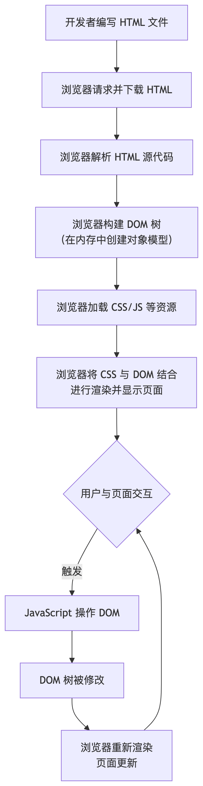
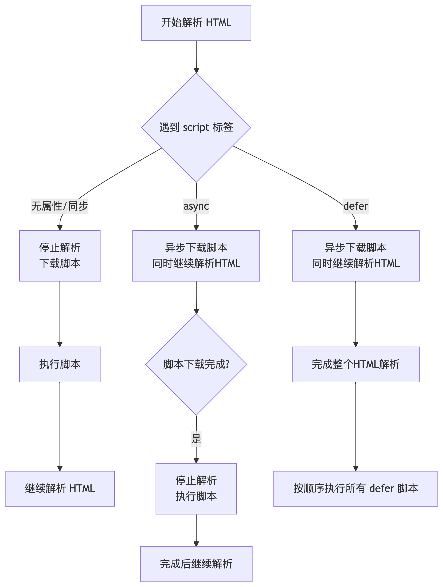

## DOCTYPE 是什么，都有哪些属性？
::: details 参考答案
DOCTYPE（Document Type Declaration，文档类型声明）是位于 HTML 文档最顶部的`声明`。它不是一个 HTML 标签，而是一个给`浏览器的指令`，目的是告诉浏览器当前文档应该使用哪种 `HTML` 或 XHTML `规范`来`解析和渲染`页面。

在现代开发中，推荐使用 HTML5 的简单声明
```html
<!DOCTYPE html>
```

已过时的 HTML 4.01 和  XHTML 1.0 声明中
```html
<!DOCTYPE HTML PUBLIC "-//W3C//DTD HTML 4.01//EN" "http://www.w3.org/TR/html4/strict.dtd">
```
:::

## meta 标签是干什么的，都有什么属性和作用
::: details 参考答案
`<meta>` 标签（`元数据标签`）用于提供关于 HTML 文档的元数据（Metadata）。元数据不会显示在页面上，但`会被浏览器、搜索引擎和其他网络服务解析和处理`。

1. 定义文档字符编码 (charset)，它指定了网页使用的`字符编码`，确保文本能正确显示（`避免乱码`）。
```html
<meta charset="UTF-8">
```

2. 定义页面描述、关键词、作者等 (`name 和 content`)，`name` 属性定义了`元数据的类型`，`content` 属性定义了`元数据的值`。
    - description（描述）  提供一段关于本网页的简洁描述。
    ```html
    <meta name="description" content="这是一家致力于销售高质量咖啡豆和咖啡制作工具的专业网店。">
    ```
    - keywords（关键词）  提供一串用英文逗号分隔的、与网页内容相关的关键词。
    ```html
    <meta name="keywords" content="咖啡, 咖啡豆,  espresso, 手冲咖啡, 咖啡机">
    ```
    - author（作者）  声明网页的作者。
    ```html
    <meta name="author" content="张三">
    ```
    - viewport（视口）  这是移动端Web开发中极其重要的标签。它`控制视口的大小和缩放比例`，使网站在移动设备上能够正确显示。
    ```html
    <meta name="viewport" content="width=device-width, initial-scale=1.0">
    ```
    - robots（机器人）  示搜索引擎爬虫如何索引和跟踪本页面。如果没有此标签，爬虫默认会索引并跟踪页面上的链接。
    ```html
    <!-- index, follow：可以索引本页并跟踪链接。（默认） -->
    <!-- noindex, nofollow：既不要索引，也不要跟踪。 -->
    <meta name="robots" content="noindex, nofollow">
    ```
3. 重定向页面 (http-equiv)
    - 页面重定向（Refresh）   在经过一定时间后，将页面重定向到另一个URL。
    ```html
    <!-- 示例（3秒后跳转到新网址） -->
    <meta http-equiv="refresh" content="3;url=https://www.example.com/">
    ```
    - 内容安全策略 (CSP)     一种重要的安全特性，用于帮助检测和缓解某些类型的攻击，如跨站脚本（XSS）和数据注入攻击。它通过白名单机制指定哪些资源（JS, CSS, 图片等）可以被加载和执行。
    ```html
    <!-- 示例（一个简单的策略：只允许从当前域名加载资源） -->
    <meta http-equiv="Content-Security-Policy" content="default-src 'self'">
    ```
:::

## 什么是 DOM ，它和 HTML 有什么区别？
::: details 参考答案
DOM 的全称是 Document Object Model（`文档对象模型`）。DOM 是浏览器根据 HTML 文档创建的一个可供程序（JavaScript）动态读写和操作的结构化表示。

- 区别
    - HTML：开发者编写的所有源码，是不可变的静态文本字符串
    - DOM：浏览器根据html解析而成的动态对象，供js操作页面

- HTML 和 DOM 在一个紧密协作的流程中共同工作

:::

## 如何理解 HTML5 语义化 ？有哪些常见的语义化标签？
::: details 参考答案
语义化就是让我们写的代码，既能被人类读懂，也能被机器读懂，用正确的标签做正确的事。

- 对SEO（搜索引擎优化）友好
- 提升可访问性（Accessibility）
- 代码结构清晰，易于维护
- 利于跨设备兼容

常见的语义化标签
::: code-group

```html [结构类标签]
<header>	页头。通常包含网站标志、主导航等。
<nav>	    导航。定义页面的主要导航链接集合。
<main>	    主体。定义文档的核心主要内容，一个页面只应有一个 <main>。
<article>	文章。定义一段独立、完整的内容，如博客文章、新闻、论坛帖子。
<section>	章节。定义文档中的一个主题内容分组，通常会有自己的标题。
<aside>	    侧边栏。定义与主内容相关但不是核心的内容，如侧边栏、引用、广告等。
<footer>	页脚。通常包含版权信息、相关链接、联系方式等。
```

```html [内容类标签]
<figure> & <figcaption>	    媒体组合。<figure> 包裹独立的媒体内容（图片、图表、代码等），<figcaption> 为其定义标题。
<mark>	                    标记。表示高亮或标记的文字，类似于荧光笔的效果。
<time>	                    时间。定义一个机器可读的日期或时间，datetime 属性提供标准格式。
<strong>	                重要。表示内容非常重要，通常加粗显示。（有语义，不仅仅是加粗）
<em>	                    强调。表示需要强调的语气，通常斜体显示。（有语义，不仅仅是斜体）
<address>	                地址。定义文档作者或拥有者的联系信息。
```

一个简单的页面结构示例
::: code-group

```html [语义化]
<header>...</header>
<nav>...</nav>
<main>
  <article>...</article>
  <section>...</section>
</main>
<aside>...</aside>
<footer>...</footer>
```

```html [非语义化]
<div id="header">...</div>
<div id="nav">...</div>
<div class="main">
  <div class="article">...</div>
  <div class="section">...</div>
</div>
<div id="sidebar">...</div>
<div id="footer">...</div>
```
:::

## DOM 节点的 attr 和 property 有何区别
::: details 参考答案
- `Attribute (特性)`：是 `HTML` 标签上的`属性`，写在源代码中，值永远是`字符串`。
    - 标准性	既有标准特性（如 id, href），也有自定义特性（如 data-*）
    - 操作方式	`getAttribute()`, `setAttribute()`, `removeAttribute()`
- `Property (属性)`：是 `DOM` 对象这个 JavaScript 对象上的`属性`，存在于内存中，值可以是`任意 JavaScript 类型`。
    - 标准性 主要是标准属性，自定义属性较少见
    - 操作方式	使用 `点号（.）` 或 `方括号（[]`） 直接访问（如 element.id）

详细解释与示例
1. 初始同步: 当浏览器解析 HTML 创建 DOM 对象时，它会读取 HTML 标签上的 标准 (standard) attributes 并在 DOM 对象上创建与之同名的 properties。
```html
<input id="myInput" type="text" value="Hello World" custom-attr="foo">
```
此时，浏览器会创建一个 HTMLInputElement 对象。初始化时：
- 它的 `id` property 被设置为 "myInput"。
- 它的 `type` property 被设置为 "text"。
- 它的 `value` property 被设置为 "Hello World"。
- 它的 `custom-attr` attribute 没有对应的标准 property。

2. 分道扬镳（最重要的区别）: 初始同步后，attribute 和 property 就各自活在`各自的世界`里。修改一个，通常不会自动影响另一个
```js
const input = document.getElementById('myInput');

// 1. 初始状态
console.log(input.getAttribute('value')); // 'Hello World' (字符串)
console.log(input.value);                 // 'Hello World' (字符串)

// 2. 用户在输入框中将值改为 "Goodbye"
// （通过界面交互修改了 property）

// 3. 再次获取值
console.log(input.getAttribute('value')); // 'Hello World' (attribute 未变！)
console.log(input.value);                 // 'Goodbye' (property 反映了当前值)

// 4. 通过 JS 设置 property
input.value = 'New Value';

console.log(input.getAttribute('value')); // 仍然是 'Hello World' (attribute 还是没变)
console.log(input.value);                 // 'New Value' (property 已更新)

// 5. 通过 JS 设置 attribute
input.setAttribute('value', 'Attr Value');

console.log(input.getAttribute('value')); // 'Attr Value' (attribute 已更新)
console.log(input.value);                 // 'Attr Value' (注意！这个特定的 property 被 attribute 同步了)
```
- `value attribute` 可以看作是`默认值`（defaultValue）。
- `value property` 是`当前值`（currentValue），会随着用户输入或 JavaScript 赋值而改变。
- 对于 `input.value`，设置 attribute `会同步` property，但设置 property 却`不会同步` attribute。这是一个特例，并非所有 attribute/property 对都如此。
:::

## 如何一次性插入多个 DOM 节点？考虑性能
::: details 参考答案
浏览器渲染页面的过程叫做“回流”（Reflow）或“重绘”（Repaint）。每次直接向 DOM 插入一个节点，都可能触发一次回流，这是非常昂贵的计算过程。

高性能批量插入方案
1. 使用 DocumentFragment (经典且兼容性好)

    DocumentFragment 是一个`轻量级的“虚拟”文档对象`，它不在主 DOM 树中，因此操作它`不会引起回流或重绘`。你可以将多个节点先附加到片段中，`最后一次性`将片段附加到真实的 DOM。
    - 优点： 兼容性极好，只触发一次回流。
    ```js
    const parent = document.getElementById('parent');
    const items = ['Item 1', 'Item 2', 'Item 3', ... , 'Item 100'];

    // 1. 创建文档片段
    const fragment = document.createDocumentFragment();

    items.forEach(text => {
    const li = document.createElement('li');
    li.textContent = text;
    // 2. 将每个新节点先附加到片段中（无回流）
    fragment.appendChild(li);
    });

    // 3. 一次性将片段的所有子节点附加到真实 DOM（只触发一次回流）
    parent.appendChild(fragment);
    ```
2. 使用 innerHTML 或 outerHTML (字符串拼接法)
    - 优点：非常简单、直观，在现代浏览器中性能很好。
    - 缺点：会销毁父元素下的所有现有子节点、字符串拼接可能带来 XSS 注入风险
    ```js
    const parent = document.getElementById('parent');
    const items = ['Item 1', 'Item 2', 'Item 3', ... , 'Item 100'];

    // 1. 拼接所有元素的 HTML 字符串
    const htmlString = items.map(text => `<li>${text}</li>`).join('');

    // 2. 一次性写入 innerHTML（通常只触发一次回流）
    parent.innerHTML = htmlString;
    ```
3. 使用 insertAdjacentHTML() 方法 (更灵活的字符串插入)
    - 语法：`element.insertAdjacentHTML(position, text)`，position值如下
        - `'beforebegin'`: 在元素本身之前。
        - `'afterbegin'`: 在元素的第一个子元素之前。
        - `'beforeend'`: 在元素的最后一个子元素之后。(最常用)
        - `'afterend`': 在元素本身之后。
    - 优点： 灵活且高性能，不会破坏父元素的现有子节点和事件。
    ```js
    const parent = document.getElementById('parent');
    const items = ['Item 1', 'Item 2', 'Item 3', ... , 'Item 100'];

    const htmlString = items.map(text => `<li>${text}</li>`).join('');

    // 将 htmlString 插入到 parent 的内部末尾，不会清空原有内容
    parent.insertAdjacentHTML('beforeend', htmlString);
    ```
4. 现代方案：使用 append() 方法

    现代的 `Element.append()` 方法可以`一次性接受多个节点或字符串作为参数`。这是最简洁的现代语法。
    - 优点： 语法非常简洁明了，是现代 JavaScript 的首选方法之一。
    ```js
    const parent = document.getElementById('parent');
    const items = ['Item 1', 'Item 2', 'Item 3'];

    // 1. 创建所有节点并放入一个数组
    const nodes = items.map(text => {
    const li = document.createElement('li');
    li.textContent = text;
    return li;
    });

    // 2. 使用 append 一次性插入所有节点（使用扩展运算符 ...）
    parent.append(...nodes); // 只触发一次回流！

    // 它甚至可以混合插入节点和字符串！
    // parent.append(...nodes, "Some text", document.createElement('div'));
    ```
:::

## offsetHeight scrollHeight clientHeight 有什么区别
::: details 参考答案
1. clientHeight - “可视窗口”的高度
    - `内容高度 + 内边距 (Padding)`，不包括边框、外边距或滚动条。
    - 计算公式： clientHeight = height + padding-top + padding-bottom

2. offsetHeight - “整个盒子”的高度
    - `内容高度 + 内边距 (Padding) + 边框 (Border) + 水平滚动条高度`
    - 计算公式： offsetHeight = clientHeight + border-top + border-bottom + 水平滚动条高度

3. scrollHeight - “所有内容”的高度
    - 元素所有内容的实际高度，包括`当前不可见的、需要滚动才能看到的部分`，不包括边框、外边距或滚动条。
    - 计算公式： scrollHeight = 所有子内容的总高度 + padding-top + padding-bottom
:::

## HTMLCollection 和 NodeList 的区别
::: details 参考答案
`HTMLCollection` 和 `NodeList` 都是 DOM API 返回的“类数组”对象，用于表示一组节点。

1. 包含的节点类型 (Node Types)
    ```html
    <div id="container">
    <!-- 这是一个注释 -->
    <p>一个段落</p>
    一些文本
    </div>
    ```
    - HTMLCollection： `只包含元素（Element）节点`。例如，你无法通过它获取文本节点或注释节点。
    ```js
    const container = document.getElementById('container');
    const htmlCollection = container.children; // 获取的是 HTMLCollection

    console.log(htmlCollection.length); // 1 (只包含 <p> 元素，不包含注释和文本)
    ```
    - NodeList： 可以`包含所有类型的节点`，包括元素、文本节点、注释节点等。
    ```js
    const nodeList = container.childNodes; // 获取的是 NodeList

    console.log(nodeList.length); // 3 (注释节点、<p>元素、文本节点)
    nodeList.forEach(node => {
    console.log(node.nodeType); // 8 (注释), 1 (元素), 3 (文本)
    });
    ```
    `例外`：querySelectorAll() 返回的 `NodeList` 只包含`元素节点`，但它仍然是 NodeList 类型。

2. 实时性 (Liveness) - 最重要的区别！
    ```html
    <div id="parent"></div>
    ```
    - HTMLCollection 总是实时的 (Live)
    ```js
    const parent = document.getElementById('parent');
    const liveCollection = parent.getElementsByTagName('p'); // 初始为空

    // 动态添加一个新元素
    const newP = document.createElement('p');
    parent.appendChild(newP);

    console.log(liveCollection.length); // 1！集合自动更新了，长度变为1
    ```
    注意⚠️：`循环操作DOM删除时会有问题`，会导致跳过元素或逻辑错误
    - NodeList 大多数是静态的 (Static)
    ```js
    const staticList = document.querySelectorAll('p'); // 初始为空
    const newP = document.createElement('p');
    document.body.appendChild(newP);

    console.log(staticList.length); // 0！静态列表没有更新，长度仍为0
    ```
    `重要例外`：通过 `element.childNodes` 获取的 NodeList 是实时的！
    ```js
    const parent = document.getElementById('parent');
    const childNodes = parent.childNodes; // 这是实时的 NodeList

    const newText = document.createTextNode('Hello');
    parent.appendChild(newText);

    console.log(childNodes.length); // 长度增加了！因为它是实时的
    ```
3. 可用的方法 (Available Methods)
    - HTMLCollection: 非常有限，基本上只有 length 和索引访问（[index]）。
    - NodeList： 现代浏览器为 NodeList 实现了 forEach() 方法，特别是由 querySelectorAll() 返回的。
    ```js
    const list = document.querySelectorAll('div');
    // 可以使用 forEach
    list.forEach(div => {
    console.log(div);
    });

    // 可以轻松转换为真数组以使用所有数组方法 (map, filter, reduce, etc.)
    const arrayOfNodes = Array.from(list);
    const arrayOfNodes2 = [...list]; // 使用扩展运算符
    ```
:::

## Node 和 Element 有什么区别？
::: details 参考答案
`Element 是 Node 的一种`。Element 继承自 Node，因此 Element 拥有 Node 的所有属性和方法，并在此基础上添加了更多特定于元素的功能。

Node 包括`注释`、`元素标签（Element`）、`文本`
:::

## 开发一个无限下拉加载图片的页面，如何给每个图片绑定 click 事件？
::: details 参考答案
- 绝对不应该为每个`新加载的图片单独`绑定事件监听器，这会导致`性能极差`和`内存泄漏`。
```js
// ❌错误做法！千万不要这样！
function loadNewImages(images) {
  images.forEach(image => {
    const imgElement = document.createElement('img');
    imgElement.src = image.url;
    // 为每个新图片绑定监听器
    imgElement.addEventListener('click', () => {
      handleClick(image);
    });
    container.appendChild(imgElement);
  });
}
```
弊端：
- 性能差：每次加载新内容都要绑定大量事件监听器，非常消耗性能。
- 内存泄漏：如果图片被移除（例如清空列表），这些监听器可能不会被垃圾回收，导致内存占用越来越高。

- 正确方案：`事件委托` (Event Delegation)

    原理：利用`事件冒泡（Event Bubbling）机制`，将事件监听器`绑定在一个静态的、早已存在的父级容器上`（例如包裹所有图片的 `<div>`）。当子元素（图片）上的事件被触发时，它会冒泡到父元素，父元素上的监听器通过检查事件的 event.target 属性来判断事件是否来自我们关心的目标元素（即图片）。

    ```html
    <!-- 静态的父容器 -->
    <div id="image-container"></div>
    ```

    ```js
    // 1. 获取静态的父容器
    const imageContainer = document.getElementById('image-container');

    // 2. 在父容器上绑定唯一的事件监听器（事件委托）
    imageContainer.addEventListener('click', function(event) {
    // 3. 判断事件源 (event.target) 是否是我们想要的目标
    // 点击可能发生在  上，也可能发生在它的容器 .image-item 上
    // 我们使用 .closest() 方法来找到离点击目标最近的、匹配选择器的元素
    const clickedItem = event.target.closest('.image-item');

    // 如果找不到匹配的 .image-item，说明点击的是容器空白处，直接返回
    //if (!clickedItem) return;

    // 4. 获取数据（例如，存储在 data-* 属性中）
    // 假设我们在 .image-item 上存了图片的ID
    const imageId = clickedItem.dataset.id;
    const imageUrl = clickedItem.querySelector('img').src;

    // 5. 执行真正的点击处理逻辑
    handleImageClick(imageId, imageUrl);
    });

    // 真正的点击处理函数
    function handleImageClick(id, url) {
    console.log(`图片被点击了！ID: ${id}, URL: ${url}`);
    // 这里可以执行打开模态框、放大图片、跳转详情页等操作
    // e.g., openModal(url);
    }

    // 模拟无限下拉加载图片的函数
    function loadMoreImages(imageDataList) {
    const fragment = document.createDocumentFragment(); // 使用文档片段优化性能

    imageDataList.forEach(data => {
        const item = document.createElement('div');
        item.className = 'image-item';
        item.dataset.id = data.id; // 将数据存在元素上

        const img = document.createElement('img');
        img.src = data.url;
        img.alt = data.title;
        // 注意：这里没有为 img 单独绑定任何事件监听器！

        item.appendChild(img);
        fragment.appendChild(item);
    });

    imageContainer.appendChild(fragment);
    }

    // 模拟初始加载和滚动加载
    // 假设有一个 getImageData 函数来获取数据
    loadMoreImages(getImageData(0));

    window.addEventListener('scroll', () => {
    if ((window.innerHeight + window.scrollY) >= document.body.offsetHeight - 500) {
        // 快滚动到底部时，加载更多
        loadMoreImages(getImageData(nextPage));
        nextPage++;
    }
    });
    ```
:::

## window.onload 和 DOMContentLoaded 的区别是什么？
::: details 参考答案
- DOMContentLoaded：`等待初始 HTML 文档被完全加载和解析`完成后触发，不等待样式表、图像、子框架等外部资源完成加载。

- window.onload：`等待整个页面完全加载`完毕后触发，包括所有 HTML、CSS、JavaScript、图片、iframe 等所有外部资源。
:::

## script 标签放在 head 里，怎么解决加载阻塞的问题
::: details 参考答案
1. 使用 defer 属性 (现代最佳实践)
    - 作用：告诉浏览器立即开始下载脚本，但推迟执行，直到整个 HTML 文档解析完成之后（在 DOMContentLoaded 事件触发之前），且会保持执行顺序。
    - 优点：

        `并行下载`：脚本下载与 HTML 解析同时进行，不阻塞解析。

        `顺序执行`：多个带 defer 的脚本会严格按照它们在 HTML 中出现的顺序执行。

        `执行时机完美`：在 DOM 树构建完成后立即执行，非常适合需要操作 DOM 的初始化脚本。
    ```html
    <head>
    <script src="script.js" defer></script>
    <script src="another-script.js" defer></script> <!-- 会按顺序在 script.js 之后执行 -->
    </head>
    ```

2. 使用 async 属性
    - 作用：告诉浏览器`立即异步下载脚本`，并在下载完成后立即执行，执行时会阻塞 HTML 解析。多个 async 脚本的`执行顺序无法保证`（谁先下载完谁先执行）。
    - 注意： 如果脚本有`依赖关系`或需要`操作 DOM`，慎用 async。
    ```html
    <head>
    <script src="analytics.js" async></script> <!-- 谁先下载完谁先执行 -->
    <script src="widget.js" async></script>
    </head>
    ```

3. 将脚本动态注入
    - 优点： 兼容性很好，可以精确控制加载时机。
    - 缺点： 需要自己手动处理脚本的加载和执行顺序。
    ```html
    <head>
    <script>
        // 这段内联脚本不阻塞，它负责动态加载外部脚本
        const script = document.createElement('script');
        script.src = 'script.js';
        document.head.appendChild(script); // 从这里开始异步加载 script.js
    </script>
    </head>
    ```


:::

## 常见的 HTML 标签哪些是 inline 元素，哪些是 block 元素，哪些是 inline-block 元素

::: details 参考答案
::: code-group

```html [Block (块级元素)]
<!-- 独占一行，宽度默认填满父元素，可以设置宽高和所有边距。 -->
<div>	                通用的块级容器，是最常用的布局标签。
<p>	段落。
<h1>, <h2>, ..., <h6>	各级标题。
<ul>, <ol>, <menu>	    无序列表、有序列表、菜单列表。
<li>	                列表项。
<table>	                表格。
<form>	                表单。
<header>	            页头。
<footer>	            页脚。
<nav>	                导航栏。
<main>	                主体内容。
<article>	            文章。
<section>	            章节。
<aside>	                侧边栏。
<figure>	            独立的流内容（如图像、图表）。
<figcaption>	        <figure> 的标题。
<hr>	                水平分割线。
<pre>	                预格式化文本（保留空格和换行）。
<blockquote>	        块引用。
```

```html [Inline (内联元素)]
<!-- 不独占一行，与其他内联元素并排显示。无法设置宽高，水平方向的 margin 和 padding 有效，但垂直方向的不影响布局（会重叠或溢出）。 -->
<span>	    通用的内联容器。
<a>	        超链接。
<strong>	加粗强调（语义重要）。
<em>	    斜体强调（语义重音）。
<b>	        加粗（无语义，纯样式）。
<i>	        斜体（无语义，纯样式，常用于图标）。
<br>	    换行。
<label>	    表单标签。
<code>	    代码片段。
<sup>	    上标。
<sub>	    下标。
<small> 	小号字体。
```

```html [Inline-Block (内联块级元素)]
<!-- 外观上是内联的（不独占一行，可以并排），但内在是块级的（可以设置宽高和所有边距）。它就像是 inline 和 block 的混合体。 -->
	    注意：旧规范是 inline，但现代规范是 inline-block
<input>	    输入框。默认为 inline-block
<textarea>	多行文本域。默认为 inline-block
<select>	下拉选择框。默认为 inline-block
<button>	按钮。默认为 inline-block
```

注意，table 虽然也是独占一行，但它 display: table 不是 block
:::

## 常见的 CSS 选择器有哪些？

::: details 参考答案
::: code-group

```css [基础选择器]
选择器          示例	                描述
通配选择器      *	                    选择所有元素。 { margin: 0; padding: 0; }
元素选择器	    div, p, h1	            选择所有指定标签的元素。 p { color: red; }
类选择器        .classname              选择所有带有指定 class 属性的元素。 .intro { font-weight: bold; }
ID 选择器       #idname                 选择带有指定 id 属性的元素。（ID 应唯一） #header { height: 80px; }
属性选择器      [attr], [attr=value]	选择带有指定属性的元素。 [target], [type="email"]
```

```css [组合器选择器]
选择器	       示例	                    描述
后代组合器	    selector1 selector2	    选择 selector1 内部的所有 selector2 元素（无论嵌套多深）。 article p
子组合器        selector1 > selector2	选择作为 selector1 直接子元素的 selector2。 ul > li
相邻兄弟组合器  selector1 + selector2	选择紧接在 selector1 之后的第一个兄弟元素 selector2。 h2 + p
通用兄弟组合器	selector1 ~ selector2	选择在 selector1 之后的所有兄弟元素 selector2。 h2 ~ p
```

```css [伪类选择器]
选择器	    示例	                                                                    描述
动态伪类	:hover, :active, :focus, :visited, :link	                                选择处于用户交互状态的元素（如鼠标悬停、点击时、获得焦点）。 a:hover
结构伪类	:first-child, :last-child, :nth-child(n), :nth-of-type(n), :not(selector)	基于元素在 DOM 树中的位置或其父元素的子元素来选择。 li:nth-child(odd), p:first-child, div:not(.ignore)
表单伪类	:checked, :disabled, :required, :valid	                                    选择处于特定状态的表单元素。 input:checked
```

```css [伪元素选择器]
选择器	            示例	                描述
::before	        div::before	        在元素内部内容之前插入生成的内容。必须配合 content 属性使用。
::after	            div::after	        在元素内部内容之后插入生成的内容。必须配合 content 属性使用。
::first-line	    p::first-line	    选择文本的第一行。
::first-letter	    p::first-letter	    选择文本的第一个字母。
::selection	        ::selection	        选择用户高亮选中的文本部分。
```

注意： 在 CSS3 中，`伪元素`使用双冒号 `::` 以区别于`伪类 :`，但单冒号 :before 等写法仍然有效。

- 优先级计算规则（从高到低）：

1. `!important`：最高优先级（但应尽量避免使用，难以维护）

2. `内联样式`：`style="color: red;"` (优先级值为 1000)

3. `ID 选择器`：`#header` (优先级值为 100/每个)

4. `类选择器`、属性选择器、伪类：`.class, [type="text"], :hover` (优先级值为 10/每个)

5. `元素选择器`、伪元素：`div, ::befor`e (优先级值为 1/每个)

6. `通配选择器`、组合器：`*, >, +, ~` (优先级值为 0)
:::

## CSS 盒子模型，尺寸计算

```html
<!-- 如下代码，请问 div1 的 offsetWidth 是多大？ -->
<style>
  #div1 {
    width: 100px;
    padding: 10px;
    border: 1px solid #ccc;
    margin: 10px;
  }
</style>

<div id="div1"></div>
```

::: details 参考答案
`122px`

[offsetHeight scrollHeight clientHeight 有什么区别](#offsetheight-scrollheight-clientheight-有什么区别)

1. 标准盒子模型 (content-box) - 默认值
    - 行为：你设置的 width 和 height 只等于内容区域 (Content) 的尺寸。
    - 元素总宽度 = `width` + `padding`-left + padding-right + `border`-left-width + border-right-width + `margin`-left + margin-right
2. 弹性盒子模型 (border-box)
    - 行为：你设置的 width 和 height 等于内容区域 + 内边距 + 边框的总和
    - 元素总宽度 = `width` + `margin`-left + margin-right
:::

## 什么是 BFC 如何触发 BFC？
::: details 参考答案
BFC（Block Formatting Context）中文叫块级格式化上下文，可以把它理解为一个`独立的渲染区域`（或者一个“结界”）。

- BFC 的核心特性：
    1. 内部元素垂直排列：在一个 BFC 中，块级元素会从上到下垂直排列。
    2. Margin 重叠：属于同一个 BFC 的两个相邻块级元素的上下外边距（margin）会发生重叠。
    3. 隔离性：

        BFC 区域会包含内部的所有浮动元素（`解决高度塌陷`）。

        BFC 区域不会与外部浮动元素重叠（`实现自适应两栏布局`）。

        计算 BFC 高度时，`浮动元素也参与计算`。

- 如何触发 BFC？
    1. 根元素	`<html> 元素本身就是一个 BFC`。
    2. 浮动元素	`float 的值不为 none`（即 left 或 right）。
    3. 绝对定位元素	`position 为 absolute 或 fixed`。
    4. display 为特定值	`inline-block、table-cell（表格单元格默认值）、table-caption、flex、inline-flex、grid、inline-grid、flow-root`。
    5. overflow 不为 visible	`overflow: hidden、scroll、auto`。这是最常用的方法之一。
    6. contain 为特定值	`contain: layout、content、paint、strict`。

`display: flow-root：这是最现代、最纯粹的触发 BFC 的方式`。它唯一的作用就是创建 BFC，而不会带来任何副作用（如 overflow: hidden 可能隐藏溢出内容，float 会破坏布局等）。推荐优先使用它。

```css
.container {
  display: flow-root;
}
```

- BFC 的常见应用场景
    1. 解决 Margin 重叠（折叠）
    2. 清除浮动，解决高度塌陷
    3. 实现自适应两栏布局
:::

## margin 纵向重叠

::: details 参考答案
当两个垂直相邻的块级元素的上下外边距相遇时，它们将合并为一个外边距。合并后外边距的大小等于发生重叠的`两个外边距中的较大者`。

- 会发生重叠的三种基本情况
    1. 相邻的兄弟元素
    ```html
    <p style="margin-bottom: 30px;">第一个段落</p>
    <p style="margin-top: 20px;">第二个段落</p>
    ```
    这两个段落之间的实际间距`是 30px (max(30px, 20px))`，而不是 50px。

    2. 父元素与第一个/最后一个子元素

    当父元素`没有有效的边框 (border)、内边距 (padding)、或内联内容（如文本）`将其与子元素分隔开时，父元素的 `margin-top` 会和其`第一个子元素`的 margin-top 重叠；同理，父元素的 `margin-bottom` 也会和其`最后一个子元素`的 margin-bottom 重叠。
    ```html
    <div class="parent" style="margin-top: 50px;">
        <div class="child" style="margin-top: 20px;">子元素</div>
    </div>
    ```
    `.parent` div 的顶部最终的外边距`是 50px (max(50px, 20px))`，而不是 70px。

    3. 空的块级元素

    如果一个块级元素`没有边框、内边距、内联内容和高度 (height 或 min-height)`，那么它自身的上下外边距也会发生重叠。
    ```html
    <div style="margin-top: 20px; margin-bottom: 30px;"></div>
    <!-- 一个空的div -->
    ```
    这个空 div 所占的垂直空间`是 30px (max(20px, 30px))`。

- 如何防止/消除外边距重叠？
    1. `使用 Padding 或 Border` 给父元素添加一个透明的边框或内边距。
    2. `使用 Overflow 属性` 为父元素设置 overflow 值为 auto, hidden, 或 scroll，可以触发其 BFC。
    3. `使用 Flexbox 或 Grid 布局` 将父元素的布局设置为 Flex 或 Grid，也会创建一个新的格式上下文，从而阻止与子元素的外边距重叠。
    4. `使用伪元素` 这是一个非常干净的技巧，使用 ::before 伪元素来阻断第一个子元素的 margin-top 重叠。
:::

## margin 负值问题
::: details 参考答案
设置负 margin 的效果取决于元素的流式布局（正常文档流）和所设置的方向（top, right, bottom, left）。

负 Margin 在不同方向上的行为
1. margin-left 和 margin-top 为负值
    - 行为：元素会向相反方向移动。
    - margin-left: -10px;：元素向左移动 10px。
    - margin-top: -10px;：元素向上移动 10px。

2. margin-right 和 margin-bottom 为负值
    - 行为：不会移动元素本身，但会影响其周围的元素。
    - margin-right: -10px;：元素右侧的后续兄弟元素会向左移动 10px，仿佛这个元素的“右边界”向内收缩了。
    - margin-bottom: -10px;：元素下方的后续兄弟元素会向上移动 10px。
:::


## lineHeight 如何继承？
```html
<!--如下代码，p 标签的行高将会是多少？-->
<style>
  body {
    font-size: 20px;
    line-height: 200%;
  }
  p {
    font-size: 16px;
  }
</style>

<body>
  <p>AAA</p>
</body>
```

::: details 参考答案
`40px`

line-height 的继承规则取决于你给它设置的值的数据类型。它主要有三种设置方式:

1. 设置为一个无单位的数值（推荐）
    - 如何设置：`line-height: 1.5`; (只是一个数字，没有单位)
    - 如何继承：子元素会继承这个数值，然后在自身的 font-size 基础上重新计算最终的行高。
    - 计算公式：子元素的行高 = 继承的数值 × 子元素的 font-size
    - 优点：论子元素的字体大小如何变化，行高都会按比例缩放

2. 设置为一个固定单位的值（如 px, em）
    - 如何设置：`line-height: 30px`; 或 `line-height: 1.5em`; (带有单位)
    - 如何继承：子元素会继承父元素计算后的像素值，而不会随着自己的字体大小改变。

3. 设置为百分比（%）
    - 如何设置：`line-height: 150%`;
    - 如何继承：浏览器会先根据父元素的 font-size 计算出 line-height 的具体像素值，然后子元素直接`继承`这个`计算后的值`。
:::

## 使用 CSS 实现居中对齐，有哪几种方式？

::: details 参考答案
根据不同的布局上下文（行内内容、块级元素、Flexbox、Grid），居中的方法各不相同。

::: code-group
```css [水平居中]
/* 1. 行内或行内块元素（文本、链接、inline-block 元素）
方法： 在父元素上设置 text-align: center; */
.parent {
  text-align: center; /* 水平居中内部的行内内容 */
}
.child {
  display: inline-block; /* 如果子元素是块级，需改为行内块 */
}

/* 2. 单个块级元素
方法： 在子元素上设置 margin: 0 auto;（左右外边距为 auto） */
.child {
  width: 200px; /* 必须指定宽度 */
  margin: 0 auto; /* 上下为0，左右自动 */
}

/* 3. 任何元素（Flexbox 方案 - 现代首选）
方法： 将父元素设置为 Flex 容器，并使用 justify-content: center; */
.parent {
  display: flex;
  justify-content: center; /* 主轴（默认水平）对齐方式：居中 */
}
/* 子元素无需任何设置 */

/* 4. 任何元素（Grid 方案）
方法： 将父元素设置为 Grid 容器，并使用 justify-content: center; */
.parent {
  display: grid;
  justify-content: center; /* 网格轨道在容器内水平居中 */
}
/* 或者让单个项目在网格单元格内居中 */
.parent {
  display: grid;
}
.child {
  justify-self: center; /* 项目在所在的网格单元格内水平居中 */
}
```

```css [垂直居中]
/* 1. 单行文本或行内元素
方法： 设置父元素的 line-height 等于其 height */
.parent {
  height: 100px; /* 固定高度 */
  line-height: 100px; /* 行高等于高度 */
}

/* 2. 任何元素（Flexbox 方案 - 现代首选）
方法： 将父元素设置为 Flex 容器，并使用 align-items: center; */
.parent {
  display: flex;
  align-items: center; /* 交叉轴（默认垂直）对齐方式：居中 */
}
/* 子元素无需任何设置 */

/* 3. 任何元素（Grid 方案）
方法： 将父元素设置为 Grid 容器，并使用 align-content: center; 或 align-items: center; */
.parent {
  display: grid;
  align-items: center; /* 所有网格项目在单元格内垂直居中 */
  /* 或者 */
  align-content: center; /* 整个网格内容在容器内垂直居中 */
}
/* 或者让单个项目在网格单元格内居中 */
.child {
  align-self: center;
}

/* 4. 绝对定位方案（传统方式，已知元素尺寸）
方法： 使用绝对定位和负 Margin */
.parent {
  position: relative; /* 定位父级 */
}
.child {
  position: absolute;
  top: 50%; /* 先定位到50%的位置 */
  height: 100px;
  margin-top: -50px; /* 再向上移动自身高度的一半 */
}

/* 5. 绝对定位方案（传统方式，未知元素尺寸）
方法： 使用绝对定位和 Transform */
.parent {
  position: relative;
}
.child {
  position: absolute;
  top: 50%; /* 先定位到50%的位置 */
  transform: translateY(-50%); /* 再使用transform向上移动自身高度的一半 */
}
```
:::

## 什么是 CSS 定位上下文？absolute 和 relative 分别依据谁来定位？
::: details 参考答案
定位上下文（Positioning Context），更准确的说法是包含块（Containing Block），它是一个`参照系`。当你对一个元素设置 position: absolute 或 position: fixed 时，它的 top, right, bottom, left 属性值就是相对于这个“参照系”来计算的。

- static (默认)	`正常文档流`	            不参与定位，top/left 等属性无效。
- relative	    `自身原始位置`
- absolute	    `最近的非 static 祖先`	
    1. 拼爹型：脱离文档流，找一个最近的“有定位”的爹当参照。
    2. 如果爹都不行，就找 `<html>`。
- fixed	        `浏览器视口 (Viewport)`	   超凡脱俗型：完全脱离文档流，只认浏览器窗口，跟页面滚动无关。
- sticky	    `最近的滚动祖先`
    1. 定位上下文是最近的可滚动祖先元素（`设置了 overflow: hidden | scroll | auto 的祖先`）
    2. 在达到特定滚动阈值前，它表现为 relative；达到之后，它表现为 fixed，但固定范围仅限于它的定位上下文（滚动容器）。
:::


## CSS overflow: hidden display：none 和 visibility: hidden 有什么区别
::: details 参考答案
- `overflow: hidden`: 溢出内容不可见，未溢出的部分正常可见
- `display：none`: 隐藏内容，不占用任何空间，内容变化不会重新渲染
- `visibility: hidden`: 隐藏元素，但保留其占据的空间，内容变化会重新渲染

🚀拓展：vue中 `v-if`、`v-show` 的区别
- `v-if`: 动态地添加/移除 DOM 元素，元素存不存在DOM中
- `v-show`: 切换 CSS 的 `display: none`，元素始终会被渲染并保留在 DOM 中
:::


## CSS px % em rem vw/vh 的区别
::: details 参考答案
| 单位 | 类型       | 相对基准                | 特点与用途                                                                 |
|------|------------|-------------------------|---------------------------------------------------------------------------|
| px   | 绝对单位   | 设备像素                | 固定大小，与任何其他元素无关。最基础的单位。                               |
| %    | 相对单位   | 父元素的相同属性        | 用于实现相对于父元素的尺寸、间距等。                                       |
| em   | 相对单位   | 当前元素的 font-size    | 1em = 自身当前的字体大小。常用于控制与文本相关的间距。                     |
| rem  | 相对单位   | 根元素 (`<html>`) 的 font-size | 1rem = 根元素的字体大小。用于实现整体可控的响应式布局。                     |
| vw   | 相对单位   | 视口宽度的 1%           | 1vw = 1% 的视口宽度。用于创建与视口宽度相关的布局。                         |
| vh   | 相对单位   | 视口高度的 1%           | 1vh = 1% 的视口高度。用于创建与视口高度相关的布局。                         |
:::

## 如何实现 Retina 屏 1px 像素边框
::: details 参考答案
视网膜（Retina）屏幕是苹果公司"发明"的一个营销术语，是分辨率`超过人眼识别极限`的高分辨率屏幕。

在 `Retina 屏（高 DPR 设备）`下，1px 的 CSS 逻辑像素会被多个物理像素渲染，导致视觉上看起来比`实际的 1 物理像素要粗`。
- 问题根源
    - **设备像素比 (DPR)：**`DPR = 物理像素 / CSS像素`。
    - 在 DPR=2 的 Retina 屏上，设置 border: 1px solid;，这 1 个 CSS 像素会被 2x2=4 个物理像素来渲染，所以视觉上看起来有 2px 那么粗。

- 解决方案
1. 使用`伪元素 + transform: scale()`（最推荐）
    - 实现单条边框（例如底部边框）
    ```css
    /* 通用样式，用伪元素画一条标准的边框 */
    .border-1px {
        position: relative;
    }
    .border-1px::after {
        content: "";
        position: absolute;
        bottom: 0;
        left: 0;
        width: 100%;
        height: 1px; /* 初始高度为1px */
        background-color: #e0e0e0; /* 边框颜色 */
        transform-origin: 0 0; /* 设置缩放基准点 */         
    }

    /* 媒体查询，针对DPR>=2的屏幕进行缩放 */
    @media (-webkit-min-device-pixel-ratio: 2), (min-resolution: 2dppx) {
        .border-1px::after {
            transform: scaleY(0.5); /* Y轴方向缩放为原来的50% */
        }
    }

    /* 针对DPR>=3的屏幕，缩放比例调整为 1/3 */
    @media (-webkit-min-device-pixel-ratio: 3), (min-resolution: 3dppx) {
        .border-1px::after {
            transform: scaleY(0.33);
        }
    }
    ```
    - 实现四条边框
    ```css
    .cell {
        position: relative;
    }
    .cell::after {
        content: "";
        position: absolute;
        top: 0;
        left: 0;
        width: 200%; /* 宽高设为200% */
        height: 200%;
        border: 1px solid #e0e0e0;
        transform-origin: 0 0; /* 从左上角开始缩放 */
        transform: scale(0.5); /* 整体缩放50%，还原为1px */
        box-sizing: border-box; /* 确保边框包含在缩放内 */
        pointer-events: none; /* 非常重要！防止伪元素遮挡点击事件 */
    }

    /* 可以省略媒体查询，因为scale(0.5)在标准屏上会显示0.5px，但部分浏览器不支持0.5px，看起来就像没边框，反而更好 */
    ```
2. 使用 `0.5px`（最理想但兼容性有限）
```css
.border {
  border: 1px solid #000;
}

@media (-webkit-min-device-pixel-ratio: 2), (min-resolution: 2dppx) {
  .border {
    border-width: 0.5px; /* 在Retina屏下直接使用0.5px */
  }
}
```

3. 使用 `box-shadow`（模拟边框）
- 缺点
    - 颜色透明度不好控制
    - 同样存在 0.5px 的兼容性问题
```css
.box {
  box-shadow: 0 0 0 0.5px #e0e0e0;
}
```

4. 使用 background-image 和渐变（Hack 方法）
- 缺点：配置复杂，不能实现四条边框，圆角支持不好
```css
.border-b {
  background-image: linear-gradient(0deg, #e0e0e0 50%, transparent 50%);
  background-size: 100% 1px; /* 宽度100%，高度1px */
  background-repeat: no-repeat;
  background-position: bottom;
}

/* 对于DPR=2的设备 */
@media (-webkit-min-device-pixel-ratio: 2), (min-resolution: 2dppx) {
  .border-b {
    /* Y轴方向背景大小压缩为50%，但因为是渐变，所以视觉上还是1物理像素 */
    background-size: 100% 0.5px;
  }
}
```
:::

## 使用 CSS 画一个三角形
::: details 参考答案
- 绘制不同方向的三角形，以`向上三角形 (△)`为例
```css
.triangle-up {
  width: 0;
  height: 0;
  border: 50px solid transparent; /* 1. 先将所有边框设为透明 */
  border-bottom: 100px solid red; /* 2. 将下边框着色，并设定高度 */
}
```

- 绘制等腰直角三角形

通过调整相邻两边框的宽度，可以绘制不同形状的三角形，而不仅仅是正等腰的。
```css
.skinny-triangle {
  width: 0;
  height: 0;
  border-left: 30px solid transparent;  /* 左边框宽度 */
  border-right: 30px solid transparent; /* 右边框宽度 */
  border-bottom: 100px solid purple;    /* 下边框宽度，远大于左右 */
}
```
:::

## 如何实现黑白主题变化？
::: details 参考答案
1. 使用 CSS 媒体查询 `prefers-color-scheme`（遵循系统设置）
    - 优点：无需 JavaScript，简单高效，尊重用户系统级别的设置。
    - 缺点：用户无法在网站内手动切换主题，只能跟随系统设置。
    ```css
    :root {
    /* 默认浅色主题变量 */
    --color-background: #ffffff;
    --color-text: #333333;
    --color-primary: #1a56db;
    }

    /* 当检测到系统启用深色模式时，覆盖变量 */
    @media (prefers-color-scheme: dark) {
    :root {
        --color-background: #1a1a1a;
        --color-text: #e5e5e5;
        --color-primary: #3b82f6;
    }
    }

    /* 应用变量 */
    body {
    background-color: var(--color-background);
    color: var(--color-text);
    transition: background-color 0.3s ease, color 0.3s ease; /* 平滑过渡 */
    }

    button {
    background-color: var(--color-primary);
    color: white;
    }
    ```
2. 使用 JavaScript 手动切换（最常用、最灵活）
    - 步骤 1：定义 CSS 变量和主题样式
    - 步骤 2：编写 JavaScript 切换逻辑，通过 JavaScript 动态切换添加到 `<html> 或 <body> 标签上的类名`（如 .dark-theme）
:::

## 如何实现响应式布局？

::: details 参考答案
- 弹性布局（Fluid Layouts）

    使用相对单位（如 `%, vw, vh`）代替固定单位（如 `px`） 来定义元素的宽度、间距等，使得布局能够随视口大小而“流动”。
    1. 使用百分比（%）定义宽度
    ```css
    .container {
    width: 90%; /* 容器宽度始终是视口的90%，而不是固定的1200px */
    max-width: 1200px; /* 防止在大屏幕上过宽 */
    margin: 0 auto; /* 居中 */
    }

    .column {
    width: 48%; /* 两栏布局，每栏占父容器的48% */
    float: left;
    margin-right: 4%; /* 间距也使用百分比 */
    }
    .column:last-child {
    margin-right: 0;
    }
    ```

    2. 使用 Flexbox 实现弹性组件
    ```css
    .card-container {
    display: flex;
    flex-wrap: wrap; /* 关键！允许项目换行 */
    gap: 20px; /* 设置间隙 */
    }

    .card {
    flex: 1; /* 项目可伸缩 */
    min-width: 250px; /* 项目的最小宽度，防止过小 */
    /* 等同于 flex: 1 1 250px; */
    }
    ```

    3. 使用 CSS Grid 实现高级网格
    ```css
    .grid-container {
    display: grid;
    grid-template-columns: repeat(auto-fit, minmax(300px, 1fr));
    gap: 20px;
    }
    ```
    - `repeat(auto-fit, ...)`: 自动根据容器宽度创建尽可能多的列。
    - `minmax(300px, 1fr)`: 每列的宽度最小为 300px，最大为 1fr（均分剩余空间）。这是实现响应式网格的黄金代码。

- 媒体查询（Media Queries）

    根据不同的设备特性（如`屏幕宽度、分辨率、横竖屏`）应用不同的 CSS 规则。它是响应式设计的“断点”控制器。
    - 步骤1: 设置视口（Viewport）Meta 标签
    ```html
    <meta name="viewport" content="width=device-width, initial-scale=1.0">
    ```
    - 步骤2: 定义断点（Breakpoints）
    ```css
    /* ---------- 默认样式：针对移动设备（< 768px） ---------- */
    body { font-size: 14px; }
    .sidebar { display: none; } /* 移动端隐藏侧边栏 */

    /* ---------- 平板设备（≥ 768px） ---------- */
    @media (min-width: 768px) {
    body { font-size: 16px; }
    .container { width: 750px; }
    }

    /* ---------- 小型桌面设备（≥ 992px） ---------- */
    @media (min-width: 992px) {
    .container { width: 970px; }
    .sidebar { 
        display: block; /* 在大屏幕上显示侧边栏 */
        width: 25%; 
    }
    .main-content { width: 75%; }
    }

    /* ---------- 大型桌面设备（≥ 1200px） ---------- */
    @media (min-width: 1200px) {
    .container { width: 1170px; }
    }
    ```

- 弹性媒体（Flexible Media）
    - 确保图片、视频等媒体内容不会溢出其容器。
    ```css
    img, video, iframe, embed {
    max-width: 100%; /* 关键！媒体最大宽度不超过其容器 */
    height: auto; /* 高度自动按比例缩放，防止失真 */
    }
    ```    
    - 处理高分辨率（Retina）屏幕图片
    ```css
    .logo {
    background-image: url('logo.png');
    background-size: contain; /* 确保图片完整显示 */
    }
    /* 为 Retina 屏提供2倍图 */
    @media (min-resolution: 2dppx) {
    .logo {
        background-image: url('logo@2x.png');
    }
    }
    ```

- 响应式排版（Responsive Typography）

让文字大小也随屏幕变化
```css
html {
  font-size: 14px; /* 默认 */
}
@media (min-width: 768px) {
  html {
    font-size: 16px;
  }
}
@media (min-width: 1200px) {
  html {
    font-size: 18px;
  }
}

/* 或者使用视口单位，但最好用 clamp() 限制极值 */
h1 {
  font-size: clamp(2rem, 5vw, 4rem); /* 最小值2rem，随视口变化，最大值4rem */
}
```
:::

## 如何理解 z-index ？
::: details 参考答案
z-index 属性控制元素在 Z 轴上的堆叠顺序。`z-index` 值越大的元素，`离用户越近`，就越会覆盖 z-index 值小或未设置的元素。

- `z-index` 只对定位元素（position 值不是 static）生效！即 `position: relative, absolute, fixed, sticky` 的元素。
- `z-index` 只会在同一个层叠上下文中进行比较，父子元素的 z-index 不会互相影响。
:::

## 使用 flex 设计一个“四合院”布局
::: details 参考答案
上下左右固定宽度或高度，中间自适应
```html
<!DOCTYPE html>
<html lang="zh-CN">
<head>
    <meta charset="UTF-8">
    <meta name="viewport" content="width=device-width, initial-scale=1.0">
    <title>Flexbox 四合院</title>
    <link rel="stylesheet" href="style.css">
</head>
<body>
    <!-- 最大的院子围墙，纵向Flex容器 -->
    <div class="courtyard-wall">
        <!-- 北房 -->
        <div class="north-house">北房（正房）</div>

        <!-- 中间区域：包含东厢房、庭院、西厢房，横向Flex容器 -->
        <div class="middle-area">
            <div class="east-house">东厢房</div>
            <div class="yard">庭院</div>
            <div class="west-house">西厢房</div>
        </div>

        <!-- 南房（倒座房） -->
        <div class="south-house">南房（倒座房）</div>
    </div>
</body>
</html>
```
```css
* {
    margin: 0;
    padding: 0;
    box-sizing: border-box;
}

body {
    font-family: sans-serif;
    color: #333;
    min-height: 100vh;
    padding: 20px;
}

/* 最大的院子围墙 - 主Flex容器（纵向） */
.courtyard-wall {
    border: 3px solid #8d6e63; /* 围墙边框 */
    border-radius: 8px;
    min-height: 80vh;
    display: flex;
    flex-direction: column; /* 主轴为垂直方向 */
}

/* 通用房屋样式 */
[class$="-house"], .yard {
    padding: 20px;
    display: flex;
    justify-content: center;
    align-items: center;
    font-weight: bold;
}

/* 北房 - 在主轴起点 */
.north-house {
    background-color: #ffab91; /* 暖色调 */
    min-height: 100px; /* 给一个固定最小高度 */
}

/* 南房 - 在主轴终点 */
.south-house {
    background-color: #80deea; /* 冷色调 */
    min-height: 80px; /* 高度可与北房不同 */
}

/* 中间区域 - 变成一个横向Flex容器 */
.middle-area {
    display: flex;
    flex-direction: row; /* 主轴为水平方向 */
    flex: 1; /* 关键！让它占据垂直方向的所有剩余空间 */
    min-height: 200px; /* 确保庭院有足够高度 */
}

/* 东西厢房样式 */
.east-house, .west-house {
    background-color: #c5e1a5; /* 绿色调 */
    width: 120px; /* 固定宽度 */
    flex-shrink: 0; /* 防止在空间不足时被压缩 */
}

/* 庭院 - 占据中间区域的所有剩余空间 */
.yard {
    background-color: #f5f5f5;
    border: 2px dashed #9e9e9e;
    flex: 1; /* 关键！在水平方向上弹性伸缩，占据剩余宽度 */
    margin: 0 10px; /* 给东西房留出间距 */
}

/* 响应式设计：在小屏幕上调整布局 */
@media (max-width: 768px) {
    .middle-area {
        flex-direction: column; /* 改为纵向排列 */
    }
    .east-house, .west-house {
        width: auto; /* 取消固定宽度 */
        min-height: 80px; /* 给一个最小高度 */
        order: 1; /* 改变顺序，让厢房在下面 */
    }
    .yard {
        order: 0; /* 庭院在上面 */
        margin: 10px 0; /* 调整间距 */
    }
}
```
:::
