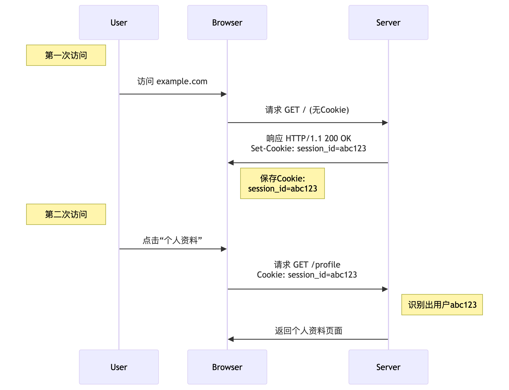
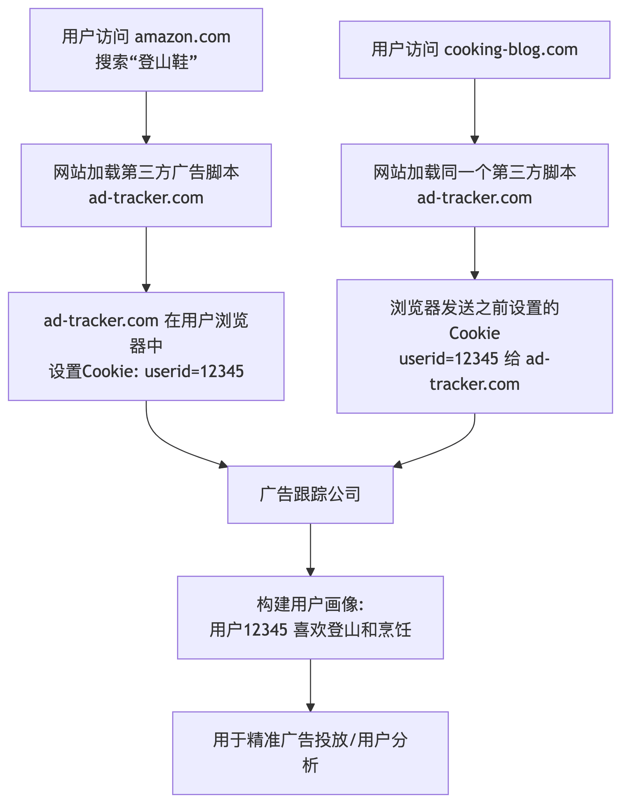
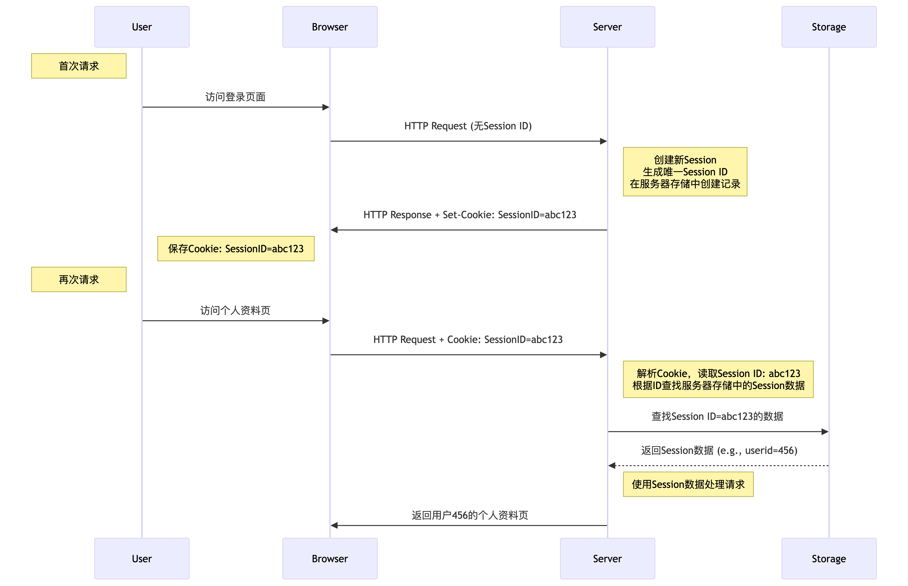
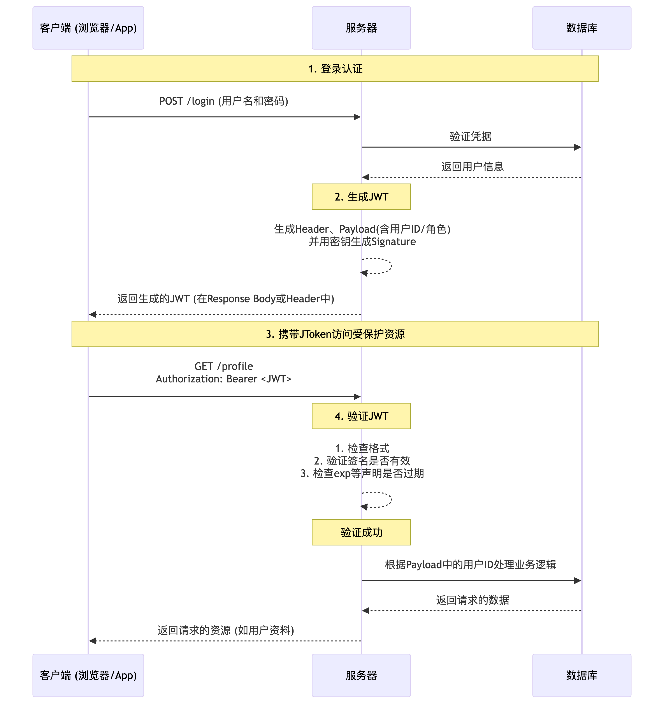
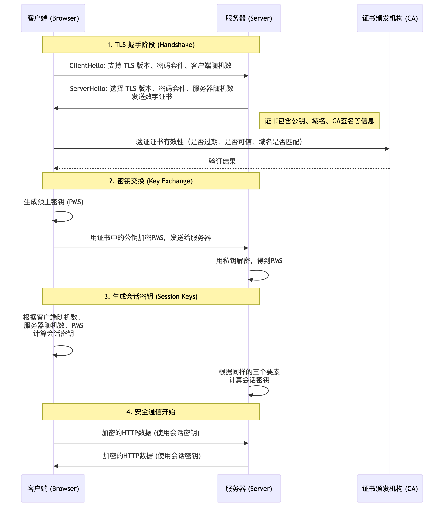

## TCP 是如何建立连接的，三次握手，四次挥手

::: details 参考答案
- 一、TCP 连接建立：三次握手 (Three-way Handshake)

    - 目的：`确认双方的发送和接收能力都正常，并同步初始序列号`，为可靠数据传输做准备。

    - 这个过程类似于两个人打电话建立通话：

        1. A： “喂，听得到吗？” （SYN 发起连接）

        2. B： “听得到，你听得到我吗？” （SYN-ACK）

        3. A： “我也听得到。” （ACK 确认连接）

        `-> 通话正式开始`。

    - 技术细节过程：假设`客户端（Client`）想要与`服务器（Server）`建立连接
        1. 第一次握手 (SYN)：`客户端`发送一个 TCP 报文。`不携带`应用层数据。客户端进入 `SYN-SENT (同步已发送)` 状态。
        2. 第二次握手 (SYN + ACK)：`服务器收到`客户端的 SYN 报文后，如果同意建立连接，则`回复一个 TCP 报文`。服务器进入 `SYN-RCVD (同步已收到)` 状态。
        3. 第三次握手 (ACK)：客户端收到服务器的 SYN-ACK 报文后。可以开始`携带应用层数`据。 客户端进入 `ESTABLISHED (已建立连接)` 状态。服务器收到这个 ACK 后，也进入 ESTABLISHED 状态。

        至此，`连接建立成功`，双方可以开始全双工的数据传输。

    - 为什么是三次，而不是两次？

    主要目的是`防止已失效的连接请求报文突然又传到了服务器`，从而导致错误。

- 二、TCP 连接断开：四次挥手 (Four-way Handshake)
    - 目的：`双方都确认要断开连接，并且确保对方的数据已经传输完毕`。
    - 这个过程类似于两个人结束通话：

        1. A： “我说完了，要挂电话了。” （FIN）

        2. B： “好的，我知道你说完了。” （ACK）... (B可能还有话要说)

        3. B： “我也说完了，可以挂了。” （FIN）

        4. A： “好的，拜拜。” （ACK）
       ` -> 通话结束。`
    - 技术细节过程：假设`客户端（`也可以是服务器）主动发起关闭连接。
        1. 第一次挥手 (FIN)： `客户端发送一个 TCP 报文`。客户端进入 FIN-WAIT-1 (终止等待1) 状态。
        2. 第二次挥手 (ACK)：`服务器收到 FIN 报文后`，发出确认报文。服务器进入 CLOSE-WAIT (关闭等待) 状态。此时 TCP 连接处于半关闭状态，客户端到服务器的连接关闭了，但服务器到客户端的连接仍然存在，服务器可能还有数据要发送给客户端。
        3. 第三次挥手 (FIN)：当`服务器`也`没有数据要发送给客户端时`，它`会发送一个 FIN 报文`。服务器进入 LAST-ACK (最后确认) 状态，等待客户端的最终确认。
        4. 第四次挥手 (ACK)：客户端收到服务器的 FIN 报文后，必须发出确认。客户端进入 TIME-WAIT (时间等待) 状态。客户端需要等待 2MSL (Maximum Segment Lifetime，最长报文段寿命，通常为 2 分钟) 时间后，才进入 `CLOSED` 状态。
:::

## HTTP 几个版本的区别
::: details 参考答案
| 特性维度         | HTTP/1.0      | HTTP/1.1        | HTTP/2           | HTTP/3                 |
| :--------------- | :------------ | :-------------- | :--------------- | :--------------------- |
| **连接方式**     | 非持久连接    | **持久连接**    | 多路复用         | 多路复用               |
| **HTTP 队头阻塞** | 有            | 有              | **解决**         | **解决**               |
| **TCP 队头阻塞**  | 有            | 有              | 有               | **解决** (使用QUIC)    |
| **服务器推送**   | 不支持        | 不支持          | **支持**         | 支持                   |
| **头部压缩**     | 无            | 无              | **HPACK**        | **QPACK**              |
| **传输协议**     | TCP           | TCP             | TCP              | **QUIC (基于UDP)**     |
| **安全性**       | 无要求        | 无要求          | 事实要求加密     | **强制加密**           |
| **连接建立**     | TCP三次握手   | TCP三次握手     | TCP+TLS握手      | **0-RTT/1-RTT快速握手** |
:::

## HTTP 常见的状态码
::: details 参考答案
| 范围  | 类别                 | 含义                                       |
| :---- | :------------------- | :----------------------------------------- |
| **1xx** | **信息性状态码**     | 请求已被接收，`继续处理`                     |
| **2xx** | **成功状态码**       | 请求已成功`被服务器接收、理解、并接受`       |
| **3xx** | **重定向状态码**     | `需要客户端采取进一步的操作`才能完成请求     |
| **4xx** | **客户端错误状态码** | 请求含有`语法错误`或者`无法被执行`             |
| **5xx** | **服务器错误状态码** | `服务器`在处理某个正确请求时`发生错误`         |

### 最常见的状态码详解

#### 1xx (信息性) - 不常见
| 状态码 | 含义                                                                 |
| :----- | :------------------------------------------------------------------- |
| **100** | Continue - 客户端应继续其请求                                        |
| **101** | Switching Protocols - 服务器`正在切换协议`（如切换到 WebSocket）       |

#### 2xx (成功) - 表示请求成功
| 状态码 | 含义                                                                 |
| :----- | :------------------------------------------------------------------- |
| **200** | OK - 请求成功 `最最常见的成功状态`。                                                        |
| **201** | Created - 成功`创建了新资源`（常用于 POST 或 PUT 请求）                                           |
| **202** | Accepted - 请求已接受，但`尚未处理完成`。适用于异步任务。                                 |
| **204** | No Content - 成功处理，但`无任何实体内容返回` （常用于 DELETE 请求或提交表单后不需要跳转页面的场景）                                |
| **206** | Partial Content - 成功`处理了部分范围请求` （如断点续传、视频拖拽播放）                           |

#### 3xx (重定向)
| 状态码 | 含义                                                                 |
| :----- | :------------------------------------------------------------------- |
| **301** | Moved Permanently - 永久重定向。`请求的资源已被永久移动到新的 URI`，返回信息会包括新的 URI。浏览器会`自动重定向到新地`址，并且搜索引擎会`更新其链接`。|
| **302** | Found - 临时重定向。请求的资源临时从不同的 URI 响应请求。浏览器`会重定向`，但搜索引擎`不会更新链接`。                                                   |
| **304** | Not Modified - 资源未修改，`使用缓存`                                  |
| **307** | Temporary Redirect - 临时重定向，与 302 类似，不改变请求方法                      |
| **308** | Permanent Redirect - 永久重定向，与 301 类似，不改变请求方法                      |

#### 4xx (客户端错误)
| 状态码 | 含义                                                                 |
| :----- | :------------------------------------------------------------------- |
| **400** | Bad Request - 错误的请求。（`如请求语法错误、参数错误`）                                           |
| **401** | Unauthorized - 需要身份认证。通常伴随着 `WWW-Authenticate` 头部，提示客户端如何进行认证。                                          |
| **403** | Forbidden - 服务器拒绝执行。（服务器知道你的身份，但你的`权限不足`）                                           |
| **404** | Not Found - 资源不存在                                               |
| **405** | Method Not Allowed - 请求方法不被允许。（`如对只支持 GET 的接口使用了 POST 方法`）                               |
| **408** | Request Timeout - 请求超时                                           |
| **429** | Too Many Requests - 请求频率过高，常用于限流（Rate Limiting）                                     |

#### 5xx (服务器错误)
| 状态码 | 含义                                                                 |
| :----- | :------------------------------------------------------------------- |
| **500** | Internal Server Error - 服务器内部错误 （`通常是后端代码 bug`）                             |
| **502** | Bad Gateway - 网关错误                                               |
| **503** | Service Unavailable - 服务不可用。服务器当前无法处理请求（`由于临时的服务器过载或维护`）                                     |
| **504** | Gateway Timeout - 网关超时                                           |

:::

## HTTP 常见 Header
::: details 参考答案
| 分类       | 主要功能                                   | 常见请求头（Examples）                            | 常见响应头（Examples）                  |
| :--------- | :----------------------------------------- | :------------------------------------------------ | :-------------------------------------- |
| **通用头** | 适用于请求和响应消息                       | `Cache-Control`, `Connection`, `Date`             | `Cache-Control`, `Connection`, `Date`   |
| **请求头** | 提供关于请求的更多信息                     | `Host`, `User-Agent`, `Accept`, `Authorization`   | -                                       |
| **响应头** | 提供关于响应的更多信息                     | -                                                 | `Server`, `Set-Cookie`, `ETag`          |
| **实体头** | 描述请求或响应的正文内容                   | `Content-Type`, `Content-Length`                  | `Content-Type`, `Content-Length`, `Last-Modified` |

---

### 一、通用头 (General Headers)

| 头部                | 描述                                                         | 示例                                                                 |
| :------------------ | :----------------------------------------------------------- | :------------------------------------------------------------------- |
| **`Cache-Control`** | 最重要的缓存控制头，指定缓存机制必须遵守的指令               | `Cache-Control: max-age=3600` (缓存1小时)<br>`Cache-Control: no-cache` (可缓存但需验证)<br>`Cache-Control: no-store` (禁止缓存) |
| **`Connection`**    | 控制当前事务完成后网络连接是否保持打开                       | `Connection: keep-alive` (保持连接)<br>`Connection: close` (关闭连接) |
| **`Date`**          | 消息发送的日期和时间                                         | `Date: Tue, 15 Nov 1994 08:12:31 GMT`                                |

### 二、请求头 (Request Headers)

| 头部                     | 描述                                                         | 示例                                                                 |
| :----------------------- | :----------------------------------------------------------- | :------------------------------------------------------------------- |
| **`Host`**               | HTTP/1.1 必需字段，指定请求的服务器的域名和端口号            | `Host: www.example.com:8080`                                         |
| **`User-Agent`**         | 允许服务器识别客户端的操作系统、浏览器和版本                 | `User-Agent: Mozilla/5.0 (Windows NT 10.0; Win64; x64) AppleWebKit/537.36` |
| **`Accept`**             | 内容协商，告知服务器客户端能够处理哪些类型的媒体（MIME类型） | `Accept: text/html, application/json`<br>`Accept: image/webp, image/*, */*` |
| **`Accept-Language`**    | 内容协商，告知服务器客户端偏好哪种自然语言                   | `Accept-Language: en-US, en;q=0.9, zh-CN;q=0.8`                      |
| **`Accept-Encoding`**    | 内容协商，告知服务器客户端能够理解的内容编码（压缩算法）     | `Accept-Encoding: gzip, deflate, br`                                 |
| **`Authorization`**      | 包含用于服务器验证用户代理身份的凭证                         | `Authorization: Bearer eyJhbGciOiJ...` (JWT)<br>`Authorization: Basic dXNlcjpwYXNz` (Basic) |
| **`Cookie`**             | 将之前由服务器通过 `Set-Cookie` 头部发送的 cookie 回传给服务器 | `Cookie: sessionId=abc123; username=john`                            |
| **`Referer`**            | 表示当前请求页面是从哪个页面链接过来的                       | `Referer: https://www.google.com/`                                   |
| **`Origin`**             | 表示跨域请求或POST请求的来源，用于CORS                       | `Origin: https://www.example.com`                                    |

### 三、响应头 (Response Headers)

| 头部                            | 描述                                                         | 示例                                                                 |
| :------------------------------ | :----------------------------------------------------------- | :------------------------------------------------------------------- |
| **`Server`**                    | 包含处理请求的服务器软件的信息                               | `Server: nginx/1.18.0`                                               |
| **`Set-Cookie`**                | 从服务器向用户代理发送 cookie                                 | `Set-Cookie: sessionId=abc123; Path=/; HttpOnly`                     |
| **`Location`**                  | 用于重定向，指示应将页面重定向到的 URL                        | `Location: /new-page.html`<br>`Location: https://example.com/login`  |
| **`Access-Control-Allow-Origin`** | CORS 核心头，指定哪些站点可以被允许以跨源方式访问资源        | `Access-Control-Allow-Origin: *` (允许所有)<br>`Access-Control-Allow-Origin: https://example.com` (允许特定源) |

### 四、实体头 (Entity Headers)

| 头部                 | 描述                                                         | 示例                                                                 |
| :------------------- | :----------------------------------------------------------- | :------------------------------------------------------------------- |
| **`Content-Type`**   | 极其重要，指示资源的 MIME 类型，告诉客户端如何解析内容        | `Content-Type: text/html; charset=utf-8`<br>`Content-Type: application/json`<br>`Content-Type: image/png` |
| **`Content-Length`** | 消息主体的大小（以字节为单位）                               | `Content-Length: 348`                                                |
| **`Content-Encoding`** | 指定对实体应用了何种编码（压缩）                             | `Content-Encoding: gzip`                                             |
| **`Last-Modified`**  | 资源最后修改的日期和时间，用于缓存验证                       | `Last-Modified: Tue, 15 Nov 1994 08:12:31 GMT`                       |
| **`ETag`**           | 缓存验证，资源的特定版本的标识符，比 `Last-Modified` 更精确  | `ETag: "33a64df551425fcc55e4d42a148795d9f25f89d4"`                   |

### 五、重要应用场景

| 场景             | 请求头示例                                      | 响应头示例                                      |
| :--------------- | :---------------------------------------------- | :---------------------------------------------- |
| **缓存控制**     | `Cache-Control: max-age=0`                      | `Cache-Control: public, max-age=3600`, `ETag: "abc123"` |
| **内容协商**     | `Accept: application/json`, `Accept-Language: zh-CN`, `Accept-Encoding: gzip` | `Content-Type: application/json`, `Content-Encoding: gzip` |
| **认证**         | `Authorization: Bearer <token>`                 | `WWW-Authenticate: Basic realm="Access to the staging site"` |
| **跨域 (CORS)**  | `Origin: https://www.example.com`               | `Access-Control-Allow-Origin: https://www.example.com`, `Access-Control-Allow-Methods: GET, POST` |
:::


## URL 包含哪些部分？
::: details 参考答案
```bash
  https://www.example.com:8080/path/to/myfile.html?key1=value1&key2=value2#SomewhereInTheDocument
  \___/   \_____________/ \__/\_____________________/ \_______________________/ \________________/
    |           |          |           |                       |                      |
  协议      主机名        端口        路径                  查询参数                 片段
(Scheme)   (Hostname)    (Port)      (Path)               (Query String)           (Fragment)
               |
            域名
          (Domain Name)
```
1. 协议： 指定浏览器使用哪种协议来请求资源。它告诉浏览器如何与服务器通信。
    - `https://`： 安全的超文本传输协议（加密，使用 SSL/TLS）。

    - `http://`： 普通的超文本传输协议（不加密，已逐渐被 HTTPS 取代）。

    - `ftp://`： 文件传输协议，用于上传和下载文件。

    - `mailto`:： 用于打开电子邮件客户端。

    - `file:///`： 用于访问本地计算机上的文件。
2. 主机名： 指定资源所在的服务器的地址。
    - 域名：如 www.example.com
        - 子域名：www
        - 主域名：example
        - 顶级域名：com
    - IP 地址，如 192.168.1.1
3. 端口： 指定服务器上用于处理请求的特定“门”或`服务`。一台服务器可以同时提供多种服务（如 Web、邮件），端口号用于区分它们。

4. 路径： 定位到服务器上的特定资源（如一个页面、一张图片、一个脚本文件）。

5. 查询参数： 用于向服务器`传递额外的参数`。通常用于搜索、筛选、分页等场景。

6. 片段： 也称为“`锚点`”，`用于指定网页内部的某个特定位置`。浏览器收到页面后会自动滚动到该位置。
:::

## GET 和 POST 请求的区别
::: details 参考答案
- `GET` 的语义是 `“获取”` 数据，它应该是安全且幂等的（`多次执行效果相同`）。

- `POST` 的语义是 `“提交/创建”` 数据，它通常是不安全且不幂等的（`每次执行可能产生不同结果`）。

1. 数据传递方式
    - GET： 数据通过 URL 的`查询字符串`（Query String） 传递。

        格式：`http://example.com/page?**key1=value1&key2=value2**`

        `数据完全暴露在地址栏中`。

    - POST： 数据放在`请求体`（Request Body） 中。

        `数据不会显示在地址栏`，相对更隐蔽（但绝不是加密，用 HTTPS 才是加密）。

2. 缓存与可收藏性

    - GET 请求因为幂等且安全，可以被浏览器、代理服务器主动缓存，也可以被收藏为书签。

    - POST 请求因为不安全且不幂等，`不会被缓存`，也`不能被收藏`。
:::

## Ajax Fetch Axios 三者有什么区别？
::: details 参考答案
| 特性 | Ajax (基于 XMLHttpRequest) | Fetch API | Axios |
| :--- | :--- | :--- | :--- |
| **本质** | **一种技术概念**，通常由 `XMLHttpRequest` 对象实现 | **浏览器原生 API** | **第三方 JavaScript 库** |
| **基于** | 回调函数 (Callback) | **Promise** | **Promise** |
| **语法** | 冗长、复杂 | 简洁、现代 | 更简洁、直观 |
| **请求/响应转换** | 需要手动进行 JSON 转换 | 需要手动进行 JSON 转换 (`response.json()`) | **自动**进行 JSON 数据转换 |
| **请求取消** | 原生支持（`xhr.abort()`） | 通过 `AbortController` 支持 | **原生支持**（现使用 `AbortController`） |
| **超时设置** | 原生支持 (`xhr.timeout`) | **不支持**，需用 `AbortController` 模拟 | **原生支持** |
| **浏览器兼容性** | 非常好（几乎所有浏览器） | 现代浏览器（IE 完全不支持） | 好（通过封装兼容旧浏览器） |
| **进度监控** | 支持 (`xhr.upload.onprogress`) | **不支持** | **支持**（浏览器环境下） |
| **CSRF 防护** | 需手动设置 | 需手动设置 | **内置支持**（XSRF Token） |
| **拦截器** | 需手动实现 | 无 | **强大**的请求/响应拦截器 |
| **HTTP 错误处理** | 不会 reject HTTP 错误码（如 404, 500） | **默认不会 reject HTTP 错误码**（只对网络错误 reject） | **会自动 reject HTTP 错误码**（状态码非 2xx） |
| **Node.js 支持** | 否 | 否（需使用 `node-fetch` 等polyfill） | **是** |
| **并发请求** | 需手动实现 | `Promise.all()` | `axios.all()` + `axios.spread()` |
| **默认配置** | 需手动封装 | 需手动封装 | **支持** (`axios.defaults`) |
| **实例创建** | 需手动封装 | 需手动封装 | **支持** (`axios.create()`) |
| **下载进度** | **支持** | 不支持 | **支持** |
| **上传进度** | **支持** | 不支持 | **支持** |

### 代码示例对比

#### Ajax (XHR)
```javascript
// 使用原生 XHR 实现 Ajax 请求
const xhr = new XMLHttpRequest();
xhr.open('GET', 'https://api.example.com/data');
xhr.responseType = 'json';

// 成功回调
xhr.onload = function() {
  if (xhr.status >= 200 && xhr.status < 300) {
    console.log('Success:', xhr.response);
  } else {
    console.error('Error:', xhr.statusText);
  }
};

// 失败回调
xhr.onerror = function() {
  console.error('Request failed');
};

// 发送请求
xhr.send();
```

#### Fetch API
```javascript
// 使用 Fetch API
fetch('https://api.example.com/data')
  .then(response => {
    // 1. 检查响应是否成功
    if (!response.ok) {
      throw new Error('Network response was not ok ' + response.status);
    }
    // 2. 解析 JSON 响应体
    return response.json();
  })
  .then(data => {
    console.log('Success:', data);
  })
  .catch(error => {
    // 这里会捕获网络错误和上面手动抛出的错误
    console.error('Error:', error);
  });

// 使用 async/await 更简洁
async function fetchData() {
  try {
    const response = await fetch('https://api.example.com/data');
    if (!response.ok) throw new Error(`HTTP error! status: ${response.status}`);
    const data = await response.json();
    console.log('Success:', data);
  } catch (error) {
    console.error('Error:', error);
  }
}
```

#### Axios
```javascript
// 使用 Axios (首先需要引入: <script src="..."> 或 npm install axios)
axios.get('https://api.example.com/data')
  .then(response => {
    // 1. 数据自动解析在 response.data 中
    // 2. HTTP 错误码（如 404）会自动进入 catch
    console.log('Success:', response.data);
  })
  .catch(error => {
    // 统一处理所有错误（网络错误、HTTP错误）
    console.error('Error:', error);
  });

// Axios 的强大功能示例：

// - 拦截器：统一添加token或处理响应
axios.interceptors.request.use(config => {
  config.headers.Authorization = 'Bearer my-token';
  return config;
});

// - 取消请求
const controller = new AbortController();
axios.get('/foo/bar', { signal: controller.signal });
controller.abort(); // 取消请求

// - 默认配置
axios.defaults.baseURL = 'https://api.example.com';
axios.defaults.timeout = 5000;
```
:::

## Fetch 和 XMLHTTPRequest 有什么区别？
::: details 参考答案
XMLHttpRequest (基于回调，冗长复杂) Fetch (基于 Promise，简洁清晰)


1. HTTP 错误处理（最重要的区别）
    - `XMLHttpRequest`： 在 `onload` 回调中，你必须手动检查 `xhr.status` 属性来判断请求是否成功。即使返回 404 或 500，也会触发 onload 而不是 onerror。
    - `Fetch`： `fetch()` Promise 只有在网络连接失败时才会被 reject。

2. 数据解析
    - `XHR`： 响应数据存储在 `xhr.responseText（字符串）`或 `xhr.response` 中，你需要自己用 `JSON.parse()` 来解析。
    - `Fetch`： Response 对象提供了多种方法来解析 body 内容（如 `.json()`, `.text()`, `.blob()`）。

3. 请求取消与超时
    - XHR： 原生支持 `xhr.abort()` 来取消请求，也原生支持 `xhr.timeout` 属性设置超时时间。
    - Fetch： 最初没有内置的取消或超时机制。现在`需要通过 AbortController 来实现`，它可以同时用于取消请求和实现超时功能。

4. 进度监控
    - XHR： 有原生支持，可以通过监听 `xhr.upload.onprogress（上传进度）`和 `xhr.onprogress（下载进度）`事件来实时监控。

    - Fetch： 目前`没有`官方API来获取请求的进度状态。
:::

## 什么是 Restful API ？
::: details 参考答案
- RESTful API 就是一个`按照 REST 原则`来设计和实现的应用程序`编程接口`。

- `REST 的六个核心约束`:
    1. 客户端-服务器架构： 用户界面（客户端）和数据存储（服务器）分离
    2. 无状态： 服务器不会存储任何客户端会话状态。
    3. 可缓存： 服务器响应必须明确指示其响应是否可缓存。
    4. 统一接口
    5. 分层系统： 系统可以由多个层次组成（如安全层、负载均衡层、应用层）
    6. 按需代码： 服务器可以临时扩展或自定义客户端的功能，例如通过发送 JavaScript 代码给浏览器执行。

- `RESTful API 的主要特征（实践中的体现）`
    1. 以资源为中心 - `API 的核心是资源`。资源可以是任何事物，如用户、产品、订单等。每个资源都有一个唯一的标识符，`通常是 URI`。
        - `/users` - 用户集合
        - `/users/123` - ID 为 123 的特定用户
        - `/users/123/orders` - 用户 123 的所有订单
    2. 使用标准的 HTTP 方法 - 使用 HTTP 协议定义的方法来对资源执行` CRUD `操作，这是“统一接口”原则的体现。

        | HTTP 方法 | 操作         | 描述                                                                 | 幂等性 | 安全性 | 示例                          |
        | :-------- | :----------- | :------------------------------------------------------------------- | :----- | :----- | :---------------------------- |
        | **GET**   | **Read**     | **获取**资源。用于检索数据，不应产生副作用。                           | 是     | 是     | `GET /users` (获取用户列表)     |
        | **POST**  | **Create**   | **创建**新资源。用于提交数据，通常会导致服务器状态变化。               | 否     | 否     | `POST /users` (创建新用户)      |
        | **PUT**   | **Update/Replace** | **整体更新/替换**资源。用于更新现有资源的全部内容。                  | 是     | 否     | `PUT /users/123` (更新用户123)  |
        | **PATCH** | **Update/Modify** | **部分更新**资源。用于更新资源的某些字段，而不是全部内容。           | 是     | 否     | `PATCH /users/123` (更新邮箱)   |
        | **DELETE**| **Delete**   | **删除**资源。用于移除服务器上的资源。                               | 是     | 否     | `DELETE /users/123` (删除用户123) |


    3. 通信是无状态的 - 每个请求都是独立的，服务器不保存客户端的任何上下文信息。`认证信息（如 Token）必须包含在每一个请求中`。
    4. 返回统一的数据格式 - 通常使用 `JSON` 作为数据交换的格式，有时也会使用 XML。
    5. 利用 HTTP 状态码
        - `200 OK` - 请求成功

        - `201 Created` - 资源创建成功

        - `400 Bad Request` - 客户端请求错误

        - `401 Unauthorized` - 未认证

        - `403 Forbidden` - 无权限

        - `404 Not Found` - 资源不存在

        - `500 Internal Server Error` - 服务器内部错误
:::

## 什么是 GraphQL ？
::: details 参考答案
GraphQL 是一个`用于 API 的 查询语言` 和一个用你已有的数据来完成这些查询的 `运行时`。

- GraphQL 的核心组件
    1. Schema（模式定义）：它使用`强类型系统`来明确定义 API 所能提供的所有数据、查询、变更和订阅，称为 `SDL`。
    ```js
    type Article {
        id: ID!
        title: String!
        content: String
        author: Author!
    }

    type Author {
        id: ID!
        name: String!
        articles: [Article!]!
    }

    type Query {
        article(id: ID!): Article
        author(id: ID!): Author
    }
    ```

    2. Resolver（解析器）： `是连接 Schema 和数据的桥梁`。

    3. 操作类型：

        - `Query（查询）`： 用于获取数据（相当于 REST 的 GET）。

        - `Mutation（变更）`： 用于修改数据（创建、更新、删除，相当于 REST 的 POST, PUT, DELETE）。

        - `Subscription（订阅）`： 用于监听数据变化，通常通过 WebSocket 实现实时更新（如聊天消息、通知）。

- GraphQL优点
    1. 高效的数据获取
    2. 强类型 schema
    3. 前端主导
    4. 单一端点

- GraphQL缺点
    1. 查询复杂性
    2. 缓存复杂
    3. 学习曲线
    4. 文件上传： 原生 GraphQL 不直接支持文件上传，`需要额外扩展`（如 graphql-upload）或通过传统 REST 端点处理。

:::

## 如何理解 cookie

::: details 参考答案
Cookie 是一小段文本信息（`通常不超过 4KB`），由服务器通过 HTTP 响应头的 `Set-Cookie` 字段发送给浏览器。`浏览器会将其存储起来`，并在后续对同一服务器的请求中，通过 HTTP 请求头的 `Cookie` 字段自动回传这段信息。

- Cookie 的工作流程（这是关键）


# Cookie 的主要属性

| 属性 | 作用 | 示例 | 解释 |
| :--- | :--- | :--- | :--- |
| **`Name=Value`** | **必需**。Cookie 的名称和值。 | `session_id=abc123` | 键值对，是 Cookie 的核心内容。 |
| **`Expires`** | **绝对过期时间**。指定一个具体的 GMT 时间，到期后 Cookie 失效。 | `Expires=Wed, 21 Oct 2025 07:28:00 GMT` | 设置一个具体的过期日期和时间。 |
| **`Max-Age`** | **相对过期时间**。指定从设置开始多少秒后 Cookie 失效。 | `Max-Age=3600` | 设置多少秒后过期（例如 1 小时）。优先级高于 `Expires`。 |
| **`Domain`** | **作用域**。指定哪些域名会携带此 Cookie。 | `Domain=example.com` | 访问 `example.com` 或其子域（如 `shop.example.com`）都会发送此 Cookie。如不指定，默认为当前域名（不包含子域）。 |
| **`Path`** | **路径**。指定 URL 路径前缀，只有匹配的路径才会携带 Cookie。 | `Path=/admin` | 只有访问 `/admin` 及其子路径（如 `/admin/users`）时才会发送。默认为 `/`，即当前站点的所有路径。 |
| **`Secure`** | **安全传输**。 | `Secure` | 此 Cookie 只会在 **HTTPS** 加密连接下被发送，防止在 HTTP 明文传输中被窃听。 |
| **`HttpOnly`** | **防脚本窃取**。 | `HttpOnly` | 禁止 JavaScript 通过 `document.cookie` API 访问此 Cookie，**有效防范 XSS 攻击**，保护敏感 Cookie（如 Session ID）。 |
| **`SameSite`** | **防CSRF攻击**。控制第三方网站发起的请求是否携带 Cookie。 | `SameSite=Lax`<br>`SameSite=Strict`<br>`SameSite=None` | `Lax`（宽松）：大多数跨站请求不发送，但导航（如点击链接）会发送。<br>`Strict`（严格）：任何跨站请求都不发送。<br>`None`（无）：所有请求都发送。**必须与 `Secure` 属性一同使用**。 |
| **`Priority`** | **优先级**。在浏览器 Cookie 数量超限时，决定哪些 Cookie 优先被删除。 | `Priority=High` | `Low`: 低优先级<br>`Medium`: 中优先级（默认）<br>`High`: 高优先级。非标准属性，支持性有限。 |

---

### 属性组合示例

#### 创建一个安全的会话 Cookie
```http
Set-Cookie: sessionId=abc123; Expires=Wed, 21 Oct 2025 07:28:00 GMT; Domain=.example.com; Path=/; Secure; HttpOnly; SameSite=Lax
```
*解释：创建一个名为 `sessionId` 的 Cookie，有效期至 2025年10月21日，对 `example.com` 的所有子域和所有路径有效，只能在 HTTPS 下传输，JS 无法访问，并启用宽松的跨站限制。*

#### 创建一个临时偏好设置 Cookie
```http
Set-Cookie: theme=dark; Max-Age=86400; Path=/
```
*解释：创建一个名为 `theme` 的 Cookie，有效期为 1 天 (86400秒)，对本站的所有路径有效。*

### 关键注意事项

1.  **`SameSite=None` 必须与 `Secure` 一同使用**，否则会被现代浏览器拒绝。
2.  **`HttpOnly`** 是保护身份验证 Cookie 免受 XSS 攻击的最重要属性之一。
3.  如果**不设置 `Expires` 或 `Max-Age`**，Cookie 将成为**会话 Cookie**，在浏览器关闭时自动删除。
4.  指定 `Domain` 时（如 `.example.com`），Cookie 对**子域也有效**；如果不指定，则默认为当前精确域名。
:::

## 为何现代浏览器都禁用第三方 cookie
::: details 参考答案
- `第一方 Cookie`： 由你正在访问的网站（地址栏中的域名）直接设置的 Cookie。
    - 例子： 你访问 amazon.com，它给你设置一个 Cookie 来记住你的登录状态、购物车内容。这是有用的、必要的。

    - 用途： 核心功能（`会话管理、个性化设置`）。

- `第三方 Cookie`： 由你正在访问的网站嵌入的其他第三方域名设置的 Cookie。

    - 例子： 你访问一个新闻网站 `news.com`，这个网站上有一个来自 `doubleclick.net` (Google 的广告公司) 的广告横幅。这个广告横幅在你的浏览器里设置了一个属于 doubleclick.net 的 Cookie。这个 Cookie 就是第三方 Cookie。

    - 用途： 几乎主要用于`跨站跟踪、广告投放和重定向`。
- 第三方 Cookie 是如何工作的？（跟踪原理）


- 为何要禁用？核心原因
    1. 侵犯用户隐私：
        - 第三方 Cookie 可以跨站点追踪用户行为
        - 广告商可以构建用户画像和浏览历史
        - 用户数据可能被未经授权收集和使用
    2. 安全风险
        - 增加 CSRF（跨站请求伪造）攻击风险
        - 可能被用于会话劫持
        - 恶意网站可能滥用第三方 Cookie
    3. 浏览器的影响：`Safari 和 Firefox` 很早就开始严格限制第三方 Cookie，`Google 的 Chrome`原计划是限制，目前搁置，无痕模式下可以自动屏蔽第三方 Cookie。

- 替代方案
    1. 强化第一方数据 (First-Party Data)
    2. 上下文广告 (Contextual Advertising) - 根据当前正在浏览的网页内容来投放相关广告，而不是根据用户是谁。
    3. 统一 ID 2.0 (Unified ID 2.0) - 将用户自愿提供的身份信息（如经过哈希加密处理的邮箱地址）转换为一个标准的、可互通的广告标识符。
    4. Google 的隐私沙盒 (Privacy Sandbox) - 在阻止跨站跟踪的同时，满足广告主的核心需求（广告投放和效果衡量）。
:::

## 如何理解 Session ？

::: details 参考答案
- Session 是一种`在服务器端存储用户特定数据的机制`，用于跟踪用户在与 Web 应用程序交互期间的状态。

- Session 的工作流程（这是关键）


- 核心要点
    1. 数据存储在服务器，这比存在客户端的 Cookie 安全得多
    2. 只有 Session ID 在客户端
    3. Session ID 通过 Cookie 传递

# Session vs. Cookie：核心区别总结

| 特性 | **Session** | **Cookie** |
| :--- | :--- | :--- |
| **存储位置** | **服务器端** (内存、数据库、缓存中) | **客户端** (用户浏览器中) |
| **安全性** | **较高**，敏感数据存储在服务器，不易被窃取或篡改 | **较低**，数据存储在客户端，可能被查看、修改或盗用 |
| **容量限制** | 理论上只受服务器资源限制 | 每个域名下最多约 **50个** Cookie，每个最大 **4KB** |
| **生命周期** | 通常与用户会话相关，浏览器关闭或超时后失效 | 可设置长期有效（通过 `Expires` 或 `Max-Age` 属性） |
| **数据类型** | 可存储任何可序列化的对象（复杂数据类型） | 只能存储字符串（简单键值对） |
| **主要用途** | 存储敏感、临时的用户状态数据 | 存储不敏感的数据或用于会话跟踪 |
| **性能影响** | 会给服务器带来存储和查找的开销 | 几乎无服务器开销，但每次请求都会携带，增加带宽 |
| **依赖关系** | 通常依赖 Cookie 来传递 Session ID | 可以独立使用，也可用于实现 Session 机制 |
| **示例内容** | `{ user_id: 123, username: 'alice', cart_items: [...] }` | `session_id=abc123; theme=dark` |

:::

## 什么是 JWT 描述它的工作过程
::: details 参考答案
JWT 是 `JSON Web Token` 的缩写。它是一种开放标准，定义了一种紧凑且自包含的方式，用于在各方之间作为 JSON 对象安全地传输信息。

- JWT 的组成结构：三部分（一个很长的字符串，用点`.`分隔成三部分）：`aaaaaa.bbbbbb.cccccc`
    1. `Header (头部)` 通常由两部分组成：

        - `typ`： 令牌类型，就是 JWT。

        - `alg`： 签名算法，如 HMAC SHA256 (HS256) 或 RSA。
    2. `Payload (载荷)` 包含的是声明。声明分三种类型：

        - 注册声明： 预定义的、建议但不强制使用的标准字段。

            iss (issuer)： 签发人

            exp (expiration time)： 过期时间

            sub (subject)： 主题

            aud (audience)： 受众

        - 公共声明： 可以添加任何信息的自定义字段，但最好避免和已注册声明冲突。

        - 私有声明： 用于在同意使用它们的各方之间共享信息的自定义字段。

        `重要提示`： 尽管载荷是经过 `Base64Url` 编码的，但它`不是加密的`。任何人拿到 JWT 都可以解码出载荷的内容。因此，`绝对不能在载荷中存放敏感信息（如密码）`。

    3. `Signature (签名)` 签名是 JWT 的安全核心。它的生成方式如下：
        ```bash
        签名 = 算法(
            base64UrlEncode(header) + "." +
            base64UrlEncode(payload),
            密钥(secret)
        )
        ```
        签名的作用是：

        `验证发送者的身份`： 只有持有密钥的服务器才能生成有效的签名。

        `确保信息未被篡改`： 如果头部或载荷在传输过程中被修改，服务器重新计算出的签名将与原来的不匹配，从而验证失败。

- JWT 的工作过程（认证流程）


- JWT 的优点
    1. 无状态 / 可扩展：服务器`不需要在内存或数据库中存储会话信息`。Token 本身包含了所有所需信息。
    2. 跨域友好： 由于是基于 Token 的，它可以轻松`解决跨域问题（CORS）`，非常适合单页应用和前后端分离架构。
    3. 多功能性： 不仅可以用于认证，还可以用于安全地交换信息。

- JWT 的缺点
    1. Token 无法主动失效： 由于服务器无状态，一旦签发了 JWT，在它过期之前都会有效。
    2. 安全性依赖密钥管理： 如果签名密钥泄露，攻击者可以伪造任意 Token，系统将完全失控。
    3. Payload 仅编码不加密： 敏感信息不能放入 Payload。
    4. Token 体积： 比 Session ID 大得多，如果放入过多信息，每次请求都会带来额外的开销。
:::

## JWT 如何自动更新 token ？
::: details 参考答案
最常见的解决方案是 `Refresh Token（刷新令牌）`模式。

- 核心思想：双 Token 机制
    1. `Access Token (访问令牌)`：
        生命周期： 短命的。`过期时间较短`，例如 15分钟到1小时。

        用途： `用于访问受保护的资源`（如获取用户数据、调用 API）。它直接包含在请求的 `Authorization` 头中。

        特点： `高风险`，因为一旦泄露，攻击者window of attack（攻击窗口期）也很短。

    2. `Refresh Token (刷新令牌)`：

        生命周期： 长命的。`过期时间很长`，例如 7天、30天，甚至更长。

        用途： 唯一用途就是用来`获取新的 Access Token`。它不会用于直接访问资源。

        特点： `低频率使用`，被严格保管在服务器端。如果泄露，风险极高，因此需要被安全地存储并可被服务器撤销。
- 工作流程：

    1. 用户登录后获取 access token 和 refresh token
    2. 使用 access token 访问接口
    3. access token 过期时，使用 refresh token 获取新的 access token
    4. refresh token 过期时，需要重新登录

- 前端实现逻辑（伪代码）
```js
// 使用 Axios 拦截器实现自动 Token 刷新
let isRefreshing = false;
let failedQueue = [];

// 响应拦截器
axios.interceptors.response.use(
  (response) => response,
  (error) => {
    const originalRequest = error.config;

    // 如果是 401 错误且请求不是 /refresh 本身，并且尚未开始刷新
    if (error.response.status === 401 && !originalRequest._retry && originalRequest.url !== '/auth/refresh') {
      if (isRefreshing) {
        // 如果正在刷新，将失败的请求加入队列，等待新token
        return new Promise((resolve, reject) => {
          failedQueue.push({ resolve, reject });
        }).then(token => {
          originalRequest.headers['Authorization'] = 'Bearer ' + token;
          return axios(originalRequest);
        }).catch(err => {
          return Promise.reject(err);
        });
      }

      originalRequest._retry = true; // 标记此请求已重试
      isRefreshing = true;

      // 从安全存储中获取 refreshToken
      const refreshToken = localStorage.getItem('refreshToken'); 

      return new Promise((resolve, reject) => {
        // 调用刷新端点
        axios.post('/auth/refresh', { refresh_token: refreshToken })
          .then(({ data }) => {
            // 刷新成功！
            const newAccessToken = data.access_token;
            localStorage.setItem('accessToken', newAccessToken); // 存储新 accessToken
            if (data.refresh_token) {
              localStorage.setItem('refreshToken', data.refresh_token); // 存储新 refreshToken（如果启用轮转）
            }

            // 更新后续请求的默认Authorization头
            axios.defaults.headers.common['Authorization'] = 'Bearer ' + newAccessToken;
            // 重试原始请求
            originalRequest.headers['Authorization'] = 'Bearer ' + newAccessToken;
            
            // 处理队列中所有失败的请求
            failedQueue.forEach(promise => promise.resolve(newAccessToken));
            failedQueue = [];
            
            resolve(axios(originalRequest));
          })
          .catch((err) => {
            // 刷新也失败了（如refreshToken过期），清空所有token，让用户重新登录
            localStorage.removeItem('accessToken');
            localStorage.removeItem('refreshToken');
            window.location.href = '/login'; // 跳转到登录页
            reject(err);
          })
          .finally(() => {
            isRefreshing = false;
          });
      });
    }

    return Promise.reject(error);
  }
);
```

- 安全最佳实践
    1. 使用 HttpOnly Cookie 存储 Refresh Token
    2. 启用 `Refresh Token Rotation`： 每次使用 Refresh Token 后都使其失效并颁发一个新的。
    3. 设置较短的 Access Token 过期时间： 通常为 15-30 分钟，将泄露风险窗口降到最低。
    4. 服务器端持久化存储并管理 Refresh Token： 必须能够查询、使 Refresh Token 失效，这是实现`用户“注销”功能`的根本。
    5. 为 Refresh Token 设置较长的合理过期时间： 例如 7 天，平衡安全性和用户体验。
:::

## 什么是 SSO 单点登录，描述它的工作过程
::: details 参考答案
SSO 是 Single Sign-On 的缩写，中文叫“单点登录”。它是`一种身份认证方案`，允许用户使用一组凭证（如用户名和密码）`登录一次`，即可获得`访问多个相关但独立的软件系统`（称为“应用”或“服务”）的权限，而无需在每个系统上重新登录。


- 工作过程详解（基于标准的 SAML 或 OAuth/OIDC 流程）
    1. 用户访问应用： 用户试图访问 app.example.com。
    2. 应用检查登录状态： 应用发现用户`没有它的本地会话（即没有它的 Cookie）`，于是将用户`重定向到信任的认证中心`，并附上自己的身份和回调地址。
    3. 认证中心检查全局登录状态：
        - 如果`用户已经登录过`认证中心（即浏览器里有认证中心的 SSO Cookie），则`直接进入认证中心创建令牌`。这是`实现“单点”的关键`！
        - 如果`用户未登录`，认证中心则`呈现登录页面`。用户进行主登录后，再进入认证中心创建令牌。
    4. 认证中心将令牌返回给应用
    5. 应用验证令牌：令牌验证通过后，应用创建本地会话。至此，用户就算登录了这个应用。
    6. 用户访问资源： 应用将用户重定向到他最初想访问的页面，用户即可正常使用该应用。

- SSO 的优点
    1. 极佳的用户体验： 只需记住一套密码，登录一次，即可访问所有授权应用，`无需反复登录`。
    2. 提升安全性
    3. 降低管理成本： IT管理员只需在`一个中心点管理用户账户和权限`

- SSO 的缺点
    1. 单点故障： 如果认证中心宕机，所有依赖它的应用都将无法登录。
    2. 实现复杂
    3. 初始成本高： 需要前期投入和规划。
:::

## 什么是跨域？如何实现跨域通讯？
::: details 参考答案
跨域指的是浏览器出于安全考虑，限制一个源的脚本与另一个源的资源进行交互。这是`浏览器的同源策略所导致的行为`。

同源策略是：如果`两个 URL 的协议、域名、端口三者完全相同`，则它们是同源的，浏览器允许它们自由交互。`只要有一项不同，就是跨域`，浏览器就会施加限制。

- 跨域限制的行为主要包括：
    1. AJAX / Fetch 请求
    2. Web 字体、WebGL 纹理
    3. Cookie、LocalStorage、IndexedDB 的读取。

    注意： 有些标签允许跨域加载资源，如` 、<link>、<script>`。这是 `JSONP` 实现的基础。

- 如何实现跨域通信？
    1. JSONP
        - 原理： 利用 `<script>` 标签没有跨域限制的特点来实现的临时方案。
        - 优点： 兼容性极好（支持老式浏览器）。
        - 缺点： 仅支持 GET 请求，不支持 POST 等其他方法。安全性差，容易遭受 XSS 攻击。一种过时的 Hack，`现代开发中已不推荐使用`。
    2. CORS
        - 原理： `跨域资源共享`。这是 W3C 标准，也是现代`浏览器处理跨域问题的首选和官方方案`。
        - 过程（对于复杂请求）：
            1. 浏览器先发送一个 `OPTIONS` 方法的`预检请求到目标服务器`。
            2. 服务器响应这个预检请求，在响应头中声明允许的源、方法、头信息等。
                ```http
                Access-Control-Allow-Origin: https://www.my-site.com // 允许的源
                Access-Control-Allow-Methods: GET, POST, PUT // 允许的方法
                Access-Control-Allow-Headers: Content-Type, Authorization // 允许的头部
                ```
            3. 浏览器检查这些响应头，如果当前请求符合服务器声明的规则，则继续发送真正的请求（如 POST）；否则，报错并阻止请求。
        - 优点： 功能强大，支持所有类型的 HTTP 请求，是官方标准。
        - 缺点： `需要服务器端配合设置`。如果服务器不设置 `Access-Control-Allow-Origin`，前端无法绕过。
    3. 服务器代理
        - 原理： “`浏览器有同源策略，但服务器没有`”。既然浏览器不能直接请求跨域 API，那就先请求自己的同源服务器，再由自己的服务器去请求那个跨域 API，最后将结果返回给浏览器。

        - 过程：

            1. 前端请求： `GET /api/users` (请求自己的服务器)

            2. 你的服务器（如 Nginx 或 Node.js 应用）接收到 /api/users 请求。

            3. 你的服务器内部去请求真正的目标 API： `GET https://api.other-site.com/users`。

            4. 你的服务器拿到数据后，再返回给前端。

        - 优点： 对前端开发者完全透明，无需任何跨域配置，浏览器不会报错。

        - 缺点： 需要服务器端额外的开发和配置工作。
    4. WebSocket
        - 原理： `WebSocket` 是一种双向通信协议，在`建立连接时使用的 HTTP 协议本身不受同源策略限制`。

        - 适用场景： 适用于需要`全双工、实时、长连接的跨域通信`，如聊天室、实时游戏。
    5. postMessage
        - 原理： 这是 HTML5 提供的一个 API，`允许不同源的窗口/iframe` 之间安全地进行双向通信。

        - 过程：

            一个窗口（如 `https://a.com`）可以向另一个窗口（如 `https://b.com`）的 window 对象发送消息：`otherWindow.postMessage('Hello!', 'https://b.com')`。

            目标窗口需要通过`监听 message 事件`来接收消息。

        - 适用场景： 主要用于与嵌入的第三方 iframe 或弹出的新窗口进行通信。
:::

## HTTP 请求跨域时为何要发送 options 请求
::: details 参考答案
浏览器发送 `OPTIONS 请求（预检请求）` 是 `CORS` 机制的一部分。其核心目的是：

为了安全起见，浏览器必须先通过一个“预检”请求，询问目标服务器是否允许当前网页源使用`特定的真实请求方法（如 PUT, DELETE`）和`头信息（如 Authorization）`，只有得到服务器的明确许可后，浏览器才会发出真实的请求。

- 哪些请求会触发预检请求？

    CORS 将请求分为两类：简单请求和非简单请求。`只有非简单请求才会触发预检请求`。
    1. `简单请求（不会触发预检）` 必须同时满足以下所有条件：
        - 方法： `GET`、`HEAD`、`POST`
        - 头信息： 只能包含以下安全的头部：

            `Accept`

            `Accept-Language`

            `Content-Language`

            `Content-Type (仅限 application/x-www-form-urlencoded, multipart/form-data, text/plain)`

        - 其他： 请求中的任何 `XMLHttpRequestUpload` 对象均`没有注册`任何事件监听器；请求中没有使用 `ReadableStream` 对象。

    `例如`：一个使用 POST 方法、`Content-Type: application/x-www-form-urlencoded` 的表单提交是简单请求，不会触发预检。
    2. `非简单请求（会触发预检）` 只要不满足上述任一条件的请求，就是非简单请求。常见情况包括：
        - 使用了非简单方法： `PUT`, `DELETE`, `PATCH`, `CONNECT` 等。

        - 包含了非简单头： 如 `Authorization（携带Token）`、`Content-Type: application/json`、`自定义头（如 X-Custom-Header）`。

        - 其他： 如使用了非简单的 Content-Type。

    `例如`：一个使用 DELETE 方法，或者 Content-Type: application/json 的 POST 请求，都会触发预检。

- 预检请求的完整工作流程
    1. 浏览器发送预检请求
    2. 服务器响应预检请求
    3. 浏览器检查并发送真实请求：
        - 如果`全部允许`，浏览器就会`发出真实的请求`。

        - 如果有`任何一项不被允许`，浏览器就会在`控制台抛出 CORS 错误`，并`阻止真实请求的发出`。
:::

## options 请求会携带 cookie 吗
::: details 参考答案
`不会`。对于标准的预检 OPTIONS 请求，浏览器绝对不会携带认证凭证（如 `Cookie、Authorization` 头）。

`OPTIONS 请求的唯一目的是询问服务器是否允许后续的真实请求。`

- 如何让“真实请求”携带 Cookie？
    1. 前端配置 - 在使用 fetch 或 XMLHttpRequest 发起真实请求时，必须明确设置 `withCredentials` 标志。
    ```js
    fetch('https://api.other-site.com/data', {
        method: 'GET',
        credentials: 'include' // <-- 这是关键！告诉浏览器要发送Cookie
    })

    const xhr = new XMLHttpRequest();
    xhr.open('GET', 'https://api.other-site.com/data');
    xhr.withCredentials = true; // <-- 这是关键！
    xhr.send();
    ```
    2. 后端配置 - 服务器在响应真实请求的预检请求和真实请求时，`必须明确允许凭证`。这需要设置两个头：
    - `Access-Control-Allow-Credentials: true`

    - `Access-Control-Allow-Origin` 头不能使用通配符 `*`，必须明确`指定一个具体的源`（如 https://www.my-frontend.com）。

    示例后端响应头：
    ```http
    // 对 OPTIONS 预检请求的响应
    HTTP/1.1 204 No Content
    Access-Control-Allow-Origin: https://www.my-frontend.com // 必须是具体源，不能是 *
    Access-Control-Allow-Methods: GET, POST, PUT
    Access-Control-Allow-Headers: Content-Type
    Access-Control-Allow-Credentials: true // 允许凭证
    Access-Control-Max-Age: 86400

    // 对真实 GET 请求的响应
    HTTP/1.1 200 OK
    Access-Control-Allow-Origin: https://www.my-frontend.com // 必须是具体源，不能是 *
    Access-Control-Allow-Credentials: true // 允许凭证
    Content-Type: application/json

    // ... 响应数据
    ```
:::

## 简述浏览器的缓存策略
::: details 参考答案
浏览器的缓存策略是Web性能优化的核心之一。其核心思想是：如果能直接使用本地缓存的资源，就不要向服务器发起请求。

浏览器的缓存策略主要分为两大类：`强缓存和协商缓存`

- 强缓存：如果资源在有效期内，浏览器会直接从`磁盘（from disk cache）`或`内存（from memory cache）`读取，HTTP状态码为 200，`网络请求显示灰色（代表未发起网络请求）`。

- 协商缓存 (Negotiation Cache) / 对比缓存  -  `当强缓存失效后，浏览器带着缓存标识去询问服务器，资源是否过期`。如果没过期，服务器告诉浏览器继续使用缓存；如果过期了，则返回新的资源。
    - 需要的 响应头 / 请求头
        1. `Last-Modified` / `If-Modified-Since` 基于文件修改时间
        2. `ETag` / `If-None-Match` (优先级更高) 基于文件内容哈希值
    - `一定会发起一次HTTP请求` 校验服务器资源信息与请求头信息是否一致？
        - 如果一致，返回 304 Not Modified，浏览器使用本地缓存，不返回资源内容。
        - 如果不一致，返回 200 OK 和新的资源内容，并更新 `Last-Modified` 或 `ETag` 头。

- 浏览器从哪里读取缓存？
    1. `Service Worker Cache`： 由开发者精确控制，功能最强大。

    2. `Memory Cache`： 内存缓存，读取速度快，但持续时间短，随进程释放。

    3. `Disk Cache`： 磁盘缓存，读取速度慢，但容量大、持续时间长。

    4. `Push Cache`： HTTP/2 Push 推送的资源，会话级别，持续时间短。

- 对于前端开发者（或需要配置服务器的后端开发者），通常的缓存策略如下：
    1. HTML 文件：设置 `Cache-Control: no-cache`。让浏览器会对HTML文件使用协商缓存
    2. CSS、JS、图片等静态资源：设置 `Cache-Control: max-age=31536000（一年）`并配置`指纹`（ Fingerprinting，如在`文件名中加哈希值`，如 main.a1b2c3.css）。
:::

## 什么是图片防盗链，如何实现？
::: details 参考答案
`图片防盗链`是一种保护网站资源（`主要是图片，也包括视频、文件等`）不被其他网站直接盗用、嵌入的技术。

防盗链服务器的工作就是：`检查请求图片的 Referer 值`。如果 Referer 不在允许的白名单内（即不是自己的域名），就拒绝服务（返回错误码或替代图片）。

## 如何实现？（主要方案）
1. 使用 Web 服务器配置（最常用、高效）

    对于 `Nginx 和 Apache` 这类 Web 服务器，只需简单配置即可实现。

    - Nginx 配置示例：   
    ```nginx
    server {
        listen 80;
        server_name www.my-blog.com;

        location ~* \.(jpg|jpeg|png|gif|webp)$ { # 匹配图片文件
            # 定义允许访问的域名白名单
            valid_referers none blocked server_names ~\.google\. ~\.baidu\. *.my-blog.com;
            # valid_referers 指令指定了合法的Referer来源:
            # - `none`: 允许没有Referer头的请求（如直接浏览器地址栏输入）
            # - `blocked`: 允许Referer头被防火墙修改或删除的请求
            # - `server_names`: 允许本server_name（即www.my-blog.com）
            # - `*.my-blog.com`: 允许所有my-blog.com的子域
            # - `~\.google\.`: 允许来自Google搜索引擎的抓取（正则匹配）

            # 如果Referer不在白名单内，$invalid_referer变量为1
            if ($invalid_referer) {
                # 方式一：返回一个错误码，如403禁止访问
                return 403;
                # 方式二：返回一张替代图片（如“禁止盗链”的提示图）
                # rewrite ^ /path/to/anti-steal-link.jpg break;
            }
        }
    }
    ```
    配置后需重载 Nginx：`nginx -s reload`

    - Apache 配置示例（通过 `.htaccess` 文件）：
    ```apache
    RewriteEngine On
    RewriteCond %{HTTP_REFERER} !^$
    RewriteCond %{HTTP_REFERER} !^https?://(www\.)?my-blog.com/.*$ [NC]
    RewriteCond %{HTTP_REFERER} !^https?://(www\.)?google.com/.*$ [NC]
    RewriteRule \.(jpg|jpeg|png|gif|webp)$ - [F, NC]
    # [F] 表示Forbidden，返回403状态码
    ```

2. 使用编程语言动态处理

    如果你的图片是由`PHP、Python、Node.js`等后端程序提供的，你可以在代码中实现逻辑。

    Node.js (Express.js) 示例：
    ```js
    const express = require('express');
    const app = express();

    app.get('/images/:imageName', (req, res) => {
        const referer = req.get('Referer');
        const allowedDomains = ['my-blog.com', 'another-allowed-site.com']; 
        // 如果没有Referer（直接访问）或Referer在白名单内，则允许访问
        if (!referer || allowedDomains.some(domain => referer.includes(domain))) {
            // 安全地读取文件并返回（注意防止路径遍历攻击！）
            const imagePath = path.join(__dirname, 'uploads', req.params.imageName);
            res.sendFile(imagePath);
        } else {
            // 拒绝盗链访问
            res.status(403).send('Forbidden: Hotlinking not allowed!');
            // 或者返回一张替代图片
            // res.sendFile(path.join(__dirname, 'assets', 'anti-steal.jpg'));
        }
    });

    app.listen(3000);
    ```

3. 使用 CDN 服务提供商的配置
    - Referer 黑白名单
    - 签名URL
:::

## 简述 HTTPS 加密过程
::: details 参考答案
HTTPS 的加密过程融合了`非对称加密`、`对称加密`和`数字证书`，最终目标是建立一个安全的通信通道。

验证证书（包含公钥、域名、CA）有效性 -> 客户端生成预主密钥 -> 服务端私钥解密 -> 客户端和服务端计算会话密钥 -> 使用会话密钥通信


:::

## 移动端 H5 如何抓包？
::: details 参考答案
`抓包的原理`很简单：将你的移动设备上的网络请求，转发到你的电脑上，然后由电脑上的抓包工具进行拦截、记录和分析。

1. 使用 Charles（最推荐、最强大）
    - 在电脑上安装 Charles。
    - 确保手机和电脑在同一个局域网（连接同一个 WiFi）。
    - 手机设置代理为电脑 IP 和端口
    - 在手机上安装 Charles 证书（HTTPS 抓包必须！）
    - 开始抓包：你在手机上操作 H5 页面或 App，所有的网络请求就会在 Charles 的 `Structure` 或 `Sequence` 视图中显示出来。
2. 使用 Fiddler Classic（Windows 平台经典之选）
    - 配置 Fiddler
    - 配置手机网络代理
    - 在手机上安装 Fiddler 证书
    - 开始抓包
3. 使用浏览器开发者工具（简单场景，仅限调试）
    - 设备模拟：模拟各种手机设备、屏幕尺寸和触摸事件
    - 远程调试（Android + Chrome）：
        1. 手机开启"USB 调试模式"（在"开发者选项"中）。
        2. 用 USB 数据线连接手机和电脑。
        3. 在电脑 Chrome 地址栏输入 chrome://inspect/#devices。
        4. 在手机上用 Chrome 浏览器打开目标 H5 页面。
        5. 在 chrome://inspect 页面会看到你的设备和新打开的页面，点击 inspect，就会弹出一个开发者工具窗口，这个窗口就是直接调试你手机上的页面，可以实时看到网络请求、Console 日志等。
:::

## script 标签的 defer 和 async 有什么区别
::: details 参考答案

| 特性 | **没有 `defer` 或 `async`** | **`async`** | **`defer`** |
| :--- | :--- | :--- | :--- |
| **加载是否阻塞 HTML 解析** | **阻塞** | **不阻塞**（异步加载） | **不阻塞**（异步加载） |
| **执行是否阻塞 HTML 解析** | **阻塞** | **阻塞**（加载完就立即执行） | **不阻塞**（等解析完才执行） |
| **执行顺序** | 在文档中的**顺序** | **加载完成的顺序**（谁先下载完谁先执行） | 在文档中的**顺序** |
| **执行时机** | 下载完成后立即执行 | 下载完成后立即执行（时机不确定） | 在整个 HTML 解析完成后，`DOMContentLoaded` 事件之前 |
| **是否保证脚本顺序** | 是 | **否** | **是** |
| **DOM 是否就绪** | 不确定 | 不确定 | **是**（整个 DOM 已构建完成） |
| **适用场景** | 无特殊优化需求 | 独立的第三方脚本，如数据分析（Google Analytics）、广告 | 需要操作 DOM 的脚本，或存在依赖关系的脚本 |

---


##### 传统方式（阻塞）
```html
<!-- 解析会在此暂停，直到脚本加载并执行完毕 -->
<script src="script.js"></script>
<!-- 后续内容继续解析 -->
```

##### Async（异步）
```html
<!-- 解析继续，脚本异步加载，加载完成立即执行 -->
<script async src="analytics.js"></script>
<script async src="advertisement.js"></script>
<!-- 注意：无法保证 analytics.js 和 advertisement.js 的执行顺序 -->
```

##### Defer（延迟）
```html
<!-- 解析继续，脚本异步加载，在整个页面解析完后按顺序执行 -->
<script defer src="vendor-library.js"></script>
<script defer src="app.js"></script>
<!-- 保证顺序：vendor-library.js 一定在 app.js 之前执行 -->
```

#### 与 DOMContentLoaded 事件的关系

| 属性 | 与 DOMContentLoaded 的关系 |
| :--- | :--- |
| **无** | 脚本的执行会延迟 DOMContentLoaded 的触发 |
| **`async`** | 可能在其之前或之后触发，没有保证 |
| **`defer`** | 在所有 defer 脚本执行完毕后才会触发 |
:::

## prefetch 和 dns-prefetch 分别是什么

::: details 参考答案
`prefetch` 和 `dns-prefetch`，这两个都是`资源提示`。


| 特性 | **dns-prefetch** | **prefetch** |
| :--- | :--- | :--- |
| **定义** | **DNS 预解析** | **资源预获取** |
| **功能** | 提前解析**域名**对应的 IP 地址 | 提前**下载并缓存**整个资源文件 |
| **优化阶段** | 网络请求的**最初阶段**（DNS查找） | 网络请求的**最终阶段**（资源下载） |
| **操作粒度** | 细粒度（仅处理DNS查询） | 粗粒度（处理完整资源下载） |
| **资源类型** | 域名 | JavaScript、CSS、图片、字体、文档等 |
| **优先级** | 非常低 | 非常低（在浏览器空闲时进行） |
| **缓存位置** | DNS 缓存 | HTTP 缓存（磁盘缓存） |
| **语法示例** | `<link rel="dns-prefetch" href="https://api.example.com">` | `<link rel="prefetch" href="/path/to/script.js" as="script">` |
| **必需属性** | `href` | `href`, `as` |
| **典型应用场景** | 第三方域名（分析、广告、CDN、字体提供商） | 下一页确定要使用的关键资源 |
| **节省时间** | DNS 查询时间（通常 20-120ms） | 整个资源下载时间（可能数百ms甚至更多） |
| **优势** | 减少第三方资源连接的延迟 | 实现下一页面的瞬时加载 |
| **风险** | 基本无风险 | 可能浪费带宽（预加载了未使用的资源） |

---

##### dns-prefetch 适用场景
```html
<!-- 预解析第三方资源域名 -->
<link rel="dns-prefetch" href="https://www.google-analytics.com">
<link rel="dns-prefetch" href="https://fonts.googleapis.com">
<link rel="dns-prefetch" href="https://cdnjs.cloudflare.com">
<link rel="dns-prefetch" href="https://api.example.com">
```

##### prefetch 适用场景
```html
<!-- 预获取下一页资源 -->
<link rel="prefetch" href="/products/checkout.js" as="script">
<link rel="prefetch" href="/products/checkout.css" as="style">
<link rel="prefetch" href="/images/product-hero.jpg" as="image">

<!-- 预获取字体文件 -->
<link rel="prefetch" href="/fonts/awesome.woff2" as="font" type="font/woff2" crossorigin>

<!-- 预获取文档 -->
<link rel="prefetch" href="/next-page.html" as="document">
```

#### 与其他资源提示的对比

| 提示类型 | 目的 | 优先级 |
| :--- | :--- | :--- |
| **`dns-prefetch`** | 解析DNS | 最低 |
| **`preconnect`** | 解析DNS + 建立TCP连接 + 进行TLS握手 | 中等 |
| **`prefetch`** | 获取并缓存资源 | 最低 |
| **`preload`** | **当前页面**关键资源的早期获取 | **高** |
:::

## WebSocket 和 HTTP 协议有什么区别
::: details 参考答案

| 特性 | **HTTP** | **WebSocket** |
| :--- | :--- | :--- |
| **协议层** | **应用层**协议 | 基于 **TCP** 的**独立**应用层协议 |
| **通信模式** | **半双工**（请求-响应） | **全双工**（双向实时通信） |
| **连接方式** | **无状态**、短连接（默认） | **有状态**、持久化的长连接 |
| **发起方向** | 只能由**客户端发起** | **服务器可以主动推送**消息给客户端 |
| **数据格式** | 包含**完整头部**（Header+Body），冗余 | **轻量级**，数据帧开销极小（仅2-10字节） |
| **适用场景** | 获取文档、API 调用、提交表单等**离散操作** | 实时聊天、直播、游戏、股票行情等**持续数据流** |

---

简单来说，**HTTP 是为获取文档而设计的，而 WebSocket 是为实时对话而设计的**。
:::

## 如何上传文件？使用 fetch 或者 axios
::: details 参考答案

无论使用哪种工具，文件上传的`核心原理`都是相同的：
1.  在 HTML 中提供一个 `<input type="file">` 元素让用户选择文件。
2.  在 JavaScript 中获取到这个文件对象（File object）。
3.  使用 **`FormData`** 对象来包装这个文件（也可以添加其他字段）。
4.  通过 HTTP **POST** 请求将 `FormData` 发送到服务器。
5.  服务器端接收并处理上传的文件。

---

### 方法一：使用 Fetch API

`fetch` 是现代浏览器原生的 API，是一种更现代、更底层的方法。

```html
<input type="file" id="fileInput" />
<button onclick="uploadFile()">Upload with Fetch</button>

<script>
  async function uploadFile() {
    // 1. 获取文件输入元素和文件对象
    const fileInput = document.getElementById('fileInput');
    const file = fileInput.files[0]; // 获取第一个文件

    if (!file) {
      alert('Please select a file first!');
      return;
    }

    // 2. 创建 FormData 对象并追加文件
    const formData = new FormData();
    formData.append('file', file); // 'file' 需要与服务器端解析的字段名一致
    formData.append('username', 'john_doe'); // 还可以追加其他数据

    try {
      // 3. 使用 fetch 发送 POST 请求
      const response = await fetch('/api/upload', {
        method: 'POST',
        body: formData, // 注意：不要设置 Content-Type 头！
        // credentials: 'include' // 如果需要携带cookie（如身份验证），取消注释
      });

      // 4. 处理服务器响应
      if (response.ok) {
        const result = await response.json();
        console.log('Upload successful:', result);
        alert('File uploaded successfully!');
      } else {
        console.error('Upload failed:', response.statusText);
        alert('Upload failed.');
      }
    } catch (error) {
      console.error('Error:', error);
      alert('An error occurred while uploading.');
    }
  }
</script>
```

### 方法二：使用 Axios

```html
<input type="file" id="fileInputAxios" />
<button onclick="uploadFileWithAxios()">Upload with Axios</button>
<div id="progress"></div>

<script src="https://cdn.jsdelivr.net/npm/axios/dist/axios.min.js"></script>
<script>
  async function uploadFileWithAxios() {
    const fileInput = document.getElementById('fileInputAxios');
    const file = fileInput.files[0];
    const progressDiv = document.getElementById('progress');

    if (!file) {
      alert('Please select a file first!');
      return;
    }

    const formData = new FormData();
    formData.append('file', file);

    try {
      // 发送请求
      const response = await axios.post('/api/upload', formData, {
        headers: {
          // Axios 也会自动设置 'Content-Type' 为 'multipart/form-data'
        },
        // onUploadProgress: function(progressEvent) { // 进度监听（Axios 的一大优势）
        //   const percentCompleted = Math.round(
        //     (progressEvent.loaded * 100) / progressEvent.total
        //   );
        //   progressDiv.innerHTML = `Uploading: ${percentCompleted}%`;
        // }
      });

      console.log('Upload successful:', response.data);
      alert('File uploaded successfully with Axios!');
    } catch (error) {
      console.error('Upload failed:', error);
      if (error.response) {
        // 服务器返回了错误状态码（4xx, 5xx）
        alert(`Error: ${error.response.data.message}`);
      } else {
        // 网络错误或其他错误
        alert('An error occurred while uploading.');
      }
    }
  }
</script>
```

#### 代码示例（带上传进度）

Axios 的一个巨大优势是提供了**上传进度回调**，这对于大文件上传非常有用。

```javascript
// 使用 onUploadProgress 配置项
await axios.post('/api/upload', formData, {
  onUploadProgress: function(progressEvent) {
    const percentCompleted = Math.round(
      (progressEvent.loaded * 100) / progressEvent.total
    );
    // 更新进度条 UI
    progressDiv.innerHTML = `Uploading: ${percentCompleted}%`;
    console.log(percentCompleted);
  }
});
```

---

### 服务器端注意事项（以 Node.js + Express 为例）

无论前端用什么方法，后端都需要相应的中间件来处理 `multipart/form-data` 格式。**不要使用 `express.json()`**，因为它无法处理文件上传。

推荐使用 `multer` 中间件：

```bash
npm install multer
```

```javascript
// server.js (Node.js/Express)
const express = require('express');
const multer = require('multer');
const app = express();

// 配置 multer：指定文件存储位置和文件名
const storage = multer.diskStorage({
  destination: function (req, file, cb) {
    cb(null, 'uploads/') // 文件将保存在项目的 'uploads/' 目录
  },
  filename: function (req, file, cb) {
    // 防止文件名冲突，使用时间戳+原文件名
    cb(null, Date.now() + '-' + file.originalname)
  }
});

const upload = multer({ storage: storage });

// 处理文件上传的路由
// 'file' 必须与前端的 formData.append('file', file) 中的字段名一致
app.post('/api/upload', upload.single('file'), (req, res) => {
  // 文件信息在 req.file 中
  console.log(req.file);
  // 其他普通字段在 req.body 中
  console.log(req.body.username);

  res.json({
    message: 'File uploaded successfully!',
    file: req.file
  });
});

app.listen(3000, () => console.log('Server running on port 3000'));
```

### 注意事项
-  **核心步骤**：两者都离不开 `FormData` 对象，并且都**不能手动设置 `Content-Type` 头**。
-  **后端配合**：确保服务器端使用正确的中间件（如 `multer` for Node.js）来接收 `multipart/form-data` 格式的数据。
:::

## 如何上传大文件？
::: details 参考答案

**核心挑战：**
1.  **网络不稳定**： 上传过程中网络中断，整个文件需要重新上传。
2.  **服务器压力**： 大文件长时间占用服务器连接和内存。
3.  **用户体验**： 用户无法知道上传进度，也无法暂停或恢复。

---

### 核心方案：分片上传 + 断点续传

这是处理大文件上传的**行业标准方案**。其核心思想是：

1.  **分片**： 将一个大文件切割成多个小的文件块。
2.  **上传**： 逐个或并行上传这些文件块。
3.  **合并**： 所有分片上传完成后，通知服务器将所有分片合并成原始文件。
4.  **断点续传**： 记录上传进度，即使中途失败，下次也可以从断点处继续上传，而不必重头开始。

### 实现步骤（以前端 + Node.js 后端为例）

#### 前端实现 (使用 JavaScript)

前端主要负责文件分片、计算哈希、控制上传和记录进度。

```html
<input type="file" id="fileInput" />
<button onclick="uploadFile()">开始上传</button>
<button onclick="pauseUpload()">暂停</button>
<button onclick="resumeUpload()">恢复</button>
<div>进度: <progress id="progressBar" value="0" max="100"></progress> <span id="percentage">0%</span></div>

<script>
  let file = null;
  let fileHash = null;
  const CHUNK_SIZE = 2 * 1024 * 1024; // 分片大小设置为 2MB
  let uploadedChunks = []; // 记录已上传的分片
  let isPaused = false;

  async function uploadFile() {
    file = document.getElementById('fileInput').files[0];
    if (!file) return;

    // 1. 计算文件哈希（作为文件唯一标识，用于断点续传）
    fileHash = await calculateFileHash(file);
    console.log('文件哈希:', fileHash);

    // 2. 查询服务器是否已存在该文件，以及已上传的分片
    const { data } = await axios.get(`http://localhost:3000/check?fileHash=${fileHash}&fileName=${file.name}`);
    uploadedChunks = data.uploadedChunks || [];
    if (data.exists) {
      alert('文件已存在，无需重复上传！');
      return;
    }

    // 3. 进行文件分片
    const chunks = createFileChunks(file);
    console.log(`分片数: ${chunks.length}`);

    // 4. 上传未完成的分片
    await uploadChunks(chunks, fileHash, file.name);
  }

  // 计算文件哈希（使用 SparkMD5 等库）
  async function calculateFileHash(file) {
    // 这里简化处理，实际应用应使用增量哈希算法
    return new Promise(resolve => {
      const spark = new SparkMD5.ArrayBuffer();
      const reader = new FileReader();
      reader.readAsArrayBuffer(file);
      reader.onload = e => {
        spark.append(e.target.result);
        resolve(spark.end());
      };
    });
  }

  // 将文件分片
  function createFileChunks(file, chunkSize = CHUNK_SIZE) {
    const chunks = [];
    let start = 0;
    while (start < file.size) {
      chunks.push(file.slice(start, start + chunkSize));
      start += chunkSize;
    }
    return chunks;
  }

  // 上传分片
  async function uploadChunks(chunks, fileHash, fileName) {
    isPaused = false;
    const requests = chunks.map((chunk, index) => {
      // 如果该分片已上传过，则跳过
      if (uploadedChunks.includes(index)) {
        console.log(`分片 ${index} 已上传，跳过`);
        return Promise.resolve();
      }

      const formData = new FormData();
      formData.append('file', chunk);
      formData.append('fileHash', fileHash);
      formData.append('index', index); // 分片索引
      formData.append('totalChunks', chunks.length); // 总分片数
      formData.append('fileName', fileName);

      return axios.post('http://localhost:3000/upload', formData, {
        onUploadProgress: (progressEvent) => {
          if (!isPaused) {
            // 更新总进度条逻辑较为复杂，此处简化处理
            console.log(`分片 ${index} 上传进度:`, progressEvent);
          }
        }
      }).then(() => {
        uploadedChunks.push(index); // 上传成功，记录该分片
        updateProgress(); // 更新总进度
      });
    });

    // 并行上传所有分片（也可控制并发数）
    await Promise.all(requests);

    // 5. 所有分片上传完成，通知服务器合并
    if (!isPaused && uploadedChunks.length === chunks.length) {
      await axios.post('http://localhost:3000/merge', {
        fileHash,
        fileName,
        totalChunks: chunks.length
      });
      alert('上传并合并成功！');
    }
  }

  function pauseUpload() {
    isPaused = true;
    // 此处应取消正在进行的请求，可使用 axios 的 CancelToken
  }

  function resumeUpload() {
    if (file) {
      uploadChunks(createFileChunks(file), fileHash, file.name);
    }
  }

  function updateProgress() {
    const totalChunks = Math.ceil(file.size / CHUNK_SIZE);
    const progress = (uploadedChunks.length / totalChunks) * 100;
    document.getElementById('progressBar').value = progress;
    document.getElementById('percentage').textContent = `${progress.toFixed(2)}%`;
  }
</script>
<!-- 引入 SparkMD5 用于计算文件哈希 -->
<script src="https://cdnjs.cloudflare.com/ajax/libs/spark-md5/3.0.2/spark-md5.min.js"></script>
```

#### 后端实现 (使用 Node.js + Express)

后端负责接收分片、存储分片、检查进度和合并文件。

```javascript
const express = require('express');
const multer = require('multer');
const fs = require('fs');
const path = require('path');
const app = express();

app.use(express.json());
app.use(express.static('public'));

// 配置 multer 用于接收分片
const storage = multer.diskStorage({
  destination: function (req, file, cb) {
    const { fileHash } = req.body;
    const chunkDir = `chunks/${fileHash}`;
    // 如果分片目录不存在，则创建
    if (!fs.existsSync(chunkDir)) {
      fs.mkdirSync(chunkDir, { recursive: true });
    }
    cb(null, chunkDir);
  },
  filename: function (req, file, cb) {
    const { index } = req.body;
    // 分片命名为其索引，便于后续合并
    cb(null, `${index}`);
  }
});
const upload = multer({ storage: storage });

// 检查分片上传状态接口
app.get('/check', (req, res) => {
  const { fileHash, fileName } = req.query;
  const chunkDir = path.join('chunks', fileHash);
  const filePath = path.join('uploads', fileName); // 最终文件路径

  // 1. 检查文件是否已完整存在（秒传功能）
  if (fs.existsSync(filePath)) {
    return res.json({ exists: true });
  }

  // 2. 检查已上传的分片
  let uploadedChunks = [];
  if (fs.existsSync(chunkDir)) {
    uploadedChunks = fs.readdirSync(chunkDir).map(name => parseInt(name));
  }
  res.json({ exists: false, uploadedChunks });
});

// 上传分片接口
app.post('/upload', upload.single('file'), (req, res) => {
  // Multer 已经将分片文件保存到指定目录
  res.json({ message: 'Chunk uploaded successfully', index: req.body.index });
});

// 合并分片接口
app.post('/merge', async (req, res) => {
  const { fileHash, fileName, totalChunks } = req.body;
  const chunkDir = path.join('chunks', fileHash);
  const uploadDir = 'uploads';
  const filePath = path.join(uploadDir, fileName);

  // 1. 确保上传目录存在
  if (!fs.existsSync(uploadDir)) {
    fs.mkdirSync(uploadDir, { recursive: true });
  }

  // 2. 按分片索引顺序读取所有分片
  const chunks = Array.from({ length: totalChunks }, (_, i) => i);
  const writeStream = fs.createWriteStream(filePath);

  try {
    // 3. 流式合并，避免内存溢出
    for (const index of chunks) {
      const chunkPath = path.join(chunkDir, index.toString());
      const chunkBuffer = fs.readFileSync(chunkPath);
      writeStream.write(chunkBuffer);
      // 可选的：合并后删除分片以节省空间
      // fs.unlinkSync(chunkPath);
    }
    writeStream.end();

    // 4. 合并完成，删除分片目录
    fs.rmdirSync(chunkDir, { recursive: true });

    res.json({ message: 'File merged successfully' });
  } catch (error) {
    console.error('Merge error:', error);
    res.status(500).json({ error: 'Merge failed' });
  }
});

app.listen(3000, () => console.log('Server running on port 3000'));
```

---

### 其他优化技术

1.  **文件秒传**：
    *   在上传前，前端计算文件的哈希值（如 MD5、SHA-256）并发送给服务器。
    *   服务器检查该哈希值是否已存在。如果存在，说明文件已存储在服务器上，直接返回成功，无需再次上传。

2.  **并发控制**：
    *   虽然使用了 `Promise.all`，但一次性上传所有分片可能会爆浏览器的并发连接数。
    *   可以使用 `p-limit`、`async-pool` 等库来控制并发数（例如一次只上传 3-5 个分片）。

3.  **错误重试**：
    *   为每个分片的上传请求添加重试机制，提高成功率。

:::

## 如何实现图片懒加载？
::: details 参考答案
- 懒加载的核心思想是：`只加载用户当前可见或即将看到的图片，而暂时不加载页面可视区域之外的图片`。当用户滚动页面，图片进入可视区域时，再动态地去加载它们。
    1. 减少页面首次加载的 HTTP 请求数，加快加载速度。

    2. 节省用户带宽和服务器流量。

    3. 提升用户体验，特别是对于图片非常多的页面（如电商网站、图库）。

1. 使用原生 JavaScript（传统方式）
```html
<!-- HTML: 使用 data-src 存储真实的图片路径 -->


<!-- ... 更多图片 -->

<script>
document.addEventListener('DOMContentLoaded', function() {
  // 获取所有需要懒加载的图片
  const lazyImages = document.querySelectorAll('img.lazy-img');
  // 节流函数，避免滚动事件触发过于频繁
  let lazyImageThrottle;

  // 初始化，先检查一次
  lazyLoad(); 

  // 监听滚动事件（使用节流优化性能）
  window.addEventListener('scroll', function() {
    clearTimeout(lazyImageThrottle);
    lazyImageThrottle = setTimeout(lazyLoad, 200); // 200ms 检查一次
  });

  function lazyLoad() {
    // 遍历所有懒加载图片
    lazyImages.forEach(img => {
      // 如果图片已经被加载过（data-src 已被清空），则跳过
      if (!img.dataset.src) return;

      // 判断图片是否进入可视区域
      // 元素距离顶部的距离 < 视窗高度 + 滚动条垂直位置
      if (img.offsetTop < (window.innerHeight + window.pageYOffset)) {
        // 将 data-src 的值赋给 src，浏览器便会开始加载图片
        img.src = img.dataset.src;
        // 图片加载完成后，移除 data-src 属性，避免重复加载
        img.addEventListener('load', function() {
          img.removeAttribute('data-src');
        });
      }
    });
  }
});
</script>
```

2. 使用现代浏览器原生 API - `IntersectionObserver（推荐）`
```html


<script>
  document.addEventListener('DOMContentLoaded', function() {
    const lazyImages = document.querySelectorAll('img.lazy');

    // 1. 创建 IntersectionObserver 实例
    const imageObserver = new IntersectionObserver((entries, observer) => {
      entries.forEach(entry => {
        // 2. 判断元素是否进入视口
        if (entry.isIntersecting) {
          const img = entry.target; // 获取被观察的图片元素
          // 3. 将 data-src 的值赋给 src
          img.src = img.dataset.src;
          // 4. 图片加载完成后，移除 class 和 data-src
          img.addEventListener('load', () => {
            img.classList.remove('lazy');
            img.removeAttribute('data-src');
          });
          // 5. 停止观察该图片（任务已完成）
          observer.unobserve(img);
        }
      });
    }, {
      // 配置选项：设置触发观察的“提前量”（根元素的 margin）
      // 例如 rootMargin: '0px 0px 200px 0px' 表示在距离视口底部 200px 时就开始加载
      rootMargin: '0px 0px 200px 0px'
    });

    // 6. 开始观察所有懒加载图片
    lazyImages.forEach(img => {
      imageObserver.observe(img);
    });
  });
</script>
```

3. 使用现成的库（最快捷）
    - lozad.js： 一个轻量级、高性能的库，基于 IntersectionObserver，配置简单。

    - verlok/lazyload： 另一个流行的选择。

    - yall.js： 功能非常全面。
:::

## 在网络层面可做哪些性能优化？
::: details 参考答案
网络层面的性能优化可以概括为：`减少请求数量`、`减小资源体积`、`降低网络延迟`。

| 优化方向 | 具体措施 |
| :--- | :--- |
| **减少请求** | 1. HTTP 缓存策略<br>2. 合并资源/精灵图<br>3. 内联关键资源<br>4. 避免重定向 |
| **减小体积** | 1. 开启 Gzip/Brotli<br>2. 压缩图片（WebP）<br>3. 代码压缩、Tree Shaking<br>4. 代码拆分与懒加载 |
| **降低延迟** | 1. **使用 CDN**<br>2. DNS Prefetch / Preconnect<br>3. **升级到 HTTP/2**<br>4. 保持连接（Keep-Alive） |
| **加载优先级** | 1. Preload 关键资源<br>2. Prefetch 未来资源<br>3. 异步加载非关键脚本（`async`/`defer`） |

**最重要的几项**：配置 **HTTP 缓存**、开启 **Brotli/Gzip 压缩**、使用 **CDN**、升级到 **HTTP/2**、对图片进行优化（**WebP**）。从这些方面入手，效果最为显著。
:::