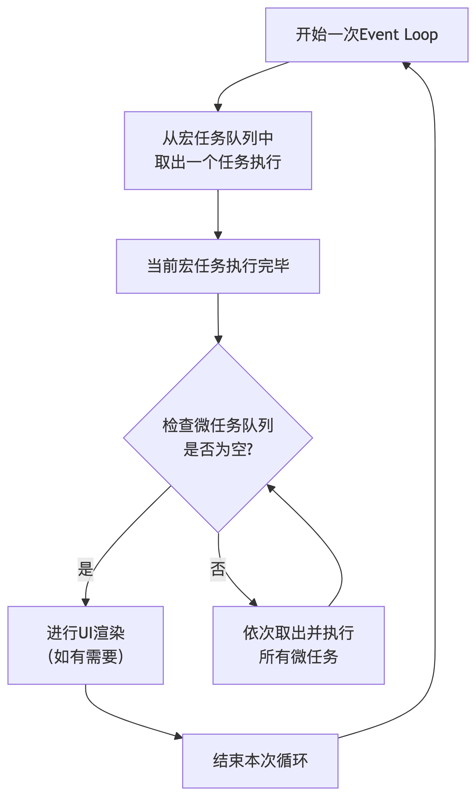
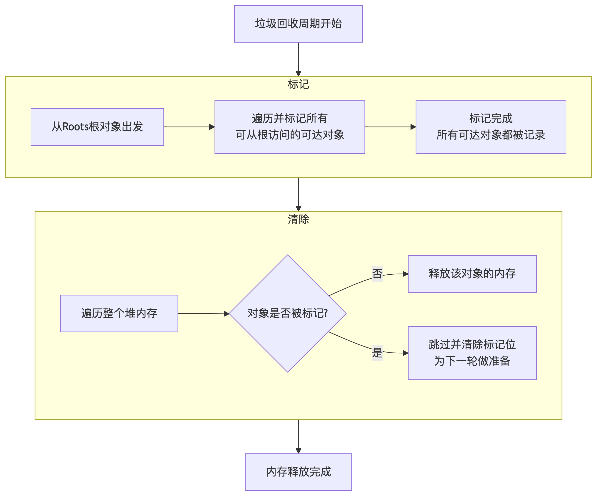
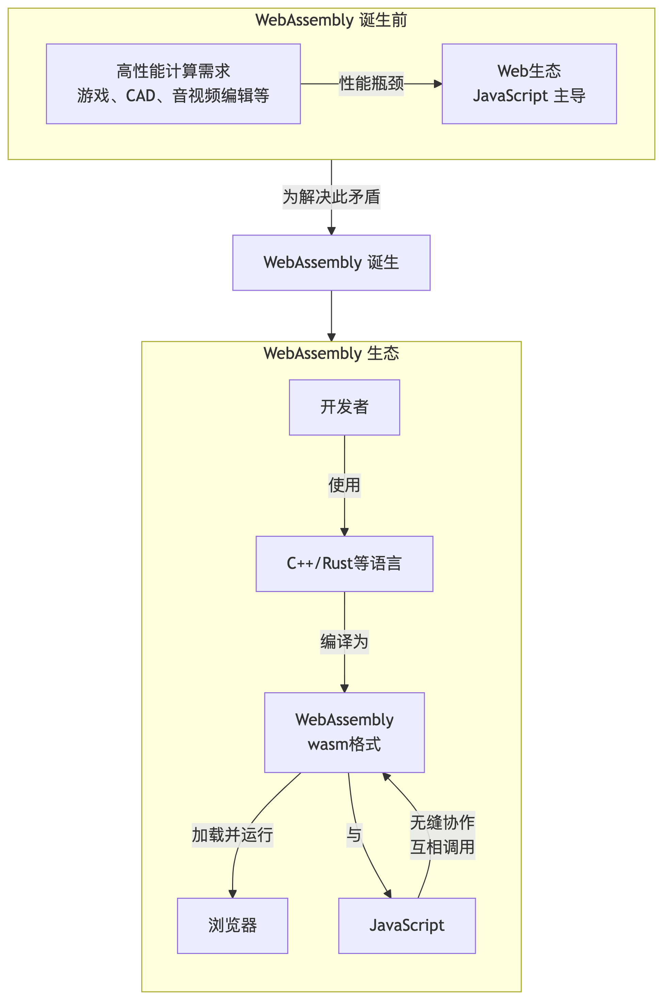
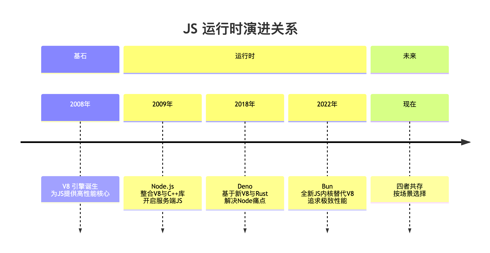

## 了解哪些最新的 ES 新特性？
::: details 参考答案
`ES2025` 为 JavaScript 带来了多项切实提升开发效率的新特性，主要集中在更`便捷的数据处理`、更`强大的集合操作`和更`精细的异步控制`等方面。

1. 引入了`迭代器辅助方法`（`Iterator` Helpers）
```js
const mySet = new Set([1, 2, 3]);
const doubledIterator = Iterator.from(mySet).map(x => x * 2); // 直接map，无需转数组再map
console.log(Array.from(doubledIterator)); // 输出: [2, 4, 6] (如需数组再转换)
```
除了 map，还有 `filter`、`take（取前N项`）、`drop（跳过前N项）`等方法

2. 新的 Set 方法: 为 Set 数据结构`新增了标准的数学集合运算方法`
    - 求`并集 (Union)`：union 方法返回一个新集合，包含两个集合中所有不重复的元素。
    ```js
    const setA = new Set([1, 2, 3]);
    const setB = new Set([3, 4, 5]);
    const unionSet = setA.union(setB);
    console.log(Array.from(unionSet)); // 输出: [1, 2, 3, 4, 5]
    ```
    - 求`交集 (Intersection)`：intersection 方法返回一个新集合，包含两个集合中共有的元素。
    ```js
    const setA = new Set([1, 2, 3]);
    const setB = new Set([3, 4, 5]);
    const intersectionSet = setA.intersection(setB);
    console.log(Array.from(intersectionSet)); // 输出: [3]
    ```
    - 求`差集 (Difference)`：difference 方法返回一个新集合，包含在第一个集合但不在第二个集合中的元素。
    ```js
    const setA = new Set([1, 2, 3]);
    const setB = new Set([3, 4, 5]);
    const differenceSet = setA.difference(setB);
    console.log(Array.from(differenceSet)); // 输出: [1, 2]
    ```
    此外还有 `isDisjointFrom` (是否无交集)、`isSubsetOf` (是否为子集)、`isSupersetOf` (是否为超集) 等方法

3. Promise.try
    ```js
    Promise.try(() => {
    if (!userId) throw new Error('User ID is required!'); // 无论是同步错误还是异步错误...
    return fetch(`/api/users/${userId}`);
    }).catch(error => console.error('Caught reliably:', error)); // ...都能被可靠地捕获
    ```
    `Promise.try` 让错误处理变得更加一致和可靠

4. 正则表达式修饰符: 引入了 `/v `标志（源自 unicodeSets 提案）
    ```js
    // 匹配一个元音字母或一个表情符号字符
    // 传统方式可能会很繁琐且容易出错
    const traditionalRegex = /[aeiou\u{1F600}-\u{1F64F}]/u;

    // 使用 /v 标志，可以进行集合操作，更清晰
    const newRegex = /[\p{White_Space}&&\p{ASCII}]/v; // 匹配ASCII字符集中的空白符
    ```
    `/v` 标志让复杂的字符集合操作变得更加可读和可维护。

5. JSON 模块与导入属性: 在导入 JSON 模块时使用`导入属性`来明确指定其类型为 `'json'`
    ```js
    // 之前 (虽然很多打包工具和运行环境已支持)
    import packageJson from './package.json';

    // ES2025 (使用导入属性，显式声明类型)
    import packageJson from './package.json' with { type: 'json' };

    console.log(packageJson.name); // 正常访问JSON内容
    ```
:::

## typeof 能判断哪些类型
::: details 参考答案
1. 基本类型
    - `"number"`：表示数字类型（包括 NaN）。
    ```js
    typeof 42; // "number"
    typeof NaN; // "number"（注意：NaN 是数字类型）
    ```
    - `"string"`：表示字符串类型。
    ```js
    typeof "hello"; // "string"
    ```
    - `"boolean"`：表示布尔类型。
    ```js
    typeof true; // "boolean"
    ```
    - `"undefined"`：表示未定义的值。
    ```js
    typeof undefined; // "undefined"
    ```
    - ⚠️`"object"`：表示对象类型。
    ```js
    typeof null; // "object"（这是历史遗留 bug，但无法修复）
    ```
    - `"bigint"`：表示 BigInt 类型（大整数）
    ```js
    typeof 123n; // "bigint"
    ```
    - `"symbol"`：表示 Symbol 类型。
    ```js
    typeof Symbol("id"); // "symbol"
    ```

2. 引用类型
    - `"object"`：表示对象类型（包括数组、null、日期等，但 null 有特殊情况）。
    ```js
    typeof {}; // "object"
    typeof []; // "object"（注意：数组返回 "object"）
    typeof null; // "object"（这是历史遗留 bug，但无法修复）
    typeof new Date(); // "object"
    ```
    - `"function"`：表示函数类型。
    ```js
    typeof function() {}; // "function"
    ```
:::

## == 和 === 有什么区别？
::: details 参考答案
- `==` 是宽松相等（Loose Equality），会进行类型转换
```js
// 经典情况：数字 vs 字符串
// 字符串 '5' 被转换为数字 5，然后比较
5 == '5';    // true

// 经典情况：布尔值 vs 其他
// 布尔值 true 被转换为数字 1，然后比较
true == 1;   // true
false == 0;  // true

// 特殊情况：null 和 undefined
null == undefined; // true (这是一个特例)
null == 0;        // false (null 除了和 undefined 宽松相等，不与其他任何值相等)
undefined == '';  // false

// 对象 vs 基本类型
// 数组 [5] 被转换为字符串 '5'，然后 '5' 被转换为数字 5
[5] == 5;    // true
// 数组转换为空字符串 '', 然后 '' 被转换为数字 0
[] == 0;     // true
// 数组转换为空字符串 ''
[] == '';    // true
```
- `===` 是严格相等（Strict Equality），不会进行类型转换
:::

## 你熟悉哪些数组 API ？
::: details 参考答案
- 会改变原数组
    1. `push()` / `pop()`
        - push(...items): 在数组`末尾添加一个或多个`元素，返回新的长度。
        - pop(): `移除`数组`最后一个`元素，并返回该元素。
    2. `unshift()` / `shift()`
        - unshift(...items): 在数组`开头添加一个或多个`元素，返回新的长度。
        - shift(): 移除数组`第一个`元素，并返回该元素。
    3. `splice()` - 非常强大
        - splice(start, deleteCount, ...items): 从 `start` 索引开始，删除 `deleteCount` 个元素，并插入 `items`。返回被删除的元素组成的数组。
        - 用途：删除、替换、插入元素。
    4. `reverse()`: 颠倒数组中元素的顺序。
    5. `sort()`
        - sort(compareFunction?): 对数组元素进行排序。默认是`将元素转换为字符串，比较UTF-16编码`，所以对数字排序需要提供比较函数。
        - arr.sort((a, b) => a - b) // 数字升序
    6. `copyWithin()` (ES6)
        - copyWithin(target, start, end?): 浅复制数组的一部分到同一数组中的另一个位置并返回它，不改变数组长度。
    7. `fill()` (ES6)
        - fill(value, start?, end?): 用一个固定值填充数组中从起始索引到终止索引内的全部元素。

- 不改变原数组，返回新值或新数组
    1. `concat`(...valuesOrArrays): 合并两个或多个数组，返回一个新数组
    2. `join`(separator?): 将数组的所有元素连接成一个字符串，用 separator 分隔。`默认用逗号`。
    3. `slice`(start?, end?): 返回一个由 start 到 end（不包括end）的`浅拷贝的新数组`。常用于复制数组：arr.slice()。
    4. `indexOf()` / `lastIndexOf()`
        - indexOf(searchElement, fromIndex?): 返回数组中第一个与给定值相等的元素的索引，没有则返回 -1。
        - lastIndexOf(): 从后往前找。
    5. `includes()` (ES7)
        - includes(searchElement, fromIndex?): 判断数组是否包含某个元素，返回布尔值。比 indexOf 更语义化，且能正确判断 NaN。
    6. `find()` (ES6)
        - find(callback): 返回数组中满足提供的测试函数的第一个元素的值。否则返回 undefined。
    7. `findIndex()` (ES6)
        - findIndex(callback): 返回数组中满足提供的测试函数的第一个元素的索引。否则返回 -1。

- 迭代方法
    1. `forEach`(callback): 对数组的每个元素执行一次提供的函数。没有返回值。
    2. `map`(callback): 创建一个新数组，其结果是该数组中的每个元素都调用一次提供的函数后的返回值。
    3. `filter`(callback): 创建一个新数组，其包含通过所提供函数测试的所有元素。
    4. `reduce()` / `reduceRight()` - 强大但稍复杂
        - reduce(callback(accumulator, currentValue[, index[, array]]), initialValue?): 对数组中的每个元素按序执行一个提供的 reducer 函数，每一次运行 reducer 会将先前元素的计算结果作为参数传入，最后将其结果汇总为单个返回值。
        - reduceRight(): 从右向左执行。
    5. `some`(callback): 测试数组中是否至少有一个元素通过了提供的函数的测试。返回布尔值。
    6. `every`(callback): 测试数组中的所有元素是否都通过了提供的函数的测试。返回布尔值。
    7. `flat()` (ES2019) 数组扁平化
        - flat(depth?): 按照一个可指定的深度递归遍历数组，并将所有元素与遍历到的子数组中的元素合并为一个新数组返回。默认深度为1。
    8. `flatMap()` (ES2019)
        - flatMap(callback): 相当于先 map() 再 flat()（深度为1），但更高效。

- 其他实用方法 (ES6+)
    1. `Array.isArray()`: 用于确定传递的值是否是一个 Array。比 typeof 更可靠。
    2. `Array.from()`: 从一个类数组对象或可迭代对象创建一个新的浅拷贝的数组实例。
    3. `Array.of()`: 创建一个具有可变数量参数的新数组实例，而不考虑参数的数量或类型。解决了 new Array(3) 的歧义问题。
:::

## 值类型和引用类型的区别
::: details 参考答案
| 特性                | 值类型 (Primitive Types)                          | 引用类型 (Reference Types)                     |
|---------------------|--------------------------------------------------|-----------------------------------------------|
| 包含哪些类型        | Number, String, Boolean, Undefined, Null, Symbol, BigInt | Object, Array, Function, Date, RegExp, 所有其他对象 |
| 存储内容            | 直接存储数据值本身                               | 存储的是数据在内存中的地址（引用）             |
| 存储地点            | 存储在栈内存中                                   | 数据本身存储在堆内存中，地址存储在栈内存       |
| 赋值行为            | 复制值。创建一个全新的副本，二者互不影响。       | 复制地址。两个变量指向同一个内存地址，操作的是同一份数据。 |
| 比较行为            | 比较的是值是否相等。                             | 比较的是内存地址是否相同（是否是同一个对象）。 |
| 函数参数传递        | 按值传递。函数内修改不会影响外部变量。           | 按地址传递。函数内修改对象的属性会影响外部变量。 |

1. 赋值行为
    - 值类型：复制值
    ```js
    let a = 10; // 在栈内存中开辟空间，存储值 10
    let b = a;  // 在栈内存中开辟一个**新空间**，将 a 的值 10 **复制**一份存进去

    a = 20;     // 修改 a 的值，只会改变 a 自己的栈空间

    console.log(a); // 20
    console.log(b); // 10 (b 的值不受 a 的影响，因为它们是两个独立的副本)
    ```
    - 引用类型：复制地址（引用）
    ```js
    let obj1 = { name: 'Alice' }; 
    // 1. 在堆内存中创建一个对象 `{ name: 'Alice' }`
    // 2. 在栈内存中存储变量 `obj1`，其值是对象在堆内存中的地址

    let obj2 = obj1; 
    // 3. 将 `obj1` 栈内存中的**地址**复制一份给 `obj2`
    // 4. 现在 `obj1` 和 `obj2` 指向堆内存中的**同一个对象**

    obj1.name = 'Bob'; // 通过 `obj1` 的地址找到堆内存中的对象并修改它

    console.log(obj1.name); // 'Bob'
    console.log(obj2.name); // 'Bob' (!obj2 也“看到”了变化，因为它们指向同一个对象!)
    ```
2. 比较行为
    - 值类型：比较值
    ```js
    let num1 = 5;
    let num2 = 5;
    console.log(num1 === num2); // true (值相等)

    let str1 = 'hello';
    let str2 = 'hello';
    console.log(str1 === str2); // true (值相等)
    ```
    - 引用类型：比较地址
    ```js
    let arr1 = [1, 2, 3];
    let arr2 = [1, 2, 3]; // 创建了一个全新的数组，在堆内存中的新地址
    console.log(arr1 === arr2); // false (虽然内容一样，但地址不同)

    let obj3 = { count: 100 };
    let obj4 = obj3; // 复制地址，指向同一个对象
    console.log(obj3 === obj4); // true (因为地址相同)
    ```
3. 函数参数传递
    - 值类型参数：按值传递

    函数内部修改不会影响外部的原始变量。
    ```js
    function changeValue(x) {
    x = 100; // 这里的 x 是外部 num 的一个副本
    console.log(x); // 100
    }

    let num = 50;
    changeValue(num);
    console.log(num); // 50 (外部的 num 未被改变)
    ```
    - 引用类型参数：按地址传递

    函数内部修改对象的属性会影响外部的原始对象。
    ```js
    function changeProperty(obj) {
    obj.value = 'changed'; // 通过传入的地址，修改了堆内存中共享的那个对象
    console.log(obj.value); // 'changed'
    }

    let myObj = { value: 'original' };
    changeProperty(myObj);
    console.log(myObj.value); // 'changed' (外部的对象也被修改了!)
    ```
    `注意`：如果在函数内部让参数指向一个全新对象，则不会影响外部原变量，因为你只是改变了局部变量存储的地址，而不是修改了原地址指向的对象。
    ```js
    function reassignReference(obj) {
    obj = { newKey: 'new value' }; // 让局部变量 obj 指向一个新对象
    console.log(obj.newKey); // 'new value'
    }

    let myObj = { originalKey: 'original value' };
    reassignReference(myObj);
    console.log(myObj.originalKey); // 'original value' (外部的 myObj 未受影响)
    ```
:::

## 箭头函数和普通函数的区别
::: details 参考答案
1. this 关键字的指向 (最核心的区别)
    - 普通函数：`动态 this`
    - 箭头函数：`词法 this` 箭头函数没有自己的 this。它内部的 this 值继承自`定义它时所处的父级`执行上下文，并且一旦定义就永不改变。call, apply, bind 也无法改变其 this 指向。
    ```js
    const person = {
    name: 'Alice',
    tasks: ['Task 1', 'Task 2'],
    showTasks: function() { // 普通函数，this 指向 person
        this.tasks.forEach(task => { // 箭头函数，this 继承自 showTasks
        console.log(this.name + ' needs to do: ' + task);
        // this.name 能正确指向 person.name
        });
    }
    };

    person.showTasks();
    // Output:
    // Alice needs to do: Task 1
    // Alice needs to do: Task 2
    ```
    再看一个经典场景（比如在 setTimeout 中）：
    ```js
    function Timer() {
        this.seconds = 0;

        // 普通函数 - this 会在 setTimeout 被调用时丢失指向
        setInterval(function() {
            this.seconds++; // 这里的 this 指向全局对象，不是 Timer 实例
            console.log(this.seconds); // NaN
        }, 1000);

        // 箭头函数 - this 继承自 Timer 构造函数
        setInterval(() => {
            this.seconds++; // 这里的 this 正确指向 Timer 实例
            console.log(this.seconds); // 1, 2, 3...
        }, 1000);
    }
    new Timer();
    ```
2. 能否作为构造函数
    - 普通函数：可以
    - 箭头函数：不可以 箭头函数没有 `[[Construct]]` 内部方法，因此`不能用 new 调用`，否则会抛出错误。
3. arguments 对象
    - 普通函数：有
    ```js
    function logArgs() {
    console.log(arguments); // Arguments(3) [1, 2, 3]
    }
    logArgs(1, 2, 3);
    ```
    - 箭头函数：没有
    ```js
    const logArgs = (...args) => { // 使用 ...args 收集所有参数
    console.log(args); // [1, 2, 3]
    };
    logArgs(1, 2, 3);
    ```
4. 语法简洁性
:::

## 什么时候不能使用箭头函数
::: details 参考答案
1. 定义对象的方法：当你希望方法中的 this 指向调用该方法的对象本身时。

2. 定义构造函数：箭头函数不能使用 new 关键字来调用。

3. 需要动态上下文的回调函数（如事件处理器）：当你需要函数内部的 this 指向触发事件的 DOM 元素时。
    - 错误示例：
    ```js
    const button = document.getElementById('myButton');
    button.addEventListener('click', () => {
    // 这里的 this 继承自父作用域，不会指向 button 元素
    console.log(this); // 可能是 window 或 undefined
    this.classList.toggle('active'); // TypeError!
    });
    ```
    - 正确做法（使用普通函数）：
    ```js
    const button = document.getElementById('myButton');
    button.addEventListener('click', function() {
    // 普通函数内的 this 指向触发事件的元素
    console.log(this); // <button id="myButton">...
    this.classList.toggle('active'); // 正常工作
    });
    ```
4. 需要访问 arguments 对象时

5. 定义原型方法
    - 错误示例：
    ```js
    function Person(name) {
    this.name = name;
    }

    // 箭头函数绑定的是定义时的 this（此时是全局作用域）
    Person.prototype.greet = () => {
    console.log(`Hi, I'm ${this.name}`); // Hi, I'm undefined
    };

    const alice = new Person('Alice');
    alice.greet();
    ```
    - 正确做法（使用普通函数）：
    ```js
    Person.prototype.greet = function() {
    console.log(`Hi, I'm ${this.name}`); // Hi, I'm Alice
    };
    ```

6. 生成器函数：箭头函数不能用作生成器函数。
    - 错误示例：
    ```js
    const gen = *() => { // SyntaxError
    yield 1;
    };
    ```
    - 正确做法（使用普通函数）：
    ```js
    function* gen() {
    yield 1;
    }
    ```
:::


## for...in 和 for...of 的区别
::: details 参考答案
1. `for...in`：`遍历对象`的可枚举属性（键）
```js
const person = {
  name: 'Alice',
  age: 30,
  job: 'Developer'
};

// 遍历对象的属性名 (keys)
for (const key in person) {
  console.log(key); // 输出: 'name', 'age', 'job'
  console.log(person[key]); // 输出: 'Alice', 30, 'Developer'
}
```
- ⚠️ 重要注意事项：可能会遍历到`原型链上的属性`
```js
Object.prototype.customMethod = function() {}; // 在原型上添加一个方法

const obj = { a: 1, b: 2 };

for (const key in obj) {
  console.log(key); // 输出: 'a', 'b', 'customMethod' (!)
}

// 解决方法：使用 hasOwnProperty 过滤
for (const key in obj) {
  if (obj.hasOwnProperty(key)) { // 只遍历对象自身的属性
    console.log(key); // 输出: 'a', 'b'
  }
}
```
- `在数组上的使用（不推荐！）`

2. `for...of`：遍历`可迭代对象`的值

什么是可迭代对象？

实现了 `[Symbol.iterator]` 方法的对象，例如：`Array`、`String`、`Map`、`Set`、`arguments 对象`、`NodeList (DOM 集合)`
```js
// 1. 遍历数组的值
const fruits = ['apple', 'banana', 'orange'];
for (const fruit of fruits) {
  console.log(fruit); // 输出: 'apple', 'banana', 'orange'
}

// 2. 遍历字符串的字符
const str = 'hello';
for (const char of str) {
  console.log(char); // 输出: 'h', 'e', 'l', 'l', 'o'
}

// 3. 遍历 Map 的条目
const map = new Map([['name', 'Alice'], ['age', 30]]);
for (const [key, value] of map) { // 使用解构赋值
  console.log(key, value); // 输出: 'name' 'Alice', 'age' 30
}

// 4. 遍历 Set 的值
const set = new Set([1, 2, 3, 3]);
for (const value of set) {
  console.log(value); // 输出: 1, 2, 3 (自动去重)
}
```
- `for...of 无法遍历普通对象`

现代 JavaScript 中的最佳实践
1. 遍历数组：优先使用 for...of，因为它最简洁且直接获取值。
```js
for (const element of array) { ... }
```
如果需要索引，可以使用 array.entries()：
```js
for (const [index, element] of array.entries()) {
  console.log(index, element);
}
```

2. 遍历对象：通常不直接使用 for...in，而是先获取键数组再遍历，更安全可控。
```js
// 获取所有自身可枚举属性的键
for (const key of Object.keys(object)) {
  console.log(key, object[key]);
}
// 获取所有自身可枚举属性的值
for (const value of Object.values(object)) {
  console.log(value);
}
// 获取所有自身可枚举属性的键值对
for (const [key, value] of Object.entries(object)) {
  console.log(key, value);
}
```
:::

## JS 原型和原型链
::: details 参考答案
1. 原型 (Prototype)
    - 每个函数（`除了箭头函数`）都有一个特殊的属性 `prototype`（显示原型）。它是一个对象。
    - 当这个函数被用作`构造函数`（通过 new 调用）来创建实例时，所有实例都会隐式地继承该 prototype 对象上的属性和方法。
2. 原型链 (Prototype Chain)
    - 每个对象都有一个指向其原型的内部链接（`[[Prototype]]`）。当试图访问一个对象的属性时，如果该对象自身没有这个属性，JavaScript 引擎就会沿着这个链接去`它的原型`上找，如果原型上也没有，就去`原型的原型`上找，直到找到 `null` 为止。这条链接起来的`路径就是原型链`。

    - 构造函数、原型和实例的关系
    ```js
    // 1. 创建一个构造函数
    function Person(name) {
    this.name = name;
    }

    // 2. 在函数的 prototype 属性上添加方法
    // 这个方法会被所有 Person 的实例共享
    Person.prototype.sayHello = function() {
    console.log(`Hello, my name is ${this.name}`);
    };

    // 3. 使用 new 创建实例
    const alice = new Person('Alice');
    const bob = new Person('Bob');

    // 4. 实例可以访问原型上的方法
    alice.sayHello(); // "Hello, my name is Alice"
    bob.sayHello();   // "Hello, my name is Bob"

    // 5. 检查关系
    console.log(alice.__proto__ === Person.prototype); // true
    // __proto__ 是实例指向原型的引用（非标准，但被广泛支持）

    console.log(Object.getPrototypeOf(alice) === Person.prototype); // true
    // Object.getPrototypeOf() 是标准方法

    console.log(Person.prototype.constructor === Person); // true
    // 原型对象有一个 constructor 属性指回构造函数本身
    ```

    - 完整的原型链

    所有的对象最终都指向 `Object.prototype`，而 `Object.prototype 的原型是 null`，这就形成了链条的终点。
    ```js
    // 继续上面的例子

    // 1. 实例 alice 的原型是 Person.prototype
    console.log(Object.getPrototypeOf(alice) === Person.prototype); // true

    // 2. Person.prototype 也是一个普通对象，它的原型是 Object.prototype
    console.log(Object.getPrototypeOf(Person.prototype) === Object.prototype); // true

    // 3. Object.prototype 是绝大多数对象的顶层原型，它的原型是 null
    console.log(Object.getPrototypeOf(Object.prototype) === null); // true

    // 4. 完整的原型链:
    // alice -> Person.prototype -> Object.prototype -> null

    // 检查 alice 是否继承了 Object.prototype 的方法
    console.log(alice.toString()); // "[object Object]" (方法来自 Object.prototype)
    console.log(alice.hasOwnProperty('name')); // true (方法来自 Object.prototype)
    ```
    - 如果 `alice 对象`自身没有 sayHello 属性，可以沿着 `__proto__ 指针`找到`它的原型`（Person.prototype），如果 Person.prototype 上也没有，就继续沿着原型链向上找（`Person.prototype.__proto__`，即 Object.prototype）。

3. 现代语法与原型（ES6 Class）

    ES6 的 class 语法只是基于原型的继承的语法糖，其底层实现依然离不开原型和原型链。
    ```js
    class Person {
        constructor(name) {
            this.name = name; // 这里的代码相当于构造函数体内的代码
        }

        sayHello() { // 这个方法会被添加到 Person.prototype 上
            console.log(`Hello, my name is ${this.name}`);
        }
    }

    const alice = new Person('Alice');
    alice.sayHello();

    // 底层原型关系依然不变
    console.log(alice.__proto__ === Person.prototype); // true
    console.log(Person.prototype.hasOwnProperty('sayHello')); // true
    ```
:::

## JS 继承有几种方式？
::: details 参考答案
1. 原型链继承：让子类的原型对象指向父类的一个实例。
    - 优点：实现简单。
    - 缺点：
        1. 引用类型的属性被所有实例共享（大问题！）
        2. 创建子类实例时，无法向父类构造函数传参。
```js
function Parent() {
  this.name = 'parent';
  this.colors = ['red', 'blue'];
}
Parent.prototype.sayName = function() {
  console.log(this.name);
};

function Child() {
  this.type = 'child';
}

// 关键：将 Child 的原型指向 Parent 的实例
Child.prototype = new Parent();

const child1 = new Child();
child1.sayName(); // 'parent' (继承自原型链)

// 缺点1：引用类型的属性被所有实例共享
child1.colors.push('green');
const child2 = new Child();
console.log(child2.colors); // ['red', 'blue', 'green'] (!)

// 缺点2：无法向父类构造函数传参
```

2. 构造函数继承：在子类构造函数内部调用父类构造函数，使用 `call` 或 `apply` 改变 this 指向。
    - 优点：
        1. 避免了引用类型属性被所有实例共享。
        2. 可以在子类中向父类传递参数。
    - 缺点：
        1. 方法都在构造函数中定义，每次创建实例都会创建一遍方法，无法实现函数复用。
        2. 无法继承父类原型上定义的方法（如 sayName）。
```js
function Parent(name) {
  this.name = name;
  this.colors = ['red', 'blue'];
}
Parent.prototype.sayName = function() {
  console.log(this.name);
};

function Child(name, age) {
  // 关键：在子类构造函数中执行父类构造函数，并绑定子类的 this
  Parent.call(this, name); // 相当于 this.Parent(name)
  this.age = age;
}

const child1 = new Child('Alice', 10);
const child2 = new Child('Bob', 12);

child1.colors.push('green');
console.log(child1.colors); // ['red', 'blue', 'green']
console.log(child2.colors); // ['red', 'blue'] (引用类型独立了！)

// console.log(child1.sayName()); // TypeError: child1.sayName is not a function
// 缺点：无法继承父类原型上的方法
```

3. 组合继承：结合原型链继承和构造函数继承，是 JavaScript 中最常用的继承模式。
    - 优点：
        1. 实例属性独立，不共享。
        2. 可以继承父类实例属性和原型属性/方法。
        3. 可以向父类构造函数传参。
    - 缺点：
        1. 父类构造函数被调用了两次（Parent.call() 和 new Parent()），存在一份多余的父类实例属性。
```js
function Parent(name) {
  this.name = name;
  this.colors = ['red', 'blue'];
}
Parent.prototype.sayName = function() {
  console.log(this.name);
};

function Child(name, age) {
  // 1. 构造函数继承：继承实例属性
  Parent.call(this, name); // 第二次调用 Parent
  this.age = age;
}

// 2. 原型链继承：继承原型方法
Child.prototype = new Parent(); // 第一次调用 Parent
// 修复 constructor 指针，指回 Child
Child.prototype.constructor = Child;

// 可以添加子类特有的原型方法
Child.prototype.sayAge = function() {
  console.log(this.age);
};

const child1 = new Child('Alice', 10);
child1.colors.push('green');
console.log(child1.colors); // ['red', 'blue', 'green']
child1.sayName(); // 'Alice' (来自原型)
child1.sayAge(); // 10 (自身原型方法)

const child2 = new Child('Bob', 12);
console.log(child2.colors); // ['red', 'blue'] (引用类型独立)
child2.sayName(); // 'Bob'
```

4. 原型式继承：基于一个现有对象作为原型，创建一个新对象。`Object.create()` 的原理。
- 优点：不需要创建构造函数，简单。
- 缺点：与原型链继承相同，引用类型的属性始终共享。
```js
// 道格拉斯·克罗克福德提出的方法，ES5 的 Object.create() 规范化了此概念
function createObject(o) {
  function F() {} // 创建一个临时构造函数
  F.prototype = o; // 将其原型指向传入的对象
  return new F(); // 返回这个临时构造函数的实例
}

const parent = {
  name: 'parent',
  colors: ['red', 'blue'],
  sayName: function() {
    console.log(this.name);
  }
};

const child1 = createObject(parent); // 或 const child1 = Object.create(parent);
child1.name = 'child1';
child1.colors.push('green');

const child2 = createObject(parent);
child2.name = 'child2';

console.log(child2.colors); // ['red', 'blue', 'green'] (共享引用类型)
```

5. 寄生式继承：创建一个仅用于封装继承过程的函数，该函数在内部以某种方式增强对象，最后返回对象。
```js
function createAnother(original) {
  const clone = Object.create(original); // 通过调用函数创建一个新对象
  // 以某种方式来增强这个对象
  clone.sayHi = function() {
    console.log('hi');
  };
  return clone; // 返回这个对象
}

const parent = {
  name: 'parent',
  colors: ['red', 'blue']
};
const child = createAnother(parent);
child.sayHi(); // 'hi'
```

6. 寄生组合式继承：这是组合继承的优化版本。它解决了父构造函数被调用两次的问题。是最理想的继承方式。
    - 优点：
        1. 只调用了一次父类构造函数，效率更高。
        2. 避免了在 Child.prototype 上创建不必要的、多余的属性。
        3. 原型链保持不变。
```js
function inheritPrototype(Child, Parent) {
  // 1. 创建父类原型的一个副本，而不是父类实例
  const prototype = Object.create(Parent.prototype);
  // 2. 修复因重写原型而丢失的 constructor 属性
  prototype.constructor = Child;
  // 3. 将子类的原型指向这个副本
  Child.prototype = prototype;
}

function Parent(name) {
  this.name = name;
  this.colors = ['red', 'blue'];
}
Parent.prototype.sayName = function() {
  console.log(this.name);
};

function Child(name, age) {
  // 只调用一次 Parent 构造函数
  Parent.call(this, name);
  this.age = age;
}

// 关键：使用寄生式继承来继承父类的原型
inheritPrototype(Child, Parent);

// 添加子类原型方法
Child.prototype.sayAge = function() {
  console.log(this.age);
};

const child1 = new Child('Alice', 10);
child1.sayName(); // 'Alice'
child1.sayAge(); // 10
```

7. ES6 Class 继承 (语法糖)：使用 `extends` 和 `super` 关键字，其底层实现原理就是寄生组合式继承。
    - 优点：语法简洁，直观，最推荐使用的方式。
```js
class Parent {
  constructor(name) {
    this.name = name;
    this.colors = ['red', 'blue'];
  }
  sayName() {
    console.log(this.name);
  }
}

class Child extends Parent { // extends 实现原型链继承
  constructor(name, age) {
    super(name); // super() 相当于 Parent.call(this, name)
    this.age = age;
  }
  sayAge() {
    console.log(this.age);
  }
}

const child1 = new Child('Alice', 10);
child1.sayName(); // 'Alice'
child1.sayAge(); // 10

child1.colors.push('green');
const child2 = new Child('Bob', 12);
console.log(child2.colors); // ['red', 'blue'] (引用类型独立)
```
:::

## JS 作用域和作用域链
::: details 参考答案
理解作用域和作用域链是理解`变量访问`、`闭包`、`this 绑定`等高级主题的基础。

- 作用域 (Scope)：定义了变量、函数和对象的可访问范围（可见性）。JavaScript 主要采用`词法作用域`（Lexical Scope）（也称为`静态作用域`），这意味着`作用域在函数定义时就已经确定`，而不是在函数调用时。
    1. 全局作用域 (Global Scope)
        - 访问性：可以被脚本中的任何其他代码访问。
        - 生命周期：伴随页面的生命周期。
        ```js
        var globalVar = 'I am global'; // 全局变量

        function checkGlobal() {
            console.log(globalVar); // 可以访问
        }
        checkGlobal();
        console.log(globalVar); // 也可以访问
        ```
    2. 函数作用域 (Function Scope)
        - 访问性：只能在声明它的`函数内部及其嵌套的函数中`访问。
        - 生命周期：在函数执行时创建，函数`执行完毕`后，局部变量会被`销毁`。
        ```js
        function myFunction() {
            var localVar = 'I am local'; // 局部变量（函数作用域）
            console.log(localVar); // 可以访问

            function innerFunction() {
                console.log(localVar); // 也可以访问（闭包）
            }
            innerFunction();
        }

        myFunction();
        // console.log(localVar); // ReferenceError: localVar is not defined (无法在函数外访问)
        ```

    3. 块级作用域 (Block Scope) (ES6+)：由一对花括号 `{}` 创建的代码块（如 `if, for, while 语句`、或者`单独的 {}`）形成的作用域。
        - 访问性：只能在声明它的代码块内部访问。
        - 注意：`只有使用 let 和 const 声明的变量`才拥有块级作用域。var 声明的变量会无视块级作用域。
        ```js
        if (true) {
            let blockScopedLet = 'I am block scoped (let)';
            const blockScopedConst = 'Me too (const)';
            var functionScopedVar = 'I am function scoped (var)'; // 无视块级作用域
        }
        // console.log(blockScopedLet); // ReferenceError
        // console.log(blockScopedConst); // ReferenceError
        console.log(functionScopedVar); // 'I am function scoped (var)' (仍然可以访问!)
        ```

- 作用域链 (Scope Chain)：是 JavaScript 内部用于解析变量访问权限的机制。当试图访问一个变量时，JavaScript 引擎会沿着一条由作用域构成的链式结构进行查找，这条链就是作用域链。
    - 关键点：作用域链的构成基于`函数的定义位置`（词法作用域），而不是调用位置。
    ```js
    // 全局作用域
    var globalVar = 'Global';

    function outer() {
        // outer 函数作用域
        var outerVar = 'Outer';

        function inner() {
            // inner 函数作用域
            var innerVar = 'Inner';
            console.log(innerVar); // 1. 在当前作用域找到 'Inner'
            console.log(outerVar); // 2. 在当前作用域没找到，去父级作用域(outer)找到 'Outer'
            console.log(globalVar); // 3. 在outer也没找到，再去outer的父级(全局)找到 'Global'
            // console.log(nonExistentVar); // 4. 一路找到全局都没有，报 ReferenceError
        }

        inner();
    }

    outer();
    ```

- 词法作用域的重要性：是由代码编写时`函数和变量的位置`决定的。编译阶段（或解释前的预处理阶段）就已经确定了作用域关系。
```js
var a = 10;

function foo() {
  console.log(a);
}

function bar() {
  var a = 20;
  foo(); // 输出什么？
}

bar(); // 输出 10，而不是 20！
```
:::

## JS 自由变量，如何理解
::: details 参考答案
- 在一个作用域（通常是函数）中使用的变量，如果`既不是在该作用域内声明的`，`也不是它的参数`，那么`这个变量`对这个作用域来说就是一个“自由变量”。
```js
let globalVar = 'I am global'; // 全局变量

function outer() {
  let outerVar = 'I am outer'; // outer 的局部变量

  function inner() {
    let innerVar = 'I am inner'; // inner 的局部变量（绑定变量）
    console.log(innerVar); // 绑定变量（自己在内部声明的）
    console.log(outerVar); // 自由变量！（在 outer 作用域声明的）
    console.log(globalVar); // 自由变量！（在全局作用域声明的）
  }

  inner();
}

outer();
```

- 自由变量如何被解析？—— 作用域链

- 自由变量是闭包的核心

闭包（Closure） 的本质就是：一个函数能够记住并访问其词法作用域中的自由变量，即使该函数是在其词法作用域之外执行。
```js
function createCounter() {
  let count = 0; // count 是 inner 函数的自由变量

  // inner 函数使用了自由变量 count
  function inner() {
    count++; // 自由变量！
    console.log(count);
    return count;
  }

  return inner; // 将使用了自由变量的函数返回
}

const myCounter = createCounter();
// createCounter 的执行上下文已经销毁了...
myCounter(); // 1 (但 inner 函数依然能访问到自由变量 count)
myCounter(); // 2
myCounter(); // 3
```
:::

## JS 闭包，如何理解
::: details 参考答案
一个函数在定义时关联了其内部的绑定变量和与之有关的自由变量，关联的自由变量不会因执行完上下文而销毁，这个函数和这些自由变量就形成了闭包

1. 创建私有变量（数据封装）
```js
function createCounter() {
  let privateCount = 0; // 这是一个“私有”变量，外部无法直接访问

  // 返回一个对象，里面的方法通过闭包访问 privateCount
  return {
    increment: function() {
      privateCount++;
      return privateCount;
    },
    decrement: function() {
      privateCount--;
      return privateCount;
    },
    getValue: function() {
      return privateCount;
    }
  };
}

const counter = createCounter();
console.log(counter.getValue()); // 0
console.log(counter.increment()); // 1
console.log(counter.increment()); // 2
console.log(counter.decrement()); // 1

// 无法直接从外部访问或修改 privateCount
// console.log(counter.privateCount); // undefined
// privateCount 被安全地隐藏在了闭包中
```

2. 在异步回调中保持状态

在事件监听、定时器、Ajax 请求等异步操作中，闭包能帮助我们记住函数创建时的状态。
```js
function sayHelloAfterDelay(name) {
  // 参数 `name` 被内部函数引用，形成闭包
  setTimeout(function() {
    console.log(`Hello, ${name}!`);
  }, 1000);
  // 即使 sayHelloAfterDelay 早已执行完毕，回调函数依然能记住 `name` 的值
}

sayHelloAfterDelay('Alice'); // 1秒后输出 "Hello, Alice!"
```

3. 在循环中创建唯一索引
```js
for (var i = 0; i < 3; i++) {
  setTimeout(function() {
    console.log(i); // 输出 3, 3, 3（而不是 0, 1, 2）
  }, 100);
}
```
var 没有块级作用域，三个定时器回调共享同一个全局变量 i。当回调执行时，循环早已结束，i 的值已经是 3。

- 注意事项：闭包可能带来`内存泄漏`的问题
```js
function heavyOperation() {
  let largeData = getSomeHugeData(); // 一个很大的数据
  let button = document.getElementById('myButton');

  button.onclick = function() { // 闭包引用了 largeData 和 button
    // do something...
  };

  // ... 其他代码
  // 如果以后不再需要这个事件处理函数，应该这样做：
  // button.onclick = null; // 解除引用，垃圾回收器就可以回收 largeData 和 button 了
}
```
:::

## 同步和异步有什么区别？异步的意义是什么？
::: details 参考答案
- 区别
    - 同步 (Synchronous) - “排队点餐”：顺序执行，会阻塞代码
    ```js
    console.log('Task 1 Start');
    const result = aVeryLongCalculation(); // 假设这个计算要花5秒
    console.log('Task 1 Result:', result); // 5秒后才会执行
    console.log('Task 2'); // 必须等上面所有任务完成
    // 输出顺序永远是: Task 1 Start -> (等待5秒) -> Task 1 Result -> Task 2
    ```
    - 异步 (Asynchronous) - “取号点餐”：不阻塞代码
    ```js
    console.log('Task 1 Start'); // 1. 立即执行
    setTimeout(() => {
        console.log('Async Task Done!'); // 3. 2秒后执行
    }, 2000);
    console.log('Task 2'); // 2. 立即执行，不会等待上面的2秒
    // 输出顺序是: Task 1 Start -> Task 2 -> (等待约2秒) -> Async Task Done!
    ```

- 异步的意义：避免阻塞（Non-Blocking）。
    1. 避免单线程的 JavaScript 被“卡死”
    2. 提升性能和效率
    3. 改善用户体验

- 如何处理异步操作？避免“回调地狱”
    1. 回调函数
    ```js
    readFile('file.txt', (err, data) => { // 回调函数
        if (err) throw err;
        console.log(data);
    });
    ```
    2. Promise：ES6 引入
    ```js
    fetch('https://api.example.com/data')
        .then(response => response.json())
        .then(data => console.log(data))
        .catch(error => console.error('Error:', error));
    ```
    3. Async/Await：ES8 引入
    ```js
    async function getData() {
        try {
            const response = await fetch('https://api.example.com/data'); // 等待Promise解决
            const data = await response.json(); // 再次等待
            console.log(data);
        } catch (error) {
            console.error('Error:', error);
        }
    }
    getData();
    ```
:::

## JS Promise 有几种状态？如何变化
::: details 参考答案
- `Pending（进行中）`	初始状态，异步操作未完成  从 `pending` 变为 `fulfilled` 或 `rejected`
- `Fulfilled（已完成）`	操作成功，返回 resolve 结果
- `Rejected（已拒绝）`	操作失败，返回 reject 错误

```js
const myPromise = new Promise((resolve, reject) => {
  // 这个执行器函数会立即执行
  // 模拟一个异步操作（比如网络请求）
  setTimeout(() => {
    const success = Math.random() > 0.5; // 随机模拟成功或失败

    if (success) {
      resolve('Operation succeeded!'); // 状态: pending -> fulfilled
      // 尝试再次改变状态是无效的！
      reject('This will be ignored'); // 这行代码会被忽略
    } else {
      reject(new Error('Operation failed!')); // 状态: pending -> rejected
    }
  }, 1000);
});
```
:::

## JS Promise 使用
::: details 参考答案
- 创建一个 Promise
```js
const myPromise = new Promise((resolve, reject) => {
  // 这里是执行器函数，会立即同步执行
  // 通常在这里执行一些异步操作

  const operationSuccessful = true; // 模拟操作成功或失败

  setTimeout(() => { // 模拟异步操作（如网络请求、定时器）
    if (operationSuccessful) {
      resolve('Success! Data loaded.'); // 操作成功，调用 resolve
    } else {
      reject(new Error('Failed to load data.')); // 操作失败，调用 reject
    }
  }, 1000);
});
```

- 链式调用 (Chaining)
    1. `.then()` - 处理成功和失败
    ```js
    myPromise.then(
        (successResult) => { // 第一个回调：处理成功
            console.log('成功:', successResult);
        },
        (errorReason) => { // 第二个回调：处理失败
            console.error('失败:', errorReason);
        }
    );
    ```
    2. `.catch()` - 专门处理失败 它相当于 `.then(null, errorCallback)`
    ```js
    myPromise
        .then((successResult) => {
            console.log('成功:', successResult);
        })
        .catch((errorReason) => { // 专门捕获错误
            console.error('失败:', errorReason);
        });
    ```
    .catch 的强大之处：它不仅捕获 `reject()`，还`捕获在它之前的任何一个 .then() 回调中抛出的错误`。
    3. `.finally()` - 无论成功失败都会执行
    ```js
    myPromise
        .then((result) => { /* 处理成功 */ })
        .catch((error) => { /* 处理失败 */ })
        .finally(() => {
            console.log('请求结束，无论成功失败都会执行');
            // 例如：隐藏加载中的动画
        });
    ```

- Promise 的静态方法
    1. `Promise.all()` - 等待所有成功，或一个失败
    ```js
    const promise1 = fetch('/api/user/1');
    const promise2 = fetch('/api/user/2');
    const promise3 = fetch('/api/user/3');

    Promise.all([promise1, promise2, promise3])
        .then(([user1, user2, user3]) => { // 结果是一个数组，顺序与输入一致
            console.log('All users loaded:', user1, user2, user3);
        })
        .catch((error) => { // 其中任何一个请求失败，都会进入这里
            console.error('One of the requests failed:', error);
        });
    ```
    2. `Promise.race()` - 竞速
    ```js
    const timeout = new Promise((resolve, reject) => {
        setTimeout(() => reject(new Error('Request timeout!')), 5000);
    });
    const dataPromise = fetch('/api/data');

    // 如果 fetch 在5秒内完成，就用数据；如果没完成，就触发超时错误
    Promise.race([dataPromise, timeout])
        .then((data) => {
            console.log('Data received in time:', data);
        })
        .catch((error) => {
            console.error('Either timeout or request failed:', error);
        });
    ```
    接收一个 Promise 的可迭代对象，返回一个新的 Promise。它只关心`第一个 settled 的 Promise`（无论是成功还是失败），并将其结果或原因作为自己的结果。
    3. `Promise.allSettled()` (ES2020) - 等待所有结束
    ```js
    Promise.allSettled([promise1, promise2, promise3])
        .then((results) => {
            results.forEach((result) => {
            if (result.status === 'fulfilled') {
                console.log('Success with value:', result.value);
            } else {
                console.log('Failed with reason:', result.reason);
            }
            });
        });
    ```
    等待所有输入的 Promise 都 settled（无论成功或失败）。它永远不会 reject，总是 resolve一个对象数组，每个对象描述了对应 Promise 的结果。
    4. `Promise.any()` (ES2021) - 等待第一个成功
    ```js
    Promise.any([promise1, promise2, promise3])
        .then((firstSuccessResult) => {
            console.log('The first successful result:', firstSuccessResult);
        })
        .catch((error) => {
            console.error('All promises were rejected:', error);
        });
    ```
    接收一个 Promise 的可迭代对象，返回一个新的 Promise。只要其中的一个 Promise 成功，它就成功。只有当所有 Promise 都失败时，它才失败。
:::

## async/await 使用
::: details 参考答案
`async/await` 是基于 `Promise` 的`语法糖`，它让异步代码的写法看起来和同步代码一样，极大地提高了代码的`可读性和可维护性`。
```js
async function fetchUserData(userId) {
  try {
    console.log('Start fetching...');
    const user = await fetch(`/api/users/${userId}`); // 可能失败
    const data = await user.json(); // 也可能失败
    console.log('User data:', data);
    return data; // 成功则返回数据
  } catch (error) {
    // 捕获任何在 try 块中（包括 await）抛出的错误
    console.error('Failed to fetch user:', error.message);
    // 可以选择将错误再次抛出，或者返回一个默认值
    throw new Error(`Could not load user ${userId}`); 
    // 或者 return null;
  } finally {
    console.log('Fetch attempt finished.'); // 无论成功失败都会执行
  }
}

// 消费这个 async 函数
fetchUserData(123)
  .then(data => console.log('Success handler:', data))
  .catch(err => console.error('Catch handler:', err)); // 这里会捕获 try 块中抛出的新错误
```

- 注意事项
    1. 不要滥用 await：对于没有依赖关系的异步操作，使用 Promise.all() 并行执行，否则会不必要的降低性能。

    2. await 只能在 async 函数中用：在全局作用域或普通函数中直接使用 await 会导致语法错误。在顶级模块中，可以使用顶级 await（现代浏览器和 Node.js 支持）。

    3. async 函数总是返回 Promise：即使你没有明确返回任何值，它也会返回一个 Promise.resolve(undefined)。

    4. 错误处理：忘记用 try...catch 处理 await 可能会导致未处理的 Promise rejection。总是要妥善处理错误。
:::

## JS 异步执行顺序
执行以下代码，会输出什么？
```js
async function async1() {
  console.log('async1')
  await async2()
  console.log('async1 end')
}
async function async2() {
  console.log('async2')
}
console.log('script start')
setTimeout(() => {
  console.log('setTimeOut')
}, 0)
async1()
new Promise((resolve) => {
  console.log('promise')
  resolve()
}).then(() => {
  console.log('promise2')
})
console.log('script end')
```
::: details 参考答案
```bash
script start
async1
async2
promise
script end
async1 end
promise2
setTimeOut
```
- 注意
    1. 同步代码优先执行：从上到下，先输出所有能直接执行的 console.log。

    2. 微任务优先于宏任务：Promise.then、await 后的代码是微任务；setTimeout、setInterval 是宏任务。

    3. await 的拆分：await xxx() 这行代码，可以看作是：

        - 同步执行 xxx() 函数。

        - 然后将其后面的代码包装成一个微任务，await 本身相当于让出线程。
:::

## 宏任务和微任务的区别
::: details 参考答案
宏任务和微任务的区别决定了代码的执行顺序。

| 特性         | 宏任务 (MacroTask)                          | 微任务 (MicroTask)                     |
|--------------|---------------------------------------------|----------------------------------------|
| &zwnj;**发起方**&zwnj;   | 浏览器/Node.js 环境                         | JavaScript 引擎                       |
| &zwnj;**常见类型**&zwnj; | `setTimeout`, `setInterval`, I/O 操作       | `Promise`, `process.nextTick`          |
| &zwnj;**执行顺序**&zwnj; | 事件循环的每个周期执行一个                  | 在宏任务执行后立即清空整个队列         |
| &zwnj;**优先级**&zwnj;   | 低                                          | 高                                    |

- 执行机制：事件循环（Event Loop）模型

    

    - 举例说明：经典的面试题
    ```js
    console.log('script start'); // 同步任务

    setTimeout(function() {
        console.log('setTimeout'); // 宏任务回调
    }, 0);

    Promise.resolve()
        .then(function() {
            console.log('promise1'); // 微任务回调
        })
        .then(function() {
            console.log('promise2'); // 微任务回调
        });

    console.log('script end'); // 同步任务
    ```
    输出顺序永远是：
    ```js
    script start
    script end
    promise1
    promise2
    setTimeout
    ```

    - 如果把微任务放在宏任务里呢？
    ```js
    setTimeout(() => {
        console.log('Macro Task 1');
        Promise.resolve().then(() => {
            console.log('Micro Task in Macro');
        });
    }, 0);

    setTimeout(() => {
        console.log('Macro Task 2');
    }, 0);
    ```
    输出顺序：
    ```js
    Macro Task 1
    Micro Task in Macro // 注意：第一个宏任务产生的微任务会立即执行！
    Macro Task 2
    ```

- `事件循环每次只取一个宏任务执行`，执行完后会彻底清空整个微任务队列。
- 执行微任务时，如果又产生了新的微任务，会继续执行，直到微任务队列为空，才会进行渲染或执行下一个宏任务。
:::

## 描述 Event Loop 运行机制
::: details 参考答案
JavaScript 是`单线程`的，这意味着它一次只能做一件事。`Event Loop 的使命`就是：`用单线程模拟“多线程”`的效果，实现`非阻塞的异步执行`。

- 核心组件：三大角色
    1. 调用栈 (Call Stack)：这是一个后进先出 (LIFO) 的数据结构，如果`栈被长时间占用`，浏览器就会无法渲染更新和响应用户交互，`导致“卡顿”`。
    2. 任务队列 (Task Queue)：一个先进先出 (FIFO) 的数据结构，用于存放待执行的异步任务回调函数。
        - 宏任务队列 (MacroTask Queue)：存放 `setTimeout`、`setInterval`、`setImmediate (Node.js)`、`I/O`、`UI 渲染`等任务的回调。
        - 微任务队列 (MicroTask Queue)：存放 `Promise.then/catch/finally`、`process.nextTick (Node.js)`、`MutationObserver` 等任务的回调。
    3. Event Loop 本身：它是一个持续运行的循环进程，不断地检查调用栈是否为空。一旦调用栈为空，它就按照既定规则从任务队列中取出回调函数，将其放入调用栈中执行。

执行步骤：同步任务 - 异步任务入队列 - 同步栈清空，Event Loop 启动 - 清空微任务队列 - 取宏任务执行
:::

## Set 和 Array 有什么区别

::: details 参考答案

| 特性            | Array                          | Set                          |
|-----------------|--------------------------------|------------------------------|
| &zwnj;**重复值**&zwnj;      | ✅ 允许重复元素                | ❌ 只能存储唯一值，自动去重   |
| &zwnj;**索引访问**&zwnj;    | ✅ 支持索引(arr[0])           | ❌ 不支持索引访问            |
| &zwnj;**查找性能**&zwnj;    |  🔴 O(n) 线性查找               |  🎉O(1) 哈希查找             |
| &zwnj;**删除性能**&zwnj;    | 🔴 O(n) 需遍历查找删除         |  🎉O(1) 直接删除             |
| &zwnj;**遍历方式**&zwnj;    | forEach/map/filter             | forEach/for...of             |
| &zwnj;**典型场景**&zwnj;    | 有序数据存储，索引访问需求     | 去重操作，快速成员检查       |
| &zwnj;**类型转换**&zwnj;    | Array.from(set)               | new Set(array)              |

优先使用Array的情况
- 需要按索引访问元素时
- 需要保持元素插入顺序时
- 需要使用数组操作方法时

优先使用Set的情况
- 需要自动去重功能时
- 需要快速成员检查时
- 需要高效删除操作时

```js
// Array -> Set (用于去重)
const arrayWithDuplicates = [1, 2, 2, 3, 4];
const uniqueSet = new Set(arrayWithDuplicates); // Set(4) {1, 2, 3, 4}

// Set -> Array (在去重后恢复为数组进行操作)
const uniqueArray = [...uniqueSet]; // [1, 2, 3, 4]
const uniqueArray2 = Array.from(uniqueSet); // [1, 2, 3, 4]

// 一行代码完成数组去重
const deduplicated = [...new Set(arrayWithDuplicates)];
```
:::

## Map 和 Object 有什么区别
::: details 参考答案
1. 键的类型
  - Object：Object 的键只能是`字符串或 Symbol`。如果你使用任何其他类型（如对象、数字），键自动转为字符串
  ```js
  const obj = {};
  const key = { id: 1 };

  obj[key] = 'value'; // 键 key 被转换为字符串 "[object Object]"
  console.log(obj); // { "[object Object]": "value" }

  obj[3] = 'number'; // 数字 3 被转换为字符串 "3"
  console.log(obj); // { "3": "number", "[object Object]": "value" }
  ```
  - Map：键可以是任意值
  ```js
  const map = new Map();
  const objectKey = { id: 1 };
  const functionKey = () => {};

  map.set(objectKey, 'value associated with an object');
  map.set(functionKey, 'value associated with a function');
  map.set(3, 'number key'); // 数字 3 就是数字 3，不会被转换
  map.set('3', 'string key'); // 字符串 '3' 和数字 3 是不同的键
  map.set(NaN, 'Not a Number'); // NaN 也可以作为键

  console.log(map.get(objectKey)); // 'value associated with an object'
  console.log(map.get(3)); // 'number key'
  console.log(map.get('3')); // 'string key'
  console.log(map.size); // 5
  ```
2. 顺序与迭代
  - Object：先按数字键升序，再按字符串和 Symbol 键的创建顺序，但依赖 Object 的顺序是不可靠的
  - Map：严格保持插入顺序
  ```js
  // Object 的顺序可能出乎意料
  const obj = {};
  obj['b'] = 'second';
  obj['a'] = 'first';
  obj['2'] = 'numeric second?'; // 数字字符串键可能会被重新排序
  console.log(Object.entries(obj)); // [ ['2', 'numeric second?'], ['b', 'second'], ['a', 'first'] ]

  // Map 的顺序是确定且可靠的
  const map = new Map();
  map.set('b', 'second');
  map.set('a', 'first');
  map.set('2', 'numeric second?');
  console.log([...map]); // [ ['b', 'second'], ['a', 'first'], ['2', 'numeric second?'] ]
  // 迭代顺序就是 set() 的调用顺序
  ```
3. 性能：Map 在涉及频繁添加和删除键值对的场景下，性能远优于 Object。
  - set/delete 操作：Map 专门为此优化，时间复杂度接近 O(1)。
  - size 属性：`Map 的 .size` 是属性，直接获取；Object 需要 `Object.keys(obj).length`，需要计算，性能更差。
4. 原型与默认键的冲突
  - Object：有原型，可能产生冲突
  - Map：纯净无原型
:::

## setTimeout、requestAnimationFrame 和 requestIdleCallback 有什么区别
::: details 参考答案
| 特性                  | setTimeout / setInterval          | requestAnimationFrame (rAF)       | requestIdleCallback (rIC)          |
|-----------------------|-----------------------------------|-----------------------------------|------------------------------------|
| 设计目的              | 在指定的延迟后执行一次或重复执行代码 | 在下一次浏览器重绘之前执行动画更新 | 在浏览器空闲时期执行低优先级的后台任务 |
| 执行时机              | 在指定的时间后，被放入任务队列等待执行 | 在浏览器的渲染每一帧之前执行，与屏幕刷新率同步 | 在一帧的末尾，浏览器有空闲时间时执行 |
| 调用频率              | 由开发者指定                      | 与屏幕刷新率同步（通常每秒60次）  | 不确定，取决于浏览器当前是否空闲   |
| 优先级                | 宏任务，在微任务之后执行          | 渲染阶段的任务，优先级很高        | 空闲任务，优先级最低               |
| 主要用途              | 延迟执行、防抖、节流、轮询等      | 制作动画、更新UI                  | 执行非紧急任务（日志上报、预加载等）|
| 是否保证执行          | 是（除非被清除）                  | 是（除非被取消）                  | 否（可能永远不会执行）             |

:::

## 写一个验证 email 的正则表达式
::: details 参考答案
```js
const emailRegex = /^[a-zA-Z0-9.!#$%&'*+/=?^_`{|}~-]+@[a-zA-Z0-9](?:[a-zA-Z0-9-]{0,61}[a-zA-Z0-9])?(?:\.[a-zA-Z0-9](?:[a-zA-Z0-9-]{0,61}[a-zA-Z0-9])?)*$/;

// 测试例子
const testEmails = [
    "user@example.com",          // 有效
    "firstname.lastname@example.co.uk", // 有效
    "user.name+tag@example.org", // 有效（包含+号）
    "user-name@example.com",     // 有效（包含连字符）
    "invalid.email@",            // 无效
    "plainaddress",              // 无效
    "@no-local-part.com",        // 无效
    "email@subdomain.example.com" // 有效
];

testEmails.forEach(email => {
    console.log(`${email} -> ${emailRegex.test(email) ? '有效' : '无效'}`);
});
```
分解说明：

- `^`：匹配字符串开始

- `[a-zA-Z0-9.!#$%&'*+/=?^_\{|}~-]+`：本地部分（@之前）

  允许字母、数字和一系列特殊字符

  `+` 表示至少有一个字符

- `@`：字面量的@符号

- `[a-zA-Z0-9](?:[a-zA-Z0-9-]{0,61}[a-zA-Z0-9])?`：主域名（@之后的第一部分）

  - `[a-zA-Z0-9]`：以字母或数字开头和结尾

  - `(?:[a-zA-Z0-9-]{0,61}[a-zA-Z0-9])?`：中间可以有0-61个字母、数字或连字符

- `(?:\.[a-zA-Z0-9](?:[a-zA-Z0-9-]{0,61}[a-zA-Z0-9])?)*`：顶级域名及其他子域名（如 .com, .co.uk）

  - `\.`：匹配点号

  - `*` 表示可以有0个或多个这样的部分

- `$`：匹配字符串结束
:::

## JS 模块化规范有哪些？
::: details 参考答案
| 规范       | 出现时间/环境       | 特点                                      | 加载方式  |
|------------|--------------------|------------------------------------------|----------|
| IIFE       | 早期               | 使用立即执行函数模拟模块，无规范          | 同步     |
| CommonJS   | 2009年 / Node.js   | 面向服务器，同步加载，使用`require()`和`module.exports` | 同步     |
| AMD        | 2009年 / 浏览器    | 异步模块定义，专为浏览器设计              | 异步     |
| CMD        | 2011年 / 浏览器    | 通用模块定义，延迟执行，国产规范          | 异步     |
| UMD        | 2014年             | 兼容AMD、CommonJS和全局变量               | 均可     |
| ES Module  | 2015年 (ES6)       | 语言标准，静态化，兼容浏览器和Node.js     | 均可     |

- CommonJS - “服务器霸主”: 主要用于 Node.js 环境
  - 导出模块：使用 `module.exports` 或 `exports`
  - 导入模块：使用 `require(path)`
  - 输出：值的拷贝
  - this指向：指向当前模块
  - 顶级变量：`exports`, `module`, `require`, `__dirname`, `__filename`
  ```js
  // math.js (导出模块)
  const add = (a, b) => a + b;
  const PI = 3.14159;

  // 写法一：导出单个对象
  module.exports = {
    add,
    PI
  };

  // 写法二：逐个导出属性
  // exports.add = add;
  // exports.PI = PI;

  // app.js (导入模块)
  const math = require('./math.js'); // .js 扩展名可省略

  console.log(math.add(2, 3)); // 5
  console.log(math.PI); // 3.14159
  ```

- ES Module（ES6 模块） - “未来标准”
  - 导出模块：`export / export default`
  - 导入模块：`import ... from ...`
  - 输出：值的`只读引用`（动态映射）
  - this指向：指向 `undefined`
  ```js
  // math.js (导出模块)
  // 命名导出 (多个)
  export const add = (a, b) => a + b;
  export const PI = 3.14159;

  // 默认导出 (一个)
  // export default function multiply(a, b) { return a * b; }

  // app.js (导入模块)
  // 导入命名导出 (必须用花括号，名称需一致)
  import { add, PI } from './math.js';
  // 导入默认导出 (不用花括号，可任意命名)
  // import mult from './math.js'; 

  console.log(add(2, 3)); // 5

  // 动态导入 (返回一个Promise)
  import('./math.js').then(module => {
    console.log(module.add(5, 5));
  });
  ```
:::

## JS 如何捕获异常？有几种方式？
::: details 参考答案
1. 基础：try...catch...finally（同步异常捕获）
```js
try {
  // 尝试执行可能会出错的代码
  console.log('开始尝试...');
  nonExistentFunction(); // 这个函数未定义，会抛出 ReferenceError
  console.log('这行不会被执行'); // 上一行出错，执行流立即跳转到 catch
} catch (error) {
  // 当 try 块中的代码抛出异常时，执行此块
  console.error('捕获到一个错误:', error.message);
  console.error('错误名称:', error.name); // e.g., ReferenceError
  // console.error(error.stack); // 打印完整的错误堆栈跟踪
} finally {
  // 无论是否发生异常，finally 块中的代码都会执行
  // 常用于清理工作，如关闭文件、释放资源
  console.log('尝试结束（无论成功与否都会执行）');
}
```
重要限制：`try...catch` 只能捕获同步代码中的错误。它`无法捕获异步代码`（如 setTimeout、事件回调、Promise）中抛出的错误。
```js
// 无法捕获的例子！
try {
  setTimeout(() => {
    throw new Error('异步错误！'); // 这个错误无法被外部的 try-catch 捕获
  }, 1000);
} catch (error) {
  console.error('这行不会执行', error); // 捕获不到！
}
```

2. 主动抛出异常：throw
```js
function getUserData(userId) {
  if (!userId) {
    // 主动抛出错误，中断函数执行
    throw new Error('用户ID不能为空'); // 抛出的是一个 Error 对象
    // 也可以抛出其他类型，但不推荐：throw 'Invalid ID'; 
  }
  // ... 正常逻辑
  return { name: 'Alice' };
}

try {
  const data = getUserData(); // 这里会抛出错误
} catch (error) {
  console.error('获取用户数据失败:', error.message); // "用户ID不能为空"
}
```

3. 全局错误捕获（浏览器环境）
```js
window.addEventListener('error', (event) => {
  // event 是一个 ErrorEvent 对象
  console.error('全局错误监听器捕获:', event.error.message);
  // 这个方法也能捕获到资源（如图片、脚本）加载失败的错误
  // event.target 可能是发生错误的元素（如 )
});
```
用于捕获整个页面中未被任何 try...catch 处理的“漏网之鱼”错误。

4. 异步错误捕获
  - Promise 错误：`.catch()`

  Promise 内部的错误不会被外部的 try...catch 捕获，必须使用 .catch() 方法。
  ```js
  fetch('https://api.example.com/data')
    .then(response => response.json())
    .then(data => console.log(data))
    .catch(error => { // 专门捕获 Promise 链中的任何错误
      console.error('Fetch 请求失败:', error);
    });

  // 或者在 then 的第二个参数中处理
  promise.then(
    (successData) => { /* 成功 */ },
    (error) => { /* 处理错误 */ } // 相当于 catch
  );
  ```

  - 全局未处理的 Promise 拒绝：`unhandledrejection`

  如果一个 Promise 被拒绝（rejected）但没有相应的 .catch() 处理，就会触发这个事件。
  ```js
  window.addEventListener('unhandledrejection', (event) => {
    // event.reason 是拒绝的原因（通常是一个 Error 对象）
    console.error('捕获到一个未处理的 Promise 拒绝:', event.reason);
    // 防止错误输出到控制台
    event.preventDefault();
  });
  ```

  - 使用 async/await 与 try...catch
  ```js
  async function fetchData() {
    try {
      const response = await fetch('https://api.example.com/data');
      const data = await response.json(); // 这两个 await 都可能抛出错误
      console.log(data);
      return data;
    } catch (error) {
      // 这里可以捕获到 fetch、response.json() 或函数内任何其他同步错误
      console.error('在 async 函数中捕获错误:', error);
      // 可以选择重新抛出错误，让调用者处理
      // throw new Error(`获取数据失败: ${error.message}`);
    }
  }

  fetchData();
  ```
5. Node.js 中的全局捕获
```js
// 捕获未被 catch 的异常
process.on('uncaughtException', (error) => {
  console.error('有一个异常未被捕获!', error);
  // 记录错误后，通常需要优雅地关闭进程
  // 因为进程此时处于未知状态
  process.exit(1);
});

// 捕获未被处理的 Promise rejection
process.on('unhandledRejection', (reason, promise) => {
  console.error('有一个 Promise 未被处理，原因:', reason);
  // 同样，记录日志后应退出进程
  process.exit(1);
});
```
:::

## 0.1 + 0.2 === 0.3 表达式返回什么？
::: details 参考答案
```js
false
```
1. 0.1 和 0.2 在内存中本身就是不精确的
  - 十进制的 `0.1 在二进制`中是一个无限循环小数：`0.0001100110011001100110011001100110011001100110011001101...`

  - 十进制的 `0.2 在二进制`中也是一个无限循环小数：`0.001100110011001100110011001100110011001100110011001101...`

  - 由于 64 位浮点数的位数限制，它们会被舍入（round） 到一个最接近的可表示的值。
2. 不精确的数相加，结果自然也不精确
  - 实际计算 `0.1 + 0.2` 的结果在 JavaScript 中大约是 `0.30000000000000004`
3. 与 0.3 比较
  - 十进制的 `0.3 在二进制`中同样是无限循环小数：`0.010011001100110011001100110011001100110011001100110011...`
  - 0.30000000000000004（计算结果的近似值）不等于 `0.3（另一个近似值）`
```js
console.log(0.1 + 0.2); // 输出: 0.30000000000000004
console.log(0.1 + 0.2 === 0.3); // 输出: false

// 看看它们到底相差多少
console.log((0.1 + 0.2) - 0.3); // 输出: 5.551115123125783e-17 (一个极小的数)
```

解决方案：检查两个数的差值是否小于一个极小的允许误差（epsilon）
```js
// 方法一：使用 Number.EPSILON (ES6 引入)
// Number.EPSILON 是 JavaScript 中可表示的大于 1 的最小数和 1 之间的差值，大约是 2.220446049250313e-16
function numbersEqual(a, b) {
  return Math.abs(a - b) < Number.EPSILON;
}

console.log(numbersEqual(0.1 + 0.2, 0.3)); // 输出: true


// 方法二：根据业务场景自己定义一个误差范围
function numbersEqualCustom(a, b, tolerance = 1e-10) { // 1e-10 = 0.0000000001
  return Math.abs(a - b) < tolerance;
}

console.log(numbersEqualCustom(0.1 + 0.2, 0.3)); // 输出: true


// 方法三：将小数转化为整数再计算（处理金额的常用方法，以分为单位而不是元）
// (0.1 * 10 + 0.2 * 10) / 10 === 0.3 -> (1 + 2) / 10 === 3 / 10
const result = (0.1 * 10 + 0.2 * 10) / 10;
console.log(result === 0.3); // 输出: true
```
:::

## 如何理解 JS 单线程？
::: details 参考答案
`单线程`意味着 JavaScript 引擎（如 V8）在同一时间只能执行一段代码，`只有一个调用栈`（Call Stack）。

- 设计成单线程是由 JavaScript 的主要应用场景——`浏览器脚本语言`——所决定的
  1. 避免复杂的并发问题
  2. 与浏览器渲染互斥

- 单线程的巨大挑战：阻塞

单线程最大的问题就是：`如果遇到一个耗时任务，后续所有任务都必须等待，导致页面“卡死”或无响应`。
```js
// 一个同步的耗时操作会阻塞整个页面
console.log('Task 1: Start');
for (let i = 0; i < 10000000000; i++) { } // 模拟一个耗时很长的计算
console.log('Task 2: After long calculation'); // 必须等上面的循环结束才能执行

// 在此期间，用户点击按钮、动画更新、页面滚动都会没有反应！
```
如果所有操作（如网络请求、定时器、文件读取）都这样同步执行，Web 体验将是灾难性的。

- 解决方案：非阻塞与异步编程

为了解决单线程的阻塞问题，JavaScript 并没有选择变成多线程，而是设计了一套基于 `Event Loop（事件循环）` 的非阻塞异步模型。

- 现代扩展：Web Workers     
  - 是什么：Web Workers 允许你在后台线程中运行脚本，执行一些计算密集型任务。

  - 与主线程的关系：

    Worker 线程完全独立于主线程，有自己的内存空间（不能访问 DOM、window 对象）。

    主线程和 Worker 线程之间通过`消息机制（postMessage）`进行通信，数据是拷贝过去的，而不是共享的。

  - 意义：它并没有改变 JavaScript 语言本身单线程的本质，而是浏览器提供的一种“多线程”能力，帮助主线程分担压力，避免UI被阻塞。
  ```js
  // 在主线程中
  const myWorker = new Worker('worker.js');
  myWorker.postMessage('Start calculating!'); // 发送消息给 Worker

  // 监听来自 Worker 的消息
  myWorker.onmessage = function(e) {
    console.log('Result from worker:', e.data);
  };

  // 在 worker.js 中
  self.onmessage = function(e) {
    console.log('Message from main:', e.data);
    // 在这里执行耗时计算，而不会阻塞主线程
    const result = doHeavyCalculation();
    self.postMessage(result); // 将结果发送回主线程
  };
  ```
:::

## 什么是 WebWorker 如何理解它？
::: details 参考答案
WebWorker 是现代 Web 开发中用于`解决性能瓶颈`的重要工具。

1. 核心问题：JS 单线程的瓶颈
  - 页面卡顿、无响应
  - 用户交互（点击、滚动）延迟
  - 动画掉帧

2. WebWorker 是什么？
  
  WebWorker 允许你在后台线程中运行 JavaScript 脚本，执行一些`计算密集型或长时间运行的任务`，而不会阻塞主线程的用户界面。
  1. 独立的全局环境（最重要的特性）

    WebWorker 运行在一个与主线程`完全隔离`的全局上下文中。它无法访问主线程中的任何对象：

    - ❌ 无法访问 DOM：`不能操作 document、window、parent` 等。

    - ❌ 无法访问主线程的全局变量：window 对象对它不可见。

    - 它有自己的全局上下文，通常是 `DedicatedWorkerGlobalScope` 或 `WorkerGlobalScope`。

  2. 通信方式：基于消息传递 (Message Passing)

    通过`异步消息机制`。数据在两者之间是`拷贝传递`的，而不是共享的。

    - `postMessage`(data)：发送消息。

    - `onmessage` 事件：接收消息。
  3. 类型
    - `专用 Worker (Dedicated Worker)`：由一个主页面创建和使用，且只与该页面通信。这是我们最常用的类型。

    - `共享 Worker (Shared Worker)`：可以被多个不同的页面（如不同标签页、iframe）共享和通信。使用场景较少。

    - `服务 Worker (Service Worker)`：主要用于代理网络请求、实现离线缓存和推送通知，是 PWA 的核心技术。它和 WebWorker 类似但用途不同。

3. 如何使用 WebWorker？

  使用 WebWorker 通常分为三步：`创建 -> 通信 -> 终止`。
  1. 创建 Worker (主线程)
  ```js
  // 在主线程 (main.js) 中
  // 传入一个js文件路径来创建一个Worker线程
  const myWorker = new Worker('worker.js');

  // 给 Worker 发送消息，可以发送字符串、数字、对象、数组等（但不能包含函数、DOM元素）
  myWorker.postMessage({ 
    command: 'calculate', 
    data: [1, 2, 3, 4, 5] 
  });
  console.log('Message posted to worker');

  // 监听来自 Worker 的消息
  myWorker.onmessage = function(e) {
    // e.data 中包含 Worker 发回的数据
    console.log('Result received from worker:', e.data);
    // 收到结果后，更新UI...
    document.getElementById('result').textContent = e.data;
  };

  // 监听错误
  myWorker.onerror = function(error) {
    console.error('Error in worker:', error);
  };

  // 当不再需要时，终止 Worker，释放资源
  // myWorker.terminate();
  ```
  2. Worker 线程脚本 (worker.js)
  ```js
  // 在 worker.js 中
  // 监听来自主线程的消息
  self.addEventListener('message', function(e) { // 也可以用 self.onmessage
    // e.data 是主线程发送过来的数据
    console.log('Worker received data:', e.data);

    if (e.data.command === 'calculate') {
      // 执行一个耗时计算（这里用求和大数组模拟）
      const result = e.data.data.reduce((acc, val) => acc + val, 0);
      
      // 模拟一个长时间的计算阻塞
      // 但这个阻塞只会发生在 Worker 线程，主线程依然流畅！
      const start = Date.now();
      while (Date.now() - start < 5000) { } // 阻塞5秒，但主线程不受影响

      // 将计算结果发送回主线程
      self.postMessage(`Sum is: ${result}`);
    }
  });

  // Worker 内部也可以引入其他脚本
  // importScripts('helper1.js', 'helper2.js');
  ```
4. 适用场景 vs 不适用场景
  - ✅ 非常适合使用 WebWorker 的场景：
    `图像、视频处理`：复杂的像素计算、滤镜应用。

    `大规模数据计算/处理`：排序、筛选、聚合大型数组或 JSON。

    `加密/解密`：执行复杂的加密算法。

    `语法高亮、代码压缩`：像 CodeMirror 这类编辑器会用 Worker 进行语法分析。

    `Canvas 绘图计算`：生成复杂的图形或动画数据。

    `轮询和大量日志`处理。

  - ❌ 不适用或无法使用 WebWorker 的场景：
    `直接操作 DOM`：这是最大的限制。

    `需要访问 window 或 document` 对象。

    `任务本身不耗时`：创建 Worker 和通信本身也有开销，简单任务不值得。

    `需要同步操作`：Worker 通信永远是异步的。

5. 通信性能优化：Transferable Objects

在 `postMessage` 传递`大型对象（如 ArrayBuffer、ImageBitmap）`时，默认会发生拷贝，这可能很耗时。可以使用可`转移对象`（Transferable Objects） 来转移所有权，而不是拷贝数据，这`几乎是瞬间完成`的。
```js
// 在主线程中
const largeArrayBuffer = new ArrayBuffer(10000000); // 10MB 的缓冲区
// 第二个参数指定要转移的对象
myWorker.postMessage(
  { buffer: largeArrayBuffer }, 
  [ largeArrayBuffer ] // 将 largeArrayBuffer 的所有权转移给 Worker
);
// 此后，在主线程中 largeArrayBuffer 将变为不可用（长度为0）
```
:::

## JS 如何进行内存管理和垃圾回收？
::: details 参考答案
- 内存生命周期
  1. `分配 (Allocate)`：当您创建变量、函数、对象时，系统会自动为其分配内存。

  2. `使用 (Use)`：对内存进行读写操作，例如使用变量、调用函数。

  3. `释放 (Release)`：当这些内存不再需要时，将其释放以便重用。JavaScript 的“垃圾回收”负责的就是这一步。

- 内存分配: JavaScript 在声明值时自动分配内存。
```js
// 1. 为基本类型值分配内存
const number = 123; // 为数字分配内存
const string = 'abc'; // 为字符串分配内存
const boolean = true; // 为布尔值分配内存

// 2. 为引用类型值分配内存
const object = { a: 1, b: null }; // 为对象及其包含的值分配内存
const array = [1, null, 'abc']; // 为数组及其包含的值分配内存
function foo(a) { return a * 2; } // 为函数分配内存
```

- 垃圾回收 (Garbage Collection)

  由于 JavaScript 是`自动释放内存`的，所以它需要一个机制来`定期找出哪些内存不再需要`并将其释放。这个机制就是`垃圾回收器`（Garbage Collector）。

  1. 主要算法：标记-清除 (Mark-and-Sweep)
  
  2. 引用计数：计算对象的引用次数，引用为 0 时回收。但会有循环引用的问题。
  3. 生成式垃圾回收：通过将内存分为年轻代和老年代，优化垃圾回收频率，减少内存碎片。
:::

## 如何检测 JS 内存泄漏？内存泄漏的场景有哪些？
::: details 参考答案
一、如何检测内存泄漏？
1. 感官与行为观察（初步判断）
  - `症状`：页面使用时间越长，变得越卡顿、响应越慢。

  - `测试`：在固定操作上重复几十上百次（如打开/关闭一个弹窗、切换路由），观察页面性能是否持续下降。

  - `终极测试`：如果`刷新页面后性能恢复`，但重复操作后性能又持续下降，这几乎可以断定存在内存泄漏。

2. 使用 Chrome DevTools（主要工具）

  - `a) Performance 面板（性能概览）`

    1. 打开 DevTools -> Performance 面板。

    2. 勾选 Memory 复选框。

    3. 点击 Record -> 在页面上执行你怀疑泄漏的操作 -> 点击 Stop。

    4. 分析：查看生成的“`JS Heap`”内存曲线。健康的模式是“`锯齿状`”（内存上升后，垃圾回收会使其下降）。如果`曲线呈持续上升趋势`，且每次操作后内存基线都在抬高，就表明有泄漏。

  - `b) Memory 面板（精准定位）`

    - Heap Snapshot（堆快照对比法）

      1. 在操作前拍一个快照（Snapshot 1）。

      2. 执行几次怀疑泄漏的操作。

      3. 在操作后拍一个快照（Snapshot 2）。

      4. 选择 Snapshot 2，在左上角下拉框中选择 `Comparison`（对比），对比对象是 Snapshot 1。

      5. 关注 `#Delta（增量）和 Size Delta（大小增量）为正且巨大的构造函数`，如 Object, Array, (string), (closure) 等。这些就是疑似泄漏的对象。

    - Allocation instrumentation on timeline（内存分配时间线）

      1. 选择这个选项并开始录制。

      2. 在页面上执行操作。

      3. 你会看到一条蓝色的竖条，表示内存分配。

      4. `寻找那些蓝色竖条分配了内存，但在录制结束后依然存在的部分`（蓝色竖条变成灰色）。这些灰色部分就是未被回收的内存，点击它们可以看到具体的分配位置和保留树（Retainers），从而精确定位泄漏源。

二、内存泄漏的常见场景及解决方案
1. 意外的全局变量

  在非严格模式下，给未声明的变量赋值会创建全局变量，而全局变量只有在页面关闭时才会被回收。
  ```js
  function foo() {
    leaking1 = 'I am a global'; // 糟糕！没有 var/let/const
    this.leaking2 = 'I am also global'; // 如果 foo 被直接调用，this 指向 window
  }
  foo();
  // window.leaking1 和 window.leaking2 永远存在
  ```
  解决：始终使用 `'use strict'`；避免滥用 this。

2. 被遗忘的定时器 (setInterval, setTimeout)

  定时器只要还在运行，其回调函数和引用的外部变量就无法被回收。
  ```js
  // 泄漏示例
  const data = fetchHugeData();
  setInterval(() => {
    const node = document.getElementById('Node');
    if (node) {
      node.textContent = JSON.stringify(data); // 闭包引用了巨大的 data
    }
  }, 1000);

  // 即使从DOM中移除 #Node，定时器仍在执行，data 无法被释放
  ```
  解决：在不需要时用 clearInterval() 或 clearTimeout() `清除定时器`。在组件生命周期结束时（如 `React 的 useEffect` 清理函数、`Vue 的 beforeUnmount`）清除。

3. 被遗忘的事件监听器

  为 DOM 元素添加事件监听器后，如果元素被移除但监听器未被移除，那么监听器和其引用的变量就无法被回收。
  ```js
  // 泄漏示例
  function addListener() {
    const hugeObject = { /* 很大一块数据 */ };
    document.getElementById('myButton').addEventListener('click', () => {
      // 闭包引用了 hugeObject
      console.log(hugeObject);
    });
  }
  addListener();
  // 后来...#myButton 被 removeChild() 移除了，但事件监听器还在！
  ```
  解决：使用 `removeEventListener()` 主动移除，或使用现代框架的生命周期函数管理。

4. 脱离 DOM 的引用

  在 JavaScript 中保存了对 DOM 元素的引用，即使该元素已从 DOM 树中移除，因为JS还在引用它，所以它无法被回收。
  ```js
  // 泄漏示例
  const cache = {
    element: document.getElementById('huge-image'), // 在JS中缓存了DOM元素
  };

  // 后来...
  document.body.removeChild(document.getElementById('huge-image'));
  // 虽然从DOM移除了，但 cache.element 仍引用着它，所以它和它占用的内存不会被释放
  ```
  解决：手动解除引用 `cache.element = null` 。

5. 闭包的不当使用

  闭包会保留其词法作用域中变量的引用。如果闭包本身是长期存在的（如被设置为全局回调、事件监听器），那么它引用的所有变量也会长期存在。
  ```js
  // 可能泄漏的示例
  function setupCallback() {
    const bigData = getHugeData(); // 获取大量数据
    const callback = () => { // 这个回调闭包引用了 bigData
      console.log('Data length:', bigData.length);
    };
    // 将回调注册到某个全局管理器、window 或 setInterval
    globalCallbackRegistry.register(callback);
  }
  // 只要 globalCallbackRegistry 存在，bigData 就存在
  ```
  解决：`谨慎处理长期存活闭包所引用的变量`。如果只需要部分数据，只保存需要的那部分，而不是整个大对象。

6. Web Workers 或第三方库
  - Web Workers：使用完后没有调用 `worker.terminate()`。

  - 第三方库：某些库（如图表库、地图库）可能在其内部有缓存或监听器。确保按照文档正确使用其销毁方法（如 `chart.destroy()`）。
:::


## 如何理解 WebAssembly？
::: details 参考答案
WebAssembly（通常缩写为 `Wasm`）是 Web 平台的一项革命性技术。

1. 核心定位：`一种高性能的编译目标，用于将其他语言（如 C/C++、Rust）的代码带到 Web 平台上运行。` WebAssembly 被设计为 JavaScript 的补充，而不是来取代 JavaScript 的



2. 核心特性：为什么需要它？
  - 高性能（Near-Native Speed）：

    JS：是高级语言，需要被解释/即时编译（JIT），启动快但峰值性能有时不够。

    Wasm：`是一种低级的、类似于汇编的二进制格式`。它已经被预先编译优化过，可以被浏览器快速解码和编译，`执行效率极高`，接近本地机器码的速度。

  - 语言多样性（Language Agnostic）：

    JS：是 Web 开发的唯一语言。

    Wasm：允许开发者使用 `C, C++, Rust, Go, Kotlin` 等语言来编写 Web 应用的一部分模块。这解锁了巨大的现有代码库和开发者生态。

  - 安全（Sandboxed）：和 JavaScript 一样，Wasm 也在严格的沙箱环境中运行，遵循同源策略和浏览器安全模型。它`无法直接访问 DOM、网络或任何系统资源`，所有操作都必须通过 JavaScript 代理。

  - 可移植性（Portable）：作为一种编译目标，它可以在任何支持 Wasm 的环境中运行（所有现代浏览器、Node.js、甚至是一些非 Web 环境）。

3. 工作原理：如何与 JavaScript 协作？

  WebAssembly 并不独立工作，而是与 JavaScript 协同，各自发挥所长。

  - 编译与加载：

    1. 开发者用 C++/Rust 等语言编写代码，然后将其编译成 .wasm 二进制文件。

    2. 在网页中，使用 JavaScript 异步加载这个 .wasm 文件。

    3. 浏览器将 .wasm 代码编译为当前主机机器的机器码。

  - 通信与交互：

    1. Wasm 模块和 JavaScript 通过内存和函数进行交互。

    2. 共享内存：Wasm 有一个线性的内存缓冲区。JS 可以读写这个缓冲区，向 Wasm 传递大量数据（如图像、音频数据），反之亦然。这是两者高效协作的关键。

    3. 函数导入/导出：`JS 可以调用 Wasm 模块导出的函数`（如 compute()），`Wasm 模块也可以调用从 JS 导入的函数`（如 console.log）。

4. 典型应用场景
  Wasm 并非用于普通网页，而是用于性能瓶颈至关重要的领域：

  - `游戏引擎`：Unity 和 Unreal Engine 可以编译为 Wasm，让高画质游戏能在浏览器中运行。

  - `音视频编辑与处理`：Google Meet, Adobe Photoshop Web 版 使用 Wasm 来处理复杂的图像滤镜、视频编码/解码。

  - `CAD 与科学计算`：在浏览器中运行 AutoCAD 等计算机辅助设计软件或进行复杂的物理模拟。

  - `加密算法`：执行高强度加密（如区块链相关应用）。

  - `语言移植`：将现有的 `C/C++ 库移植到 Web`（如 FFmpeg 用于视频转码、OpenCV 用于计算机视觉）。
:::

## JS V8 Nodejs Deno Bun 这几个，他们是什么关系？
::: details 参考答案


1. V8 引擎：一切的基石
  - 一个由 Google 开发的`高性能 JavaScript 和 WebAssembly 引擎`，用 C++ 编写
  - 负责编译和执行 JavaScript 代码
  - `V8 本身不是一个完整的程序`, 你不能直接用 V8 来运行一个 .js 文件
  - 提供了垃圾回收、优化编译（JIT）等核心功能

2. Node.js：第一个成功的“整车”
  - 一个 `JavaScript 运行时`（Runtime Environment）。
  - 在 V8 这个“发动机”的基础上，加入了用 `C++` 编写的关键模块（如`文件系统 fs、网络 net/http`），并提供了一个`事件循环`和`异步 I/O 模型`。它让 JS 从此可以`读写文件、创建服务器`，从而跳出了浏览器的沙箱。

3. Deno：对 Node.js 的反思与现代化
  - 同样是 JavaScript/TypeScript 运行时
  - Deno 的核心也使用 V8 引擎来执行 JS。不同的是，它的核心工具链和基础模块是用 `Rust 语言`编写的（而不是 C++）
  - 是 Node.js 的竞争者和替代者
  - 主要特点：

    默认安全（默认无文件、网络权限）

    原生支持 TypeScript（开箱即用）

    内置现代化工具（测试、格式化、打包等）

    使用标准 Web API（如 fetch，与浏览器兼容）

    单执行文件分发

4. Bun：一个全新的“性能怪兽”
  - `Bun 不再基于 V8使用`，而是要成为 V8 的替代品，是一个全新的、一体化的 JavaScript 运行时和工具集。
  - 使用 `JavaScriptCore` (JSC) 作为其 JS 引擎，JSC 是 Apple 为 `Safari 浏览器`开发的引擎。Bun 的绝大部分代码是用 `Zig 语言`编写的。
  - 目标是`提供比 Node.js 和 Deno 更快的启动速度和运行性能`，同时保持高度的兼容性。
  - 主要特点：

    极致的性能：启动速度极快，远超 Node.js 和 Deno。

    一体化工具链：内置了打包器（bundler）、转译器（transpiler）、包管理器（npm client）等，无需再安装 Webpack、Babel 等独立工具。

    高度兼容：旨在直接兼容 Node.js 的 API 和 npm 包生态系统。
:::

## 有了解过WeakMap吗？WeakMap与Map的区别是什么？
::: details 参考答案
WeakMap 是 ES6 引入的一种特殊的键值对集合，它与 Map 最大的区别体现在 “`弱引用`”（Weak Holding） 这个核心特性上。

简单来说，WeakMap 是 JavaScript 提供的一种`自动化内存管理工具`，它让你能安全地将数据与对象关联，而无需担心在对象`销毁`后忘记`清理`这些`数据`。

| 特性         | Map                          | WeakMap                      |
|--------------|------------------------------|------------------------------|
| &zwnj;**键的类型**&zwnj; | **任意值**（对象、原始值）       | **只能是对象**（不包括 null）    |
| &zwnj;**引用类型**&zwnj; | **强引用**（阻止垃圾回收）       | **弱引用**（不影响对象回收）     |
| &zwnj;**可迭代性**&zwnj; | 支持`keys()/values()/entries()/for...of` | `不可迭代`（无枚举方法） |
| &zwnj;**size属性**&zwnj; | 可获取准确元素数量           | 不可靠（动态垃圾回收影响）   |
| &zwnj;**典型用例**&zwnj; | 需要遍历/查询大小的键值存储  | 对象元数据存储（如DOM私有属性） |

1. 核心区别：弱引用 vs 强引用
  - `Map`：对其`键`保持着`强引用`。只要这个 Map 存在，那么它里面所有的键（即使是对象）也会一直存在，`不会被垃圾回收机制回收`
  ```js
  let obj = { name: 'John' };

  const map = new Map();
  map.set(obj, 'some metadata');

  obj = null; // 覆盖唯一的强引用，但对象依然存在于 Map 中，不会被回收

  // 我们仍然可以获取它，说明它还在内存中
  console.log(map.keys()); // MapIterator {{ name: 'John' }}
  console.log(map.size); // 1
  // 对象 { name: 'John' } 依然存活，因为被 Map 强引用了
  ```
  - `WeakMap`：对其`键`保持着`弱引用`。这意味着WeakMap 中键的存在`不会阻止该键对象被垃圾回收`。
  ```js
  let obj = { name: 'John' };

  const weakMap = new WeakMap();
  weakMap.set(obj, 'some metadata');

  obj = null; // 覆盖唯一的强引用

  // 从此，{ name: 'John' } 对象只剩下 WeakMap 的弱引用
  // 在下一个垃圾回收周期，这个对象将被从内存中清除
  // WeakMap 中对应的键值对也会被自动移除
  ```
  `你无法证明它被回收了，因为无法检查 WeakMap 的内容`，但 JavaScript 引擎保证会这么做。

2. API 区别：WeakMap 是“精简版”的 Map
  - Map (API 丰富)
  ```js
  const map = new Map();
  const key = { id: 1 };

  // 丰富的 API
  map.set(key, 'value');
  map.get(key); // 'value'
  map.has(key); // true
  map.delete(key); // true
  map.size; // 0

  // 可迭代
  for (let [k, v] of map) { ... }
  map.forEach((v, k) => { ... });
  [...map.keys()]; // [...]
  ```
  - WeakMap (API 精简)
  ```js
  const weakMap = new WeakMap();
  const key = { id: 1 };

  // 只有四个基本方法：set, get, has, delete
  weakMap.set(key, 'value');
  weakMap.get(key); // 'value'
  weakMap.has(key); // true
  weakMap.delete(key); // true

  // weakMap.size; // UNDEFINED! 没有 size 属性
  // weakMap.keys(); // UNDEFINED! 不可迭代
  // 无法获取键列表，也无法清空（没有 clear() 方法）
  ```

3. 典型应用场景
  - 为对象存储私有元数据（最经典的用法）

  假设你有一个对象，想为它关联一些额外的数据，但又不想直接将这些数据作为属性加到对象上（可能怕污染对象，或希望数据是私有的）。
  ```js
  const privateData = new WeakMap();

  class Person {
    constructor(name, age) {
      // 将额外数据存储在 WeakMap 中，以 this（对象实例本身）为键
      privateData.set(this, {
        secret: Math.random(),
        name: name,
        age: age
      });
    }

    getName() {
      // 通过 this 这个键来获取关联的私有数据
      return privateData.get(this).name;
    }

    getSecret() {
      return privateData.get(this).secret;
    }
  }

  const alice = new Person('Alice', 30);
  console.log(alice.getName()); // 'Alice'
  console.log(alice.getSecret()); // 0.123456789 (某个随机数)

  // alice 对象本身没有 name 和 secret 属性
  console.log(alice); // Person {}

  // 当 alice 实例被垃圾回收时（比如设为 null），
  // 它在 privateData WeakMap 中的关联数据也会被自动清除，无需手动管理内存。
  ```
  - 缓存计算结果（与对象生命周期绑定）

  缓存一个昂贵操作的结果，结果与特定输入对象绑定。如果输入对象被销毁了，缓存的结果也就没意义了，应该自动失效。
  ```js
  const cache = new WeakMap();

  function heavyComputation(obj) {
    // 如果已经有缓存，直接返回
    if (cache.has(obj)) {
      console.log('Returning from cache');
      return cache.get(obj);
    }

    // 否则进行计算...
    console.log('Calculating...');
    const result = /* 一些基于 obj 的复杂计算 */;
    // 将结果缓存起来，键是 obj
    cache.set(obj, result);
    return result;
  }

  let inputObj = { data: '...' };
  heavyComputation(inputObj); // 'Calculating...'
  heavyComputation(inputObj); // 'Returning from cache'

  inputObj = null; // 当输入对象不再需要时
  // 垃圾回收后，cache 中对应的缓存结果也会被自动清除，避免了内存泄漏。
  ```
  - 监听器或DOM元素的元数据

  在操作 DOM 时，经常需要为 DOM 元素存储一些数据。
  ```js
  const domElementMetadata = new WeakMap();
  const button = document.getElementById('myButton');

  // 为 button 元素存储一些数据
  domElementMetadata.set(button, { clickCount: 0, lastClicked: null });

  button.addEventListener('click', () => {
    const meta = domElementMetadata.get(button);
    meta.clickCount++;
    meta.lastClicked = new Date();
  });

  // 后来，如果 button 从 DOM 中被移除了，并且没有其他地方引用它，
  // 那么它和它在 WeakMap 中存储的元数据都会被垃圾回收。
  // 如果用 Map，就必须手动删除这些数据，否则就会内存泄漏。
  ```
:::
