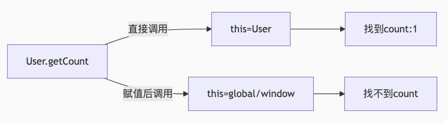
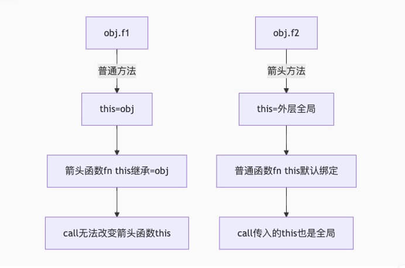
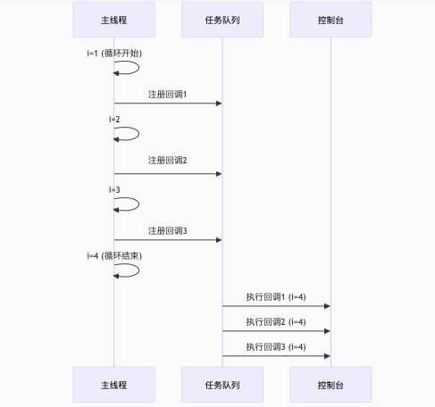
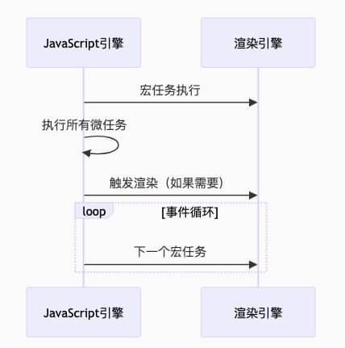

## JS 编译
以下代码，执行结果是什么？

```js
var func = 1
function func() {}
console.log(func + func)
```
::: details 参考答案
```bash
输出：2
```
🤔️考察点：`GO（Global Object）全局对象`、`全局预编译`、`变量和函数声明提升`
- 变量和函数声明提升
- 函数声明优先于变量声明
- 变量赋值会覆盖之前的声明
- var 允许重复声明，而 let/const 不允许

🍎实际执行顺序：
```js
// 编译阶段（提升后）
function func() {}  // 函数声明优先
var func;           // 变量声明（无效，因为func已经是函数）

// 执行阶段
func = 1;           // 赋值覆盖函数
console.log(func + func); // 1 + 1 = 2
```

🚀拓展：`变量提升的区别`
- var 声明‌：会被提升到作用域顶部并初始化值为 undefined
```js
console.log(a); // undefined（不会报错）
var a = 10;
```

- ‌let/const 声明‌：不会被提升到作用域顶部，但在声明前存在暂时性死区‌（Temporal Dead Zone，简称 TDZ），访问时会触发 ReferenceError
```js
{
  // TDZ 开始（此时访问 `x` 会报错）
  console.log(x); // ❌ ReferenceError
  
  let x = 10; // TDZ 结束，`x` 可访问
  console.log(x); // ✅ 10
}
```
- 特性对比表

| 特性               | `var`                  | `let`                  | `const`                |
|--------------------|------------------------|------------------------|------------------------|
| **作用域**         | 函数作用域             | 块级作用域             | 块级作用域             |
| **变量提升**       | ✅（声明+初始化`undefined`） | ✅（仅声明，不初始化）  | ✅（仅声明，不初始化）  |
| **TDZ（暂时性死区）** | ❌ 无                  | ✅ 存在（访问报错）     | ✅ 存在（访问报错）     |
| **重复声明**       | ✅ 允许                 | ❌ 不允许               | ❌ 不允许               |
| **重新赋值**       | ✅ 允许                 | ✅ 允许                 | ❌ 不允许（常量）       |
| **全局对象属性**   | ✅（`var x` → `window.x`） | ❌（`let x` ≠ `window.x`） | ❌（`const x` ≠ `window.x`） |
:::


## JS 引用类型
以下代码，执行结果是什么？

```js
let obj1 = { x: 1 }
let obj2 = obj1
obj2.y = 2
obj2 = { y: 20 }
console.log('obj1', obj1)
```

:::details 参考答案
```bash
输出：obj1 { x: 1, y: 2 }
```
🤔️考察点：`数据类型`、`指针`、`堆内存`
- 数据类型
  - 基本类型包括：Undefined、Null、Boolean、Number、String、Symbol、Bigint
  - 引用类型包括：Object、Array、函数、Date、RegExp 等
- 栈内存中obj1和obj2存储相同指针
- 堆内存创建对象{x:1}（地址0x001）

🍎实际执行顺序：
```js
let obj1 = { x: 1 };  // (1) 堆内存创建对象，obj1存储指针
let obj2 = obj1;      // (2) obj2复制obj1的指针（指向同一对象）
obj2.y = 2;           // (3) 通过指针修改堆内存中的对象
obj2 = { y: 20 };     // (4) obj2指向新对象，原对象不受影响
```

🚀拓展：`堆栈对比、const固定的是指针`
- const固定的是指针（栈内存中的地址），不影响堆内存对象的可变性
```js
const obj = { x: 1 };
obj.x = 2;    // ✅ 允许（修改属性）
obj = {x:3};  // ❌ TypeError（改变指针）
```

- JavaScript 内存模型：堆（Heap）与栈（Stack）对比

| 特性                | 栈内存（Stack）                          | 堆内存（Heap）                            |
|---------------------|----------------------------------------|------------------------------------------|
| **存储内容**         | 原始类型值、对象/函数的引用指针            | 对象实例（包括数组、函数等引用类型）        |
| **内存分配**         | 自动分配固定大小                         | 动态分配，按需扩展                        |
| **访问速度**         | ⚡️ 快（直接访问）                        | ⏳ 慢（需通过指针间接访问）                |
| **生命周期管理**     | 随函数执行结束自动释放                    | 通过垃圾回收（GC）机制管理                 |
| **内存碎片**         | 无（连续内存块）                         | 可能存在（频繁分配/释放导致）               |
| **大小限制**         | 较小（通常几MB，依赖浏览器/环境）          | 较大（可达几百MB~GB）                     |
:::


## JS parseInt
以下代码，执行结果是什么？

```js
['1', '2', '3'].map(parseInt)
```

::: details 参考答案
```bash
输出：[1, NaN, NaN]
```
🤔️考察点：`Array.prototype.map 的工作方式`、`parseInt 函数的参数`、`隐式参数传递`
- [map方法](https://developer.mozilla.org/zh-CN/docs/Web/JavaScript/Reference/Global_Objects/Array/map)会对数组的每个元素调用提供的回调函数，并接收三个参数
```js
array.map(function(currentValue, index, array) {
  // 处理逻辑
});
```
- [parseInt函数](https://developer.mozilla.org/zh-CN/docs/Web/JavaScript/Reference/Global_Objects/parseInt)解析一个字符串并返回`指定基数的十进制整数`，接收两个参数:
  - string: 要解析的字符串
  - radix: 基数（进制），介于 2-36 之间的整数
```js
parseInt(string, radix);
```

🍎实际执行顺序：
```js
['1', '2', '3'].map((currentValue, index) => {
  return parseInt(currentValue, index);
});

/**
 * 1. 第一次迭代 (index = 0)
 * 当 radix 为 0 时，如果字符串以 "0x" 或 "0X" 开头，按 16 进制解析; 否则按 10 进制解析
 * */ 
parseInt('1', 0);  // 结果：1

/**
 * 2. 第二次迭代 (index = 1)
 * 基数为 1 是无效的（必须在 2-36 之间）
 * */ 
parseInt('2', 1);  // 结果：NaN

/**
 * 3. 第三次迭代 (index = 2)
 * 基数为 2，则以二进制解析，但 '3' 不是有效的二进制数字
 * */ 
parseInt('3', 2);  // 结果：NaN
```

🚀拓展：正确地将字符串数组转换为数字数组
```js
['1', '2', '3'].map(Number);  // [1, 2, 3]
// 或
['1', '2', '3'].map(str => parseInt(str, 10));  // [1, 2, 3]
```
:::

## JS this 1
以下代码，执行结果是什么？

```js
const User = {
  count: 1,
  getCount: function () {
    return this.count
  },
}
console.log('a ', User.getCount()) // what?
const func = User.getCount
console.log('b', func()) // what?
```
::: details 参考答案
```bash
输出：a 1; b undefined
```
🤔️考察点：`this指向`
- this 是一个指向对象的指针，this 的指向与`所在方法的调用位置有关`，而与方法的声明位置无关。
- this 指向：当通过 User.getCount() 形式调用时，this 指向 User 对象
- this 指向：当函数被赋值给变量后单独调用时：
  - `非严格模式下`：this 指向全局对象（浏览器中是 window，Node.js 中是 global）
  - `严格模式下`：this 为 undefined

🍎实际执行顺序：


🚀拓展：解决方案（绑定正确的 this）
1. 使用 bind：
```js
const func = User.getCount.bind(User);
console.log('b', func()); // 输出: b 1
```
2. 使用箭头函数（如果 getCount 是箭头函数）：
```js
const User = {
  count: 1,
  getCount: () => this.count // 箭头函数不会绑定自己的this
}
// 注意：箭头函数的this由外层作用域决定，这里仍然有问题
```
3. 直接调用时保持对象关联：
```js
console.log('b', User.getCount()); // 保持User.前缀
```
:::

## JS this 2
以下代码，执行结果是什么？

```js
const obj = {
  f1() {
    const fn = () => {
      console.log('this1', this)
    }
    fn()
    fn.call(window)
  },
  f2: () => {
    function fn() {
      console.log('this2', this)
    }
    fn()
    fn.call(this)
  },
}
obj.f1()
obj.f2()
```

::: details 参考答案
```bash
obj.f1();
// 输出:
// this1 obj (对象本身)
// this1 obj (仍然是obj，箭头函数call无效)

obj.f2();
// 输出:
// this2 window (非严格模式) / undefined (严格模式)
// this2 window (非严格模式) / undefined (严格模式)
```
🤔️考察点：`箭头函数的 this`
- 没有自己的 this，继承外层作用域的 this
- 无法通过 call/apply/bind 修改

🍎实际执行顺序：


🚀拓展：理解 this 的关键在于分析函数的调用方式，而不是它的定义位置。
- this指向口诀：点谁是谁，不点全局，new 是实例，箭头看外
1. 默认绑定（独立函数调用）
```js
function showThis() {
  console.log(this);
}

showThis(); // 浏览器中指向 window，Node.js 中指向 global
```
2. 隐式绑定（方法调用）
```js
// 函数作为对象方法调用时，this 指向调用它的对象
// 注意存在隐式丢失问题
const obj = {
  name: 'Alice',
  sayHi() {
    console.log(this.name);
  }
};

obj.sayHi(); // 输出 "Alice"（this 指向 obj）
```
3. 显式绑定（call/apply/bind）
```js
function greet() {
  console.log(`Hello, ${this.name}`);
}

const person = { name: 'Bob' };

greet.call(person);   // "Hello, Bob"
greet.apply(person);  // "Hello, Bob"

const boundFunc = greet.bind(person);
boundFunc();          // "Hello, Bob"
```
4. new 绑定（构造函数
```js
// 构造函数中的 this 指向新创建的实例对象
function Person(name) {
  this.name = name;
}

const p = new Person('Charlie');
console.log(p.name); // "Charlie"
```
5. 箭头函数的 this
```js
const obj = {
  name: 'Dave',
  regularFunc: function() {
    console.log(this.name); // "Dave"
  },
  arrowFunc: () => {
    console.log(this.name); // undefined（继承自外层作用域）
  }
};

obj.regularFunc();
obj.arrowFunc();
```
6. DOM 事件处理函数
```js
button.addEventListener('click', function() {
  console.log(this); // 指向触发事件的元素
});
```
7. 定时器回调
```js
setTimeout(function() {
  console.log(this); // 浏览器中指向 window
}, 100);
```
8. 数组方法回调
```js
[1, 2, 3].forEach(function(item) {
  console.log(this); // 默认指向全局对象
}, { customThis: true }); // 可通过第二个参数指定 this
```
:::

## JS 自由变量 1
以下代码，执行结果是什么？

```js
let i
for (i = 1; i <= 3; i++) {
  setTimeout(function () {
    console.log(i)
  }, 0)
}
```
::: details 参考答案
```bash
输出：
4
4
4
```
🤔️考察点：`事件循环机制`、`setTimeout`
- 所有setTimeout回调被放入任务队列，等待当前执行栈清空；即使延迟时间为0，回调也要等到同步代码执行完毕
- [setTimeout](https://developer.mozilla.org/zh-CN/docs/Web/API/Window/setTimeout)是异步函数

🍎实际执行顺序：

:::


## JS 自由变量 2
以下代码，执行结果是什么？

```js
let n = 10
function f1() {
  n++
  function f2() {
    function f3() {
      n++
    }
    let n = 20
    f3()
    n++
  }
  f2()
  n++
}
f1()
console.log('n', n)
```

::: details 参考答案
```bash
输出：n 12
```
🤔️考察点：`块级作用域`

🍎实际执行顺序：
```js
function f1() {
  n++;  // (1) 修改全局n: 10 → 11
  function f2() {
    function f3() {
      n++;  // (3) 修改哪个n？
    }
    let n = 20;  // (2) f2作用域的局部n
    f3();  // (4) 调用f3
    n++;   // (5) 修改f2的局部n: 20 → 21
  }
  f2();   // (6) 调用f2
  n++;    // (7) 再次修改全局n: 11 → 12
}
```
:::


## JS 闭包 1
以下代码，执行结果是什么？

```js
const n = 10
function print() {
  console.log(n)
}

function f1(fn) {
  const n = 20
  fn()
}
f1(print)
```
::: details 参考答案
```bash
输出：10
```
🤔️考察点：`JavaScript 的作用域`、`闭包机制`
- [词法作用域（静态作用域）](https://developer.mozilla.org/zh-CN/docs/Web/JavaScript/Guide/Closures#%E8%AF%8D%E6%B3%95%E4%BD%9C%E7%94%A8%E5%9F%9F)：JavaScript 采用词法作用域，`函数的作用域由定义位置决定，与调用位置无关`
- [闭包](https://developer.mozilla.org/zh-CN/docs/Web/JavaScript/Guide/Closures#%E9%97%AD%E5%8C%85)：print 函数形成了一个闭包，捕获了定义时的作用域（全局作用域）
:::

## JS 闭包 2
以下代码，执行结果是什么？

```js
function fn() {
  let num = 10
  return {
    set: (n) => (num = n),
    get: () => num,
  }
}

let num = 20
const { get, set } = fn()
console.log('result1: ', get())
set(100)
console.log('result2: ', num)
console.log('result3: ', get())
```
::: details 参考答案
```bash
输出：
result1:  10
result2:  20
result3:  100
```
🤔️考察点：`闭包`
- 区分是全局变量，还是函数作用域内变量
:::

## JS Promise 1
以下代码，执行结果是什么？

```js
const promise = new Promise((resolve, reject) => {
  console.log(1)
  console.log(2)
})
promise.then(() => {
  console.log(3)
})
console.log(4)
```

::: details 参考答案
```bash
输出：
1
2
4
```
🤔️考察点：`Promise`
- Promise 构造函数中的回调函数会立即同步执行
- then 回调是异步执行的，只有在 Promise 被 resolve/reject 后才会进入微任务队列
- 如果 Promise 一直处于 pending 状态，then 回调永远不会执行

🍎实际执行顺序：
```js
const promise = new Promise((resolve, reject) => {
  console.log(1)  // (1) 同步执行
  console.log(2)  // (2) 同步执行
})
promise.then(() => {
  console.log(3)  // (4) 永远不会执行
})
console.log(4)  // (3) 同步执行
```
:::

## JS Promise 2
以下代码，执行结果是什么？

```js
const promise = new Promise((resolve, reject) => {
  console.log(1)
  setTimeout(() => {
    console.log('timerStart')
    resolve('success')
    console.log('timerEnd')
  }, 0)
  console.log(2)
})
promise.then((res) => {
  console.log(res)
})
console.log(4)
```
::: details 参考答案
```bash
输出：
1
2
4
timerStart
timerEnd
success
```
🤔️考察点：`Promise 构造函数同步执行`、`then 回调的触发时机`、`事件循环优先级`
- then 回调的触发时机：必须等待 Promise 被 resolve
- 事件循环优先级：同步代码 > 微任务 > 宏任务
  - 但这里 setTimeout 是先注册的宏任务，resolve 是在宏任务内触发的

🍎实际执行顺序：
```js
const promise = new Promise((resolve, reject) => {
  console.log(1)  // (1) 同步执行
  setTimeout(() => { /* 回调进入宏任务队列 */ }, 0)
  console.log(2)  // (2) 同步执行
})
promise.then((res) => {  // (3) 注册微任务回调（但此时Promise未解决）
  console.log(res)
})
console.log(4)  // (4) 同步执行
```

🚀拓展：宏任务与微任务
JavaScript 的事件循环（Event Loop）中，任务被分为宏任务（MacroTask）和微任务（MicroTask），它们的执行顺序直接影响代码的运行结果

- 核心概念对比

| 特性               | 宏任务（MacroTask）                          | 微任务（MicroTask）                          |
|--------------------|---------------------------------------------|---------------------------------------------|
| **定义**           | 由宿主环境发起的任务                          | 由JavaScript引擎发起的任务                    |
| **触发时机**       | 新一轮事件循环开始时                          | 当前宏任务执行结束后立即执行                   |
| **执行优先级**     | 低（在微任务之后执行）                        | 高（优先于下一个宏任务执行）                   |
| **典型代表**       | `setTimeout`/`setInterval`、I/O操作、DOM事件 | `Promise`回调、`process.nextTick`、`MutationObserver` |
| **队列机制**       | 多个独立队列                                 | 单个共享队列                                 |



- 每个宏任务执行完后，会立即清空整个微任务队列
- Node.js中优先使用setImmediate而非setTimeout(fn, 0)
- 耗时操作应放在宏任务中
- 状态更新优先使用微任务
- 避免在单个微任务中执行过多操作
:::

## JS 异步执行顺序 1
以下代码，执行结果是什么？

```js
console.log('start')
setTimeout(() => {
  console.log('a')

  Promise.resolve().then(() => {
    console.log('c')
  })
})
Promise.resolve().then(() => {
  console.log('b')

  setTimeout(() => {
    console.log('d')
  })
})
console.log('end')
```
::: details 参考答案
```bash
输出：start end b a c d
```
🤔️考察点：`同步代码`、`微任务`、`宏任务`
- 参考上题解析
:::


## JS 异步执行顺序 2
以下代码，执行结果是什么？

```js
Promise.resolve()
  .then(() => {
    console.log(0)
    return Promise.resolve(4)
  })
  .then((res) => {
    console.log(res)
  })

Promise.resolve()
  .then(() => {
    console.log(1)
  })
  .then(() => {
    console.log(2)
  })
  .then(() => {
    console.log(3)
  })
  .then(() => {
    console.log(5)
  })
  .then(() => {
    console.log(6)
  })
```

::: details 参考答案
```bash
输出：
0
1
2
3
4
5
6
```
🤔️考察点：`微任务`、`Promise 的解析过程`
- Promise链的then回调按注册顺序进入微任务队列
- 返回Promise.resolve比直接返回值`多消耗2个微任务周期`
- 多个Promise链会交替执行各自的微任务

🍎实际执行顺序：
- 第一轮微任务：
  1. 执行链A的第一个then（输出0）& 返回Promise.resolve(4)会创建额外的微任务
  1. 执行链B的第一个then（输出1）
- 第二轮微任务：
  1. 解析处理链A返回的Promise（此时还未输出4）
  1. 执行链B的第二个then（输出2）
- 第三轮微任务：
  1. 链A的Promise解析完成，调用下一个 .then()（此时还未输出4）
  1. 执行链B的第三个then（输出3）
- 第四轮微任务：
  1. 执行链A的第二个then（输出4）
  1. 执行链B的第三个then（输出5）
- 后续微任务：链B继续执行（6）
:::