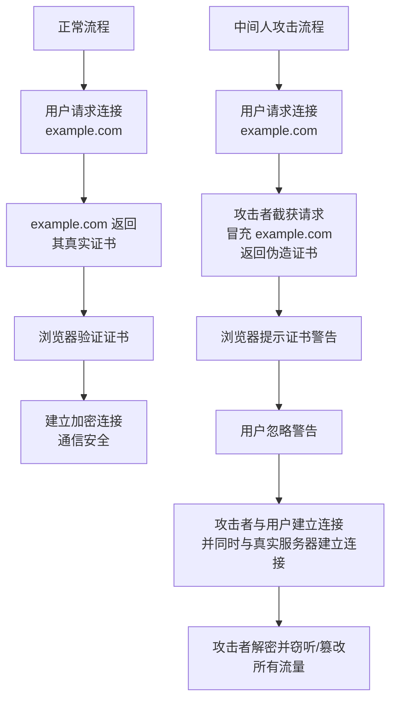

二面结束以后，有可能会再找隔壁部门的高级/资深工程师交叉面试。交叉面试会综合考察候选人的技术能力。

注意，不一定所有面试都会有交叉面试，但这些面试题还是要刷一遍的，都是常考题。

## 求两个数组的交集和并集
- 交集（Intersection）：两个数组中共同存在的元素

- 并集（Union）：两个数组中所有不重复的元素
::: details 参考答案
```js
function arrayOperations(arr1, arr2) {
    // 转换为Set去重
    const set1 = new Set(arr1);
    const set2 = new Set(arr2);
    
    // 求交集
    const intersection = [...set1].filter(x => set2.has(x));
    
    // 求并集
    const union = [...new Set([...arr1, ...arr2])];
    
    return { intersection, union };
}

// 示例
const arr1 = [1, 2, 3, 4, 5, 2];
const arr2 = [4, 5, 6, 7, 8, 4];

const result = arrayOperations(arr1, arr2);
console.log("数组1:", arr1);
console.log("数组2:", arr2);
console.log("交集:", result.intersection); // [4, 5]
console.log("并集:", result.union);       // [1, 2, 3, 4, 5, 6, 7, 8]
```
:::

## 数组转树

将扁平化的数组数据转换为树形结构，通常用于菜单、分类、组织架构等场景。

示例数据：
```js
const flatArray = [
  { id: 1, parentId: null, name: 'Root' },
  { id: 2, parentId: 1, name: 'Child 1' },
  { id: 3, parentId: 1, name: 'Child 2' },
  { id: 4, parentId: 2, name: 'Grandchild 1' },
]
```
目标生成：
```js
const tree = [
  {
    id: 1,
    name: 'Root',
    children: [
      {
        id: 2,
        name: 'Child 1',
        children: [{ id: 4, name: 'Grandchild 1', children: [] }],
      },
      {
        id: 3,
        name: 'Child 2',
        children: [],
      },
    ],
  },
]
```


::: details 参考答案

- 实现思路：

1. 遍历数组，将每个元素存储到一个以 id 为键的 Map 中。
2. 再次遍历数组，根据 parentId 将子节点挂载到父节点的 children 属性上。
3. 提取 parentId 为 null 的顶层节点作为树的根。

- 注意事项
    - 确保 `parentId 为 null` 的节点是根节点。
    - 避免循环依赖：输入数据需要合法，否则会导致死循环。
    - 时间复杂度 O(n)，性能优秀
    - 代码清晰易维护
    - 支持各种边界情况处理

::: code-group
```js [使用Map]
function arrayToTreeMap(items, options = {}) {
    const {
        idKey = 'id',
        parentKey = 'parentId',
        childrenKey = 'children'
    } = options;

    const map = new Map();
    const roots = [];

    // 创建映射表
    items.forEach(item => {
        map.set(item[idKey], { ...item, [childrenKey]: [] });
    });

    // 构建树结构
    items.forEach(item => {
        const node = map.get(item[idKey]);
        const parent = map.get(item[parentKey]);

        if (parent) {
            parent[childrenKey].push(node);
        } else {
            roots.push(node);
        }
    });

    return roots;
}

// 使用示例
const tree = arrayToTreeMap(flatArray);
console.log(JSON.stringify(tree, null, 2));
```

```js [使用对象引用]
function arrayToTreeOptimized(items, options = {}) {
    const {
        idKey = 'id',
        parentKey = 'parentId',
        childrenKey = 'children'
    } = options;

    const map = {};
    const roots = [];

    // 第一次遍历：创建所有节点的引用
    items.forEach(item => {
        map[item[idKey]] = { ...item, [childrenKey]: [] };
    });

    // 第二次遍历：构建父子关系
    items.forEach(item => {
        const node = map[item[idKey]];
        
        if (item[parentKey] && map[item[parentKey]]) {
            map[item[parentKey]][childrenKey].push(node);
        } else {
            roots.push(node);
        }
    });

    return roots;
}
```
:::

## 树转数组

将树形结构扁平化为数组，保留原有的层级关系。上述题目的逆操作

::: details 参考答案
::: code-group

```js [递归实现（DFS - 深度优先）]
function treeToArrayDFS(tree, result = []) {
  // 遍历传入的树（数组）的每一个节点
  for (const node of tree) {
    // 将当前节点加入结果数组。
    // 如果想得到纯净的节点（不含 children），可以在这里创建一个新对象，只复制需要的属性。
    // 例如：const { children, ...rest } = node; result.push(rest);
    result.push(node); 

    // 如果当前节点有子节点，则递归处理其子节点
    if (node.children && node.children.length > 0) {
      treeToArrayDFS(node.children, result);
    }
  }
  return result;
}

const flatArrayDFS = treeToArrayDFS(tree);
console.log(flatArrayDFS);
```

```js [迭代实现（BFS - 广度优先）]
// 使用队列（Queue）来实现，更适合非常深的树结构，可以避免递归导致的栈溢出。

function treeToArrayBFS(tree) {
  const result = [];
  // 创建一个队列，初始化为树的根节点数组
  const queue = [...tree]; 

  // 当队列不为空时循环
  while (queue.length > 0) {
    // 从队列头部取出一个节点
    const node = queue.shift(); 
    result.push(node);

    // 如果需要去除children
    // const { children, ...cleanNode } = node; // 解构赋值，分离出 children 和其他属性
    // result.push(cleanNode); // 只推送不包含 children 的属性

    // 如果该节点有子节点，则将子节点全部追加到队列尾部
    if (node.children && node.children.length > 0) {
      queue.push(...node.children);
    }
  }
  return result;
}

const flatArrayBFS = treeToArrayBFS(tree);
console.log(flatArrayBFS);
```


### 关键区别与选择

| 特性         | 递归 (DFS)                           | 迭代 (BFS)                           |
| :----------- | :----------------------------------- | :----------------------------------- |
| **实现方式**   | 函数自己调用自己，代码简洁             | 使用循环和队列（或栈），代码稍复杂       |
| **遍历顺序**   | 先深入到底，再回溯（1 -> 2 -> 3 -> 4 -> 5） | 先访问同级，再下级（1 -> 5 -> 2 -> 3 -> 4） |
| **性能风险**   | 树非常深时可能导致**栈溢出**           | 无栈溢出风险，更安全                   |
| **内存使用**   | 函数调用栈开销                         | 需要显式维护一个队列，存储待处理的节点     |

:::

## cookie localStorage sessionStorage 三者有什么区别，有什么应用场景？
::: details 参考答案

| 特性         | Cookie                                       | LocalStorage                            | SessionStorage                          |
| :----------- | :------------------------------------------- | :-------------------------------------- | :-------------------------------------- |
| **生命周期**   | 可设置过期时间（默认随浏览器关闭失效）               | **永久存储**，除非手动清除                    | **仅限当前会话**，关闭标签页/浏览器即被清除         |
| **存储大小**   | **~4KB**                                     | **~5MB**（因浏览器而异）                   | **~5MB**（因浏览器而异）                   |
| **与服务端通信** | **每次都会携带在 HTTP 头中**，会浪费带宽           | 仅在客户端存储，不参与服务端通信                 | 仅在客户端存储，不参与服务端通信                 |
| **API 易用性** | 原生 API 较为简陋，通常使用库（如 `js-cookie`） | 简单的 `setItem`, `getItem` 等 API        | 简单的 `setItem`, `getItem` 等 API        |
| **数据共享范围** | 在所有**同源窗口**中共享                         | 在所有**同源窗口**中共享                     | **仅在当前标签页**内共享（即使是同源页面也不同）      |
| **存储位置**   | 浏览器和服务器                                  | 仅浏览器                                  | 仅浏览器                                  |

---

### 总结与选择指南

| 如果你的需求是...                               | 那么应该选择...        |
| :----------------------------------------------- | :--------------------- |
| 需要让服务器知道的信息（如登录状态）                 | **Cookie** (设置 `HttpOnly`) |
| 需要长期、大规模存储在客户端的数据（如用户偏好）       | **LocalStorage**       |
| 只需要在当前标签页临时保存数据，关闭后即可丢弃         | **SessionStorage**     |
| 存储敏感数据（但切记，任何客户端存储都不绝对安全）     | **最好别存**，或用 SessionStorage 暂存 |

:::

## 前端会有哪些安全问题？该如何预防？
::: details 参考答案

### 一、跨站脚本攻击（XSS - Cross-Site Scripting）

*   **攻击原理**： 用户输入或URL参数等未经过滤直接被输出到HTML页面中，浏览器将其当作有效代码执行。
*   **危害**： 窃取用户Cookie、Session Tokens，篡改页面内容，发起恶意请求，重定向到钓鱼网站等。
*   **预防措施**：
    1.  **对输入进行转义和过滤**
    2.  **谨慎使用 `innerHTML`、`outerHTML`、`document.write()`**
    3.  **使用内容安全策略 (CSP - Content Security Policy)**： 通过HTTP响应头 `Content-Security-Policy` 告诉浏览器只允许加载指定源的脚本、样式、图片等资源，从根本上杜绝内联脚本和未授权源的代码执行。
    4.  对富文本内容（如用户评论中的加粗、图片），使用专门的白名单库（如 `DOMPurify`）进行过滤，只允许安全的HTML标签和属性。

---

### 二、跨站请求伪造（CSRF - Cross-Site Request Forgery）

*   **攻击原理**： 攻击者诱导用户在当前已登录的Web应用中执行一个非本意的操作。
*   **危害**： 以用户身份执行更改密码、转账、发送邮件等操作。
*   **预防措施**：
    1.  **使用 Anti-CSRF Tokens**：服务器生成一个随机、不可预测的Token（通常存在Session中）
    2.  **设置 Cookie 的 `SameSite` 属性**： `Strict` 完全禁止第三方Cookie
    3.  **验证请求来源（Origin/Referer Header）**

---

### 三、中间人攻击（MitM）与信息泄露
数据在客户端与服务器传输过程中被窃听或篡改。

*   **预防措施**：
    *   **全站 HTTPS**： 使用SSL/TLS证书对通信进行加密。
    *   **使用 HSTS (HTTP Strict Transport Security)**： 通过HTTP响应头 `Strict-Transport-Security` 强制浏览器只通过HTTPS与网站进行通信，防止SSL剥离攻击。

---

### 四、点击劫持（Clickjacking）
攻击者使用一个透明的iframe覆盖在看似无害的网页上，诱使用户点击，实际点击的是隐藏页面上的某个功能按钮（如“关注”或“删除”）。

*   **预防措施**：
    *   **使用 X-Frame-Options 响应头**： 告诉浏览器是否允许当前页面被嵌入到`<frame>`, `<iframe>`, `<embed>` 或 `<object>` 中。
        *   `DENY`： 完全不允许嵌入。
        *   `SAMEORIGIN`： 只允许同源页面嵌入。
    *   **使用 CSP 的 `frame-ancestors` 指令**： 这是更现代的替代方案，可以指定允许哪些源嵌入当前页面（如 `Content-Security-Policy: frame-ancestors 'self';`）。

---

### 其他重要安全实践

1.  **避免将敏感数据存储在客户端**： 不要将密码、密钥、个人身份信息等明文存储在 `localStorage`、`sessionStorage` 或 Cookie 中。客户端存储没有绝对安全。
2.  **依赖包安全（npm）**： 项目依赖的第三方库可能包含漏洞。
    *   **预防**： 定期使用 `npm audit` 或集成 Snyk、Dependabot 等工具扫描和修复依赖漏洞。
3.  **安全的第三方集成**： 谨慎加载第三方脚本（如 analytics、ads），因为它们如果被黑，会直接影响你的网站。
    *   **预防**： 使用 CSP 限制第三方脚本的来源；为第三方脚本添加 `integrity` 属性（子资源完整性校验 SRI），确保其内容未被篡改。
    *   Example: 
        ```html
        <script src="https://example.com/example.js"
                integrity="sha384-{hash-value}"
                crossorigin="anonymous"></script>
        ```
4.  **错误处理**： 不要将详细的错误信息（如堆栈跟踪、数据库错误）直接暴露给用户前端，这可能会泄露系统内部信息。应对错误进行友好化处理。

:::

## 常见的 git 命令有哪些？
::: details 参考答案
好的，这里为您梳理了前端开发中最常用和关键的 Git 命令，并按照工作流程进行分类，方便记忆和使用。

### 一、初始化和配置 (Init & Config)

| 命令 | 描述 | 示例 |
| :--- | :--- | :--- |
| `git init` | 在当前目录初始化一个新的 Git 仓库 | `git init` |
| `git clone <url>` | 克隆（下载）一个远程仓库到本地 | `git clone https://github.com/user/repo.git` |
| `git config` | 配置用户信息（**首次安装必须设置**） | `git config --global user.name "Your Name"` <br> `git config --global user.email "your@email.com"` |

---

### 二、基础工作流 (Basic Workflow) - 最核心的部分

这是你每天都会重复的流程：`工作区 -> 暂存区 -> 仓库`。

| 命令 | 描述 | 示例 |
| :--- | :--- | :--- |
| `git status` | **检查当前仓库的状态**（查看哪些文件被修改、暂存了） | `git status` |
| `git add <file>` | 将**工作区**的修改添加到**暂存区** | `git add index.html` (添加特定文件) <br> `git add .` (添加所有修改) |
| `git commit -m "msg"` | 将**暂存区**的内容提交到**本地仓库**，并附上提交信息 | `git commit -m "fix: 修复了登录按钮的bug"` |
| `git push` | 将**本地仓库**的提交推送到**远程仓库** | `git push origin main` |
| `git pull` | 从**远程仓库**拉取更新并合并到当前分支（=`git fetch` + `git merge`） | `git pull origin main` |

---

### 三、查看与对比 (Review & Diff)

| 命令 | 描述 | 示例 |
| :--- | :--- | :--- |
| `git log` | 查看提交历史 | `git log` <br> `git log --oneline` (简洁版) |
| `git diff` | 查看**工作区**和**暂存区**的差异 | `git diff` |
| `git diff --staged` | 查看**暂存区**和**最后一次提交**的差异 | `git diff --staged` |

---

### 四、分支管理 (Branching) - 协同开发的核心

| 命令 | 描述 | 示例 |
| :--- | :--- | :--- |
| `git branch` | 查看所有本地分支 | `git branch` |
| `git branch <name>` | 创建一个新分支 | `git branch feature/login` |
| `git checkout <branch>` | 切换到指定分支 | `git checkout feature/login` |
| `git switch <branch>` | (较新命令) 切换到指定分支，比 `checkout` 更直观 | `git switch main` |
| `git checkout -b <branch>` | **创建并切换**到新分支（常用组合技） | `git checkout -b hotfix/header` |
| `git merge <branch>` | 将指定分支合并到**当前分支** | `git switch main` <br> `git merge feature/login` |
| `git branch -d <branch>` | 删除一个已合并的分支 | `git branch -d feature/login` |

---

### 五、撤销与回退 (Undo & Reset) - 请谨慎操作！

| 命令 | 描述 | 应用场景 |
| :--- | :--- | :--- |
| `git restore <file>` | **丢弃工作区**的修改，恢复到最后一次提交的状态 | 改乱了文件，想重新开始 |
| `git restore --staged <file>` | 将文件从**暂存区**撤出，但**保留工作区的修改** | `git add` 多了文件，想取消暂存 |
| `git commit --amend` | **修补上一次提交**（可以修改提交信息或追加文件） | 提交信息写错了，或漏了文件 |
| `git reset <commit>` | **回退到指定的提交**（**谨慎使用！**） | `git reset --hard HEAD^` (回退到上一个提交，**丢弃所有修改**) |

> **警告**： 特别是 `git reset --hard` 和 `git push --force` 会覆盖历史，在团队协作中需极度谨慎。

---

### 六、远程协作 (Remote Collaboration)

| 命令 | 描述 | 示例 |
| :--- | :--- | :--- |
| `git remote -v` | 查看已配置的远程仓库地址 | `git remote -v` |
| `git fetch` | 从远程仓库获取最新信息（**但不自动合并**），更安全 | `git fetch origin` |
| `git push -u origin <branch>` | **首次推送**本地分支到远程，并建立关联 | `git push -u origin feature/login` |

---

### 七、临时存档（贮藏）(Stashing)

| 命令 | 描述 | 应用场景 |
| :--- | :--- | :--- |
| `git stash` | 将当前**工作区**和**暂存区**的修改临时保存起来 | 正在开发一个功能，突然要切分支去修个紧急bug |
| `git stash pop` | 恢复最近一次贮藏的修改，并删除贮藏记录 | 修完bug后，回到刚才的工作 |

---
:::


## 如何使用 git 多人协作开发？
::: details 参考答案

### 核心分析维度

选择哪种协作模型，主要取决于以下几个维度：
1.  **团队规模**：人数越多，对流程的规范性和隔离性要求越高。
2.  **项目复杂度与发布周期**：发布越频繁，功能越多，越需要清晰的分支结构来管理并行开发。
3.  **代码质量要求**：对稳定性和代码质量要求越高，代码审查（Code Review）就越重要。
4.  **协作成员的可信度**：成员是否都对主仓库有直接推送权限，还是需要审核机制。

---

### 综合性决策框架

#### 1. 小型项目（1-3人） -> **集中式工作流（Centralized Workflow）的增强版**

*   **核心特征**：简单、直接、低开销。
*   **策略**：
    *   **分支**：以 `main` 分支为核心。可以创建短期的功能分支（`feat-xxx`），完成后再合并到 `main`。
    *   **权限**：所有人对 `main` 分支都有推送（`push`）权限。
    *   **代码集成**：通过 **`git pull --rebase`** 来集成代码是关键。它可以将你的提交“挪动”到更新后的主线顶端，保持历史线性整洁，比直接 `git pull`（会产生合并提交）更清晰。
*   **适用场景**：创业项目初期、课程作业、个人小程序。目标是快速迭代，流程最小化。

#### 2. 中型项目（3-10人） -> **功能分支工作流（Feature Branch Workflow） + Pull Request**

*   **核心特征**：引入代码审查（Code Review）作为质量保障的核心环节。
*   **策略**：
    *   **分支**：
        *   `main` 分支：代表生产环境，绝对稳定。
        *   `develop` 分支（可选但推荐）：集成所有已完成的功能，代表下一个发布版本的状态。
        *   **功能分支（feature/\*）**：每个新功能都在自己独立的分支上开发。
    *   **权限**：**保护 `main` 和 `develop` 分支**。禁止直接 `push`，必须通过 **Pull Request (PR)** 并至少有一名其他成员审核批准（Approve）后才能合并。
    *   **流程**：`feature -> (PR -> Review -> Merge) -> develop -> (测试) -> (PR -> Merge) -> main`
*   **适用场景**：绝大多数初创公司、企业内部应用、中小型商业项目。在流程规范和发展速度之间取得了最佳平衡。

#### 3. 大型项目（10+人） -> **Git Flow（或简化变体）**

*   **核心特征**：严格的分支模型，用于管理复杂的发布、热修复和多版本维护。
*   **策略**：
    *   **分支**：
        *   `main`/`master`：严格对应生产环境。
        *   `develop`：集成所有准备下次发布的功能。
        *   `feature/*`：从 `develop` 拉取，合并回 `develop`。
        *   `release/*`：从 `develop` 拉取，用于测试、修Bug、生成版本号。完成后合并回 `main` **和** `develop`。
        *   `hotfix/*`：从 `main` 拉取，用于紧急线上修复。完成后合并回 `main` **和** `develop`。
    *   **权限**：所有长期分支（`main`, `develop`, `release/*`）都受保护，通过PR合并。
*   **适用场景**：大型互联网应用、基础软件、需要支持多个历史版本的项目。流程较重，但对于管理复杂性至关重要。
*   **现代简化**：采用 **GitHub Flow**（只有 `main` 和功能分支）或 **简化Git Flow**（去掉 `release` 分支，用标签和 `develop` 分支替代）。

#### 4. 开源项目 -> **Fork & Pull Request 工作流**

*   **核心特征**：权限隔离和社区贡献。贡献者没有直接写入主仓库的权限。
*   **策略**：
    *   **Fork**：贡献者先将主仓库复制（Fork）到自己的远程账户下。
    *   **克隆**：克隆自己账户下的仓库到本地，而非主仓库。
    *   **开发**：在本地创建功能分支进行开发。
    *   **推送 & PR**：将分支推送到**自己Fork的仓库**，然后向**主仓库**发起Pull Request。
    *   **审查**：项目维护者审查PR，决定是否合并。
*   **适用场景**：所有开源项目。完美解决了陌生人协作的信任和权限问题。

#### 5. 闭源项目 -> **私有仓库下的上述任意流程**

*   **核心特征**：访问控制严格，但团队内部协作模式灵活。
*   **策略**：闭源只是一个权限状态，而不是一个工作流。团队内部可以根据项目规模，自由选择上述任何一种模型。
    *   3人闭源团队完全可以用**小型项目**的策略。
    *   50人的闭源团队几乎一定会采用**大型项目**的Git Flow或类似变体。
*   **适用场景**：企业级商业软件、内部系统、不希望公开源代码的项目。

:::

## 是否熟悉 Linux 系统，常见的 Linux 命令有哪些？
::: details 参考答案

---

### 一、基础文件与目录操作（每天都会用）

| 命令 | 全称/含义 | 命令示例与说明 |
| :--- | :--- | :--- |
| **`pwd`** | **Print Working Directory** | `pwd` <br> 显示你当前所在的目录的绝对路径。 |
| **`ls`** | **List** | `ls` （列出文件） <br> `ls -la` （列出**所有**文件，包括隐藏文件，并显示详细信息） |
| **`cd`** | **Change Directory** | `cd /usr/bin` （切换到绝对路径） <br> `cd projects` （切换到当前目录下的子目录） <br> `cd ..` （**切换到上一级目录**） <br> `cd` 或 `cd ~` （直接回到用户家目录，如 `/home/username`） |
| **`mkdir`** | **Make Directory** | `mkdir my-project` （创建目录） <br> `mkdir -p src/components` （**递归创建**，即如果父目录不存在则一起创建） |
| **`touch`** |  | `touch index.html` （**创建一个空文件**或更新文件的修改时间） |
| **`cp`** | **Copy** | `cp file.txt file-backup.txt` （复制文件） <br> `cp -r dir1 dir2` （**递归复制**整个目录） |
| **`mv`** | **Move** | `mv old-name.txt new-name.txt` （**重命名**文件） <br> `mv file.txt /tmp/` （**移动**文件到 `/tmp` 目录） |
| **`rm`** | **Remove** | `rm file.txt` （**删除**文件） <br> `rm -r my-dir` （**递归删除**目录及内部所有内容）<br> **警告：`rm -rf /*` 是毁灭性的，绝对不要尝试！** |
| **`cat`** | **Concatenate** | `cat package.json` （**查看**文件的全部内容） |
| **`less` / `more`** |  | `less server.log` （**分页查看**大文件内容，支持上下滚动，按 `q` 退出） |

---

### 二、文件内容查看与搜索（调试和查日志神器）

| 命令 | 含义 | 命令示例与说明 |
| :--- | :--- | :--- |
| **`head`** |  | `head -n 20 log.txt` （查看文件的**开头**20行） |
| **`tail`** |  | `tail -n 20 log.txt` （查看文件的**末尾**20行） <br> `tail -f server.log` （**实时追踪**文件末尾的新内容，**看日志必备**） |
| **`grep`** | **Global Regular Expression Print** | `grep "error" server.log` （在文件中**搜索**包含 "error" 的行） <br> `grep -r "import React" src/` （**递归搜索**目录下所有文件） <br> `ps aux | grep node` （**组合使用**，查找 node 进程） |

---

### 三、系统与进程管理（排查问题用）

| 命令 | 全称/含义 | 命令示例与说明 |
| :--- | :--- | :--- |
| **`ps`** | **Process Status** | `ps aux` （查看当前运行的所有**进程**的详细信息） |
| **`kill`** |  | `kill 1234` （**结束**PID为1234的进程） <br> `kill -9 1234` （**强制结束**进程） |
| **`top`** / **`htop`** |  | `top` （**动态显示**正在运行的进程和系统资源占用情况，类似任务管理器） |
| **`df`** | **Disk Free** | `df -h` （以易读格式显示**磁盘空间**使用情况） |
| **`du`** | **Disk Usage** | `du -sh .` （查看**当前目录**的总占用空间） <br> `du -sh *` （查看当前目录下**每个子项**的大小） |
| **`chmod`** | **Change Mode** | `chmod +x script.sh` （给文件添加**可执行权限**） |

---

### 四、网络相关

| 命令 | 全称/含义 | 命令示例与说明 |
| :--- | :--- | :--- |
| **`curl`** | **Client URL** | `curl http://example.com` （**发送HTTP请求**，获取网页内容，API测试神器） <br> `curl -O http://example.com/file.zip` （下载文件） |
| **`wget`** | **World Wide Web get** | `wget http://example.com/file.zip` （**下载**文件或整个网页） |
| **`ping`** |  | `ping google.com` （**测试**与目标域名的网络是否连通） |
| **`ssh`** | **Secure Shell** | `ssh user@server.ip` （**远程登录**到另一台服务器） |

---

### 五、压缩与解压

| 命令 | 含义 | 命令示例与说明 |
| :--- | :--- | :--- |
| **`tar`** | **Tape Archive** | `tar -czvf archive.tar.gz ./folder/` （**压缩**：将 `folder` 打包成 `archive.tar.gz`） <br> `tar -xzvf archive.tar.gz` （**解压**到当前目录） |
| **`unzip`** |  | `unzip package.zip` （解压 `.zip` 文件） |

---

### 六、权限与用户

| 命令 | 全称/含义 | 命令示例与说明 |
| :--- | :--- | :--- |
| **`sudo`** | **SuperUser DO** | `sudo apt update` （以**管理员身份**运行命令） |
| **`chmod`** | **Change Mode** | `chmod 644 index.html` （用数字修改文件权限） <br> `chmod +x script.sh` （给脚本添加可执行权限） |

---

### 前端开发经典工作流示例

1.  **登录服务器查看项目日志**：
    ```bash
    ssh user@your-server.ip
    cd /var/www/app/
    tail -f logs/error.log # 实时查看错误日志
    ```

2.  **查找并终止一个失控的进程**（比如一个卡死的 `npm run dev`）：
    ```bash
    ps aux | grep node  # 找到进程的PID（比如是 1234）
    kill -9 1234       # 强制结束它
    ```

3.  **下载并解压一个资源**：
    ```bash
    wget https://example.com/release.tar.gz
    tar -xzvf release.tar.gz
    ```

4.  **检查磁盘空间是否已满**（导致构建失败或无法安装`node_modules`）：
    ```bash
    df -h
    du -sh /home/username/project/# 查看项目多大
    ```
:::

## 如何调试前端代码？
::: details 参考答案

### 一、浏览器开发者工具 (DevTools) - 核心主战场

这是最强有力的调试工具，通常通过 `F12` 或 `Ctrl+Shift+I` (Mac: `Cmd+Opt+I`) 打开。

#### 1. Elements 面板 (元素面板)
*   **功能**： 查看和实时编辑 HTML 和 CSS。
*   **调试场景**：
    *   **样式问题**： 查看元素的最终计算样式（Computed），排查样式覆盖、不生效问题。
    *   **布局问题**： 使用盒模型视图查看 `margin`, `padding`, `border`，排查布局错乱。
    *   **动态类名**： 检查 JS 动态添加或移除的类名是否正确。

#### 2. Console 面板 (控制台)
*   **功能**： 查看日志、错误信息，并作为一个 REPL 环境执行 JS 代码。
*   **调试场景**：
    *   **`console.log()`**： 最基础的输出变量值。
    *   **更多 `console` 方法**：
        *   `console.warn()`, `console.error()`： 更醒目的提示。
        *   `console.table(arrayOrObject)`： 以表格形式展示数组或对象，**非常清晰**！
        *   `console.dir(element)`： 以对象形式查看 DOM 元素的详细属性。
        *   `console.trace()`： 打印当前的调用栈，用于追踪函数被谁调用。
    *   **捕获错误**： 运行时错误（JS Exception）会直接打印在此，并附上文件名和行号，点击即可跳转到源代码。

#### 3. Sources 面板 (源代码面板) - **最强大的调试器**
*   **功能**： 查看、调试 JavaScript 源代码。
*   **核心用法**：
    1.  **设置断点 (Breakpoint)**： 在代码行号上点击，浏览器执行到此处时会暂停。
    2.  **观察作用域 (Scope)**： 在暂停时，可以查看当前作用域内**所有变量的值**。
    3.  **控制执行流程**：
        *   **Resume (F8)**： 继续执行。
        *   **Step over (F10)**： 执行下一行（不进入函数内部）。
        *   **Step into (F11)**： 执行下一行（会进入函数内部）。
        *   **Step out (Shift+F11)**： 跳出当前函数。
    4.  **监视表达式 (Watch)**： 添加一个表达式（如 `a + b`），实时查看它的值。

#### 4. Network 面板 (网络面板)
*   **功能**： 记录所有网络请求（XHR/Fetch, JS, CSS, 图片等）。
*   **调试场景**：
    *   **API 接口调试**： 检查请求是否成功发送（Status 200?）、请求参数（Payload）和响应结果（Response）。
    *   **性能优化**： 查看资源加载时间、大小，找出慢的请求。
    *   **排查404错误**： 检查静态资源（如图片、JS文件）是否路径错误。

#### 5. Application 面板 (应用面板)
*   **功能**： 查看和操作浏览器的存储数据。
*   **调试场景**：
    *   **查看/修改 Cookie、LocalStorage、SessionStorage**。
    *   **调试 Service Worker** 和 **Cache Storage**（PWA 应用必备）。

#### 6. Performance 和 Memory 面板 (性能与内存面板)
*   **功能**： 高级功能，用于分析运行时性能瓶颈和内存泄漏。
*   **调试场景**：
    *   **页面卡顿、动画不流畅**： 录制一段时间内的性能表现，找到耗时的函数。
    *   **页面内存占用越来越高**： 拍摄堆内存快照，查找无法被垃圾回收的变量。

---

### 二、Debugger 关键字

除了在 Sources 面板点击设置断点，你还可以直接在代码中写入 `debugger;` 语句。

```javascript
function problematicFunction() {
  const a = 1;
  const b = 2;
  debugger; // 执行到此处时，浏览器会自动在此暂停！
  return a + b;
}
```
*   **优点**： 无需在DevTools中手动查找文件设置断点。
*   **注意**： **记得上线前要删除或注释掉这些语句！**

---

### 三、远程调试 (Remote Debugging)

#### 1. 调试移动端浏览器 (Android/Chrome)
1.  用 USB 连接手机和电脑，并开启手机的“USB调试”模式。
2.  在电脑 Chrome 中打开 `chrome://inspect`。
3.  可以看到已连接的设备及其打开的页面，点击 `inspect` 即可像调试电脑页面一样调试手机页面。

#### 2. 调试原生应用 (如 React Native / WebView)
原理类似，允许你用电脑的 DevTools 来调试运行在模拟器或真机上的应用 JS 代码。

---

### 四、针对框架的调试工具

现代前端框架都有其专用的浏览器扩展，能极大提升调试体验。

*   **React Developer Tools**： 可以查看组件树、组件的 props 和 state，性能分析。
*   **Vue DevTools**： 功能类似，专为 Vue 设计。
*   **Redux DevTools**： 可以追踪每一个 Action 的发生和 State 的变化，支持“时间旅行”调试。

**务必为你使用的框架安装对应的调试工具！**

---

### 五、实战调试策略与流程

当遇到一个 Bug 时，不要盲目猜测，遵循一个系统化的流程：

1.  **复现问题 (Reproduce)**： 确定在什么条件下 Bug 会出现（是每次都会还是偶尔？）。
2.  **定位问题 (Locate)**：
    *   **看 Console**： 是否有红色错误信息？这是最快的方法。
    *   **确认范围**： 是样式问题？逻辑问题？还是接口问题？
        *   **样式问题** -> 用 **Elements** 面板。
        *   **逻辑问题 (JS)** -> 用 **Sources** 面板打**断点**。
        *   **接口问题** -> 用 **Network** 面板。
3.  **假设与验证 (Hypothesize & Verify)**：
    *   “我怀疑是这行代码的逻辑错了” -> 去断点看看变量的值。
    *   “我怀疑是这个 API 返回错了” -> 去 Network 看看 Response。
    *   “我怀疑是这个样式被覆盖了” -> 去 Elements 看 Computed 样式。
4.  **修复与测试 (Fix & Test)**： 修复后，再次重复操作，确认 Bug 是否解决。

:::

## 移动端 H5 如何抓包网络请求？
::: details 参考答案
核心原理是：**让移动设备的网络流量都经过你的电脑，再由电脑上的抓包工具进行拦截、记录和分析。**
---

### 方法一：使用桌面浏览器直接调试 (最简单)

这种方法适用于在电脑上开发移动端 H5 页面时的初始调试。

1.  **打开 Chrome DevTools**： 在电脑 Chrome 中打开你的 H5 页面，按 `F12` 打开开发者工具。
2.  **切换设备模拟模式**： 点击 DevTools 上的 **Toggle device toolbar** 图标（手机和平板形状的图标），或按 `Ctrl+Shift+M` (Mac: `Cmd+Shift+M`)。
3.  **选择设备与网络条件**：
    *   在上方可以选择模拟的手机型号（如 iPhone 12, Pixel 5）。
    *   你还可以模拟**网络节流**（Network throttling），模拟 3G、4G 等慢速网络环境。
4.  **抓包**： 此时在 **Network** 面板中发出的所有请求，都是基于移动端 User-Agent 和网络环境的，可以直接查看。

**优点**： 极其方便，无需任何设置。
**缺点**： 无法捕获**真机**上的请求，无法调试手机特有环境（如微信浏览器、手机APP内的WebView）。

---

### 方法二：使用 Charles / Fiddler (最专业、最强大)

这是最主流、功能最全面的抓包方案，适合所有场景。

#### 准备工作

1.  **安装抓包工具**： 在你的电脑上下载并安装 [Charles](https://www.charlesproxy.com/) 或 [Fiddler](https://www.telerik.com/fiddler)。（Charles 界面更现代，macOS 用户首选；Fiddler 免费且强大，Windows 用户居多）。
2.  **查看电脑IP地址**： 在电脑命令行输入 `ipconfig` (Windows) 或 `ifconfig` (macOS/Linux)，找到电脑的局域网 IP 地址（如 `192.168.1.10`）。

#### 设置 Charles (以 Charles 为例)

1.  **开启 HTTP 代理**： 打开 Charles，菜单栏选择 **Proxy -> Proxy Settings...**，确保 HTTP Proxy 的端口是 `8888`（默认）。

2.  **安装电脑上的 SSL 证书（抓 HTTPS 必须）**：
    *   菜单栏选择 **Help -> SSL Proxying -> Install Charles Root Certificate**。
    *   在钥匙串访问（macOS）或证书管理器（Windows）中，**信任**此证书。

3.  **设置 SSL 代理（抓 HTTPS 必须）**：
    *   菜单栏选择 **Proxy -> SSL Proxying Settings...**。
    *   勾选 **Enable SSL Proxying**。
    *   在 **Location** 列表中添加一条规则：Host 为 `*`，Port 为 `*`（这表示抓取所有域名的 HTTPS 请求）。

#### 设置手机

1.  **连接同一网络**： 确保手机和电脑连接在**同一个 WiFi** 下。
2.  **配置手机代理**：
    *   打开手机 WiFi 设置，修改当前网络的代理。
    *   **服务器**：填写你的**电脑IP地址**（如 `192.168.1.10`）。
    *   **端口**：填写 `8888`（Charles 的默认端口）。
3.  **安装手机上的 SSL 证书（抓 HTTPS 必须）**：
    *   用手机浏览器打开 `chls.pro/ssl`（Charles 专用链接），会提示你下载并安装证书。
    *   **iOS 额外步骤**： 安装后，还需进入 **设置 > 通用 > 关于本机 > 证书信任设置**，完全信任刚刚安装的 Charles Proxy CA。

#### 开始抓包

完成以上设置后，你用手机打开任何 App 或 H5 页面，所有的网络请求都会在 Charles 的界面中显示出来。

**优点**： 功能强大，可以抓取所有 App 和浏览器的流量，支持断点、重发、篡改请求/响应等高级功能。
**缺点**： 设置稍显复杂。

---

### 方法三：使用浏览器远程调试 (Chrome DevTools)

此方法适用于安卓手机上的 Chrome 浏览器或 WebView 环境。

1.  **用 USB 连接手机和电脑**： 并在手机上开启 **USB 调试** 模式（通常在“开发者选项”中）。
2.  **电脑 Chrome 访问**： 在电脑 Chrome 浏览器地址栏输入 `chrome://inspect`。
3.  **同意调试**： 手机上可能会弹出提示，询问是否允许调试，点击“同意”。
4.  **开始抓包**： 在 `chrome://inspect` 页面，你会看到已连接的手机和打开的页面。点击你要调试的页面下方的 **`inspect`**。
5.  会弹出一个全新的 DevTools 窗口，这个窗口**直接连接到你手机上的页面**。你可以在这个窗口中使用 **Network** 面板抓包，用 **Elements** 面板调试样式，和使用 **Console** 面板运行命令，就像在电脑上调试一样。

**优点**： 无需代理设置，直接使用熟悉的 DevTools，功能完整。
**缺点**： 主要限于 Chrome 浏览器和安卓系统，对 iOS 支持需要 macOS。

---

### 方法四：使用 whistle (开源、轻量)

[whistle](https://github.com/avwo/whistle) 是一个基于 Node.js 的跨平台 Web 调试代理工具，非常受国内前端开发者欢迎。

1.  **安装**： `npm install -g whistle`
2.  **启动**： `w2 start`
3.  **配置代理**： 浏览器访问 `http://127.0.0.1:8899` 进入控制台。手机代理设置指向电脑IP和8899端口。
4.  **安装证书**： 在手机浏览器访问 `http://127.0.0.1:8899`（需代理生效后）或根目录下的 `rootCA.crt` 来安装证书。

**优点**： 配置简单，规则功能强大，可以通过规则实现 hosts、重定向、修改响应等。
**缺点**： 需要熟悉命令行。

---

### 总结与选择指南

| 方法 | 适用场景 | 优点 | 缺点 |
| :--- | :--- | :--- | :--- |
| **浏览器模拟** | 初期开发，快速调试 | 极其简单，无设置 | 无法捕获真机请求 |
| **Charles/Fiddler** | **专业抓包，全能选手** | **功能最全，支持所有App** | 设置稍复杂，收费（Charles） |
| **Chrome远程调试** | 安卓Chrome/WebView调试 | 集成DevTools，体验好 | 仅限安卓Chrome，需USB |
| **whistle** | 需要强大规则功能的开发者 | 免费，规则灵活，基于Node | 需要命令行操作 |

**对于大多数前端开发者，我的建议是：**

1.  **日常开发**： 使用浏览器模拟 + 偶尔真机 Chrome 远程调试。
2.  **深度调试/测试/排查线上问题**： **必须使用 Charles 或 Fiddler**。

**常见问题：**
*   **抓不到 HTTPS 请求？** -> 99% 的原因是**手机上的 CA 证书没有正确安装和信任**。
*   **连接后手机无法上网？** -> 检查电脑防火墙是否放行了抓包工具的端口（如 8888）。
:::

## 网页重绘 repaint 和重排 reflow 有什么区别

::: details 参考答案

*   **重排 (Reflow)**：计算元素**几何属性**（位置、尺寸）的过程，意味着布局发生了改变。
*   **重绘 (Repaint)**：将元素的**外观属性**（颜色、背景等）绘制到屏幕上的过程，布局未改变。
*   **重排的成本远高于重绘**，因为它涉及到整个渲染树或部分渲染树的重新计算。

**关键关系：重排必定会引起重绘，但重绘不一定会引起重排。**


#### 1. 重排 (Reflow / Layout)

*   **是什么**： 当渲染树（Render Tree）中的一部分或全部因为元素的**尺寸、布局、隐藏**等改变而需要重新构建的过程。
*   **触发条件**： 凡是改变页面**布局**的操作都会触发重排，例如：
    *   页面首次渲染（无法避免且最耗性能的一次）
    *   添加或删除可见的 DOM 元素
    *   元素**尺寸**改变（width, height, padding, margin, border）
    *   元素**位置**改变（left, top, position, float, display）
    *   浏览器窗口大小改变（`resize` 事件）
    *   内容变化（如文本变化或图片被另一个不同尺寸的图片替换）
    *   获取某些**即时计算的属性**（如 `offsetWidth`, `offsetHeight`, `scrollTop` 等，因为浏览器需要提供最新的值，必须触发一次重排来确保计算准确）

#### 2. 重绘 (Repaint / Paint)

*   **是什么**： 当元素发生的改变**不影响其几何属性**（即在文档流中的位置和大小）时，浏览器不需要重新计算布局。
*   **触发条件**： 改变元素的**外观样式**，但不影响布局，例如：
    *   颜色改变（`color`, `background-color`）
    *   边框样式改变（`border-style`, `border-radius`）
    *   可见性（`visibility`）
    *   轮廓（`outline`）

---

### 如何优化：减少重排和重绘

1.  **避免频繁操作样式**： 最好一次性更改样式，而不是逐条修改。
    *   **不好**：
        ```javascript
        const el = document.getElementById('my-el');
        el.style.width = '100px';
        el.style.height = '200px';
        el.style.left = '10px';
        ```
    *   **好**：使用 `class`
        ```javascript
        // CSS
        .new-style {
          width: 100px;
          height: 200px;
          left: 10px;
        }
        // JS
        el.classList.add('new-style');
        ```
    *   **更好**：使用 `cssText` 或修改 `style` 的 `display` 属性进行“离线”DOM操作
        ```javascript
        // 使用 cssText
        el.style.cssText = 'width: 100px; height: 200px; left: 10px;';

        // 先“离线”操作，再放回文档
        el.style.display = 'none'; // 触发一次重排重绘
        // ...进行一系列DOM操作...
        el.style.display = 'block'; // 再触发一次重排重绘
        ```

2.  **避免频繁读写会触发重排的属性**（如 `offsetTop`, `scrollLeft` 等）。如果需要多次使用，用一个变量缓存起来。
    *   **不好**（触发两次重排）：
        ```javascript
        let width = el.offsetWidth; // 读，触发重排以确保值准确
        el.style.width = width + 10 + 'px'; // 写，触发重排
        let height = el.offsetHeight; // 读，再次触发重排
        el.style.height = height + 10 + 'px'; // 写，再次触发重排
        ```
    *   **好**（触发一次重排）：
        ```javascript
        let width = el.offsetWidth; // 读
        let height = el.offsetHeight; // 读
        el.style.width = width + 10 + 'px'; // 写
        el.style.height = height + 10 + 'px'; // 写
        ```
    *   **现代浏览器优化**：现代浏览器会有一个渲染队列机制，会将连续多次的读写操作批量执行，但最好还是遵循上述原则。

3.  **对复杂动画使用绝对定位 `position: absolute` / `fixed`**：
    *   使其脱离正常文档流，这样它的变化只会影响自身，而不会触发大面积的重排，最多只影响父级和兄弟元素。

4.  **使用 CSS3 硬件加速（GPU加速）**：
    *   使用 `transform` 和 `opacity` 来实现动画。
    *   这些属性不会触发重排和重绘。合成器（Compositor）会直接在另一个线程中处理这些变化，效率极高。
    *   常见触发硬件加速的属性：`transform`, `opacity`, `filter`, `will-change`。

### 总结

| 动作 | 过程 | 优化关键 |
| :--- | :--- | :--- |
| **改变元素几何属性** | **重排 → 重绘** | **减少DOM操作、批量读写、动画脱离文档流** |
| **改变元素视觉属性** | **重绘** | **优先使用CSS3动画（`transform/opacity`）** |

:::

## 网页多标签页之间如何通讯？和 iframe 如何通讯？
::: details 参考答案

### 一、多标签页（浏览器窗口）之间通讯

前提：**这些标签页必须同源（协议、域名、端口相同）**。

#### 1. `window.localStorage` + `storage` 事件（最常用）

*   **原理**： 当一个标签页修改了 `localStorage` 的数据，其他**同源的**标签页会触发 `window` 的 `storage` 事件。
*   **用法**：
    ```javascript
    // 发送方标签页 (Tab A)
    function sendMessage(data) {
      // 将数据存入 localStorage，key 为 'message'，value 为 JSON 字符串
      localStorage.setItem('message', JSON.stringify(data));
      // 注意：即使设置相同的值也会触发事件，如果需要避免，可以加随机数或时间戳
    }

    // 接收方标签页 (Tab B, C, D...)
    window.addEventListener('storage', function(e) {
      // e 是一个 StorageEvent 对象，包含：
      // e.key: 改变的 key（如果是 removeItem 则为 null）
      // e.oldValue: 旧值
      // e.newValue: 新值
      // e.url: 触发改变的页面 URL
      // e.storageArea: 改变的存储区域（localStorage）

      if (e.key === 'message') {
        const message = JSON.parse(e.newValue);
        console.log('收到来自其他标签页的消息:', message);
        // 处理消息...
      }
    });
    ```
*   **优点**： 原生支持，API 简单，适用于大多数简单场景。
*   **缺点**：
    *   **不能直接通信**： 发送方自己不会触发自己的 `storage` 事件。
    *   **受同源策略限制**。
    *   传输的数据类型只能是字符串，通常需要用 `JSON.stringify()` 和 `JSON.parse()` 转换。

#### 2. `BroadcastChannel` API（更现代、更专业）

这是一个专门为浏览器上下文（如标签页、iframe、workers）之间通信设计的现代 API。

*   **原理**： 创建一个指定名称的频道，所有连接到同一频道的上下文都可以广播和接收消息。
*   **用法**：
    ```javascript
    // 在所有需要通信的标签页中
    // 1. 连接到同一个频道
    const channel = new BroadcastChannel('my_channel');

    // 2. 发送消息 (Tab A)
    channel.postMessage({ type: 'NEW_MESSAGE', data: 'Hello from Tab A!' });

    // 3. 接收消息 (Tab B, C, D...)
    channel.onmessage = function(e) {
      console.log('收到广播消息:', e.data);
    };

    // 或者使用事件监听器
    channel.addEventListener('message', function(e) {
      console.log('收到广播消息:', e.data);
    });

    // 4. 关闭频道（完成后）
    // channel.close();
    ```
*   **优点**：
    *   API 非常清晰直观，专为通信设计。
    *   可以传输任何可以被[结构化克隆算法](https://developer.mozilla.org/zh-CN/docs/Web/API/Web_Workers_API/Structured_clone_algorithm)处理的数据（对象、数组等），无需手动 `JSON.stringify`。
    *   发送方自己**不会**收到自己发出的消息（除非故意循环发送）。
*   **缺点**： 兼容性稍差（IE 完全不支持），但现代浏览器都已支持。

#### 3. `window.postMessage()` + `window.open()`

这种方法适用于你有能力通过 `window.open()` 或 `window.opener` 关系来控制其他窗口的情况。

*   **原理**： 通过 `window.open()` 打开新窗口或通过 `window.opener` 获得对父窗口的引用，然后直接使用 `postMessage` 进行双向通信。
*   **用法**：
    ```javascript
    // 父窗口打开子窗口
    const childWindow = window.open('child.html', '_blank');

    // 等待子窗口加载完成，然后发送消息
    setTimeout(() => {
      childWindow.postMessage('Hello from parent!', 'https://your-domain.com');
    }, 1000);

    // 子窗口 (child.html) 监听消息
    window.addEventListener('message', function(e) {
      // 一定要验证来源！非常重要，防止恶意网站发送消息。
      if (e.origin !== 'https://your-domain.com') return;
      console.log('来自父窗口的消息:', e.data);

      // 回复消息
      e.source.postMessage('Hello back!', e.origin);
    });
    ```
*   **优点**： 功能强大，可以实现定向通信。
*   **缺点**： 需要持有其他窗口的引用，使用场景相对受限。

---

### 二、页面与 iframe 之间通讯

同样要求**同源**。如果不同源，则属于跨域通信，需要更复杂的配置（在 iframe 的 `src` 上设置 `document.domain` 或使用 `window.postMessage` 并验证 `origin`）。

#### 核心方法：`window.postMessage()`

这是**跨上下文通信（包括跨域）的标准方法**。

*   **原理**： 父页面和子 iframe 都可以通过 `contentWindow` 获取对方的引用，然后使用 `postMessage` 发送消息，并通过监听 `message` 事件来接收。

*   **示例代码**：
    ```html
    <!-- 父页面 (parent.html) -->
    <iframe id="myIframe" src="child.html"></iframe>
    <script>
      const iframe = document.getElementById('myIframe');

      // 等待 iframe 加载完成
      iframe.onload = function() {
        // 1. 父页面向子iframe发送消息
        // iframe.contentWindow 获取子窗口的window对象
        iframe.contentWindow.postMessage(
          { message: 'Hello from parent!' },
          'https://your-domain.com' // 目标源的URI，必须是子页面的源，可以是 * 但不安全
        );
      };

      // 2. 父页面监听来自子iframe的消息
      window.addEventListener('message', function(e) {
        // 安全检查：验证消息来源
        if (e.origin !== 'https://your-domain.com') return;
        console.log('来自子iframe的消息:', e.data);
      });
    </script>
    ```

    ```html
    <!-- 子iframe页面 (child.html) -->
    <script>
      // 1. 子iframe监听来自父页面的消息
      window.addEventListener('message', function(e) {
        if (e.origin !== 'https://your-domain.com') return;
        console.log('来自父页面的消息:', e.data);

        // 2. 子iframe向父页面回复消息
        // e.source 是发送消息的窗口的引用（即父窗口）
        // e.origin 是发送消息的窗口的源
        e.source.postMessage({ reply: 'Hello from iframe!' }, e.origin);
      });
    </script>
    ```

*   **关键点**：
    1.  **获取引用**：
        *   父页面获取子 iframe：`iframeElement.contentWindow`
        *   子 iframe 获取父页面：`window.parent` 或 `window.top`（获取最顶层页面）
    2.  **安全检查**： **必须**在 `message` 事件监听器中使用 `e.origin` 验证消息来源，否则会带来严重的安全风险。
    3.  **跨域**： 如果父子页面不同源，依然可以使用 `postMessage`，但必须正确设置 `targetOrigin` 参数，并且接收方必须严格验证 `e.origin`。

### 总结与选择

| 场景 | 推荐方法 | 说明 |
| :--- | :--- | :--- |
| **同源标签页通讯** | **`BroadcastChannel`** | 现代、专用、API 友好，首选 |
| **同源标签页通讯** | **`localStorage` + `storage` 事件** | 兼容性好，简单易用 |
| **有窗口引用的通讯** | **`window.postMessage()`** | 功能强大，可定向通信 |
| **页面与 iframe 通讯** | **`window.postMessage()`** | **标准方法**，同源和跨域都适用（跨域需配置） |

:::

## 什么是 axios 拦截器，能用来做什么？
::: details 参考答案
Axios 拦截器（Interceptors）是 Axios 库一个非常强大且实用的功能，它允许你在**请求被发送之前**或**响应被 then/catch 处理之前**，对它们进行全局的拦截和处理。
---

### 什么是拦截器？

Axios 提供了两种拦截器：

1.  **请求拦截器（Request Interceptors）**：在 HTTP 请求被 `axios` 发送到服务器之前，捕获它。
2.  **响应拦截器（Response Interceptors）**：在服务器的 HTTP 响应被客户端的 `then` 或 `catch` 处理之前，捕获它。


### 拦截器能用来做什么？（应用场景）

拦截器的用途极其广泛，以下是几个最经典的场景：

#### 1. 自动添加身份认证令牌（Token）
这是拦截器最常用的场景。在每次请求发出前，自动从 Vuex/Redux 或 localStorage 中获取 Token 并添加到请求头中，无需在每个 API 调用里手动写。

**代码示例：**
```javascript
// 请求拦截器
axios.interceptors.request.use(
  (config) => {
    // 在发送请求之前做些什么
    const token = localStorage.getItem('userToken');
    if (token) {
      config.headers.Authorization = `Bearer ${token}`; // 统一添加token
    }
    return config; // 必须返回config，否则请求无法发出
  },
  (error) => {
    // 对请求错误做些什么（通常是全局错误处理）
    return Promise.reject(error);
  }
);
```

#### 2. 全局统一处理错误
在响应拦截器中，你可以根据 HTTP 状态码，统一处理诸如 401（未授权）、404（未找到）、500（服务器错误）等错误，而不需要在每个请求的 `.catch()` 中重复处理。

**代码示例：**
```javascript
// 响应拦截器
axios.interceptors.response.use(
  (response) => {
    // 2xx 范围内的状态码都会触发该函数
    // 对响应数据做点什么（比如直接返回.data，简化后续操作）
    return response.data;
  },
  (error) => {
    // 超出 2xx 范围的状态码都会触发该函数
    if (error.response) {
      switch (error.response.status) {
        case 401:
          // 清除token并跳转到登录页
          localStorage.removeItem('userToken');
          router.push('/login');
          break;
        case 403:
          alert('权限不足，无法访问');
          break;
        case 500:
          alert('服务器内部错误，请稍后再试');
          break;
        default:
          console.error('请求错误:', error);
      }
    } else {
      // 网络错误或请求超时
      alert('网络异常，请检查网络连接后重试');
    }
    return Promise.reject(error); // 将错误继续抛给具体的请求处理，防止被吞掉
  }
);
```

#### 3. 显示和隐藏全局加载指示器（Loading）
在请求开始时显示一个全屏的 Loading 动画，在所有请求结束后再隐藏它，提供更好的用户体验。

**代码示例：**
```javascript
import { showLoading, hideLoading } from '@/utils/loading'; // 假设的工具函数

let requestCount = 0; // 计数器

// 请求拦截器
axios.interceptors.request.use((config) => {
  requestCount++;
  if (requestCount === 1) showLoading(); // 第一个请求开始时显示loading
  return config;
});

// 响应拦截器
axios.interceptors.response.use(
  (response) => {
    requestCount--;
    if (requestCount === 0) hideLoading(); // 最后一个请求完成时隐藏loading
    return response;
  },
  (error) => {
    requestCount--;
    if (requestCount === 0) hideLoading();
    return Promise.reject(error);
  }
);
```

#### 4. 预处理请求数据和响应数据
- **请求数据**：在发送前，可以对数据进行序列化、加密等操作。
- **响应数据**：在then方法接收到之前，可以提前对返回的数据进行解构、解密或格式化，让业务代码直接拿到最核心的数据。

**代码示例：**
```javascript
// 响应拦截器：直接返回 response.data，业务层直接拿数据，无需再 .data
axios.interceptors.response.use(
  (response) => {
    // 项目约定好的后端数据结构 { code: 200, data: ..., message: 'success' }
    const { code, data, message } = response.data;
    if (code === 200) {
      return data; // 直接返回最核心的 data
    } else {
      // 如果 code 不是成功码，则抛出错误，被响应拦截器的错误函数捕获
      return Promise.reject(new Error(message || '请求失败'));
    }
  },
  (error) => {
    return Promise.reject(error);
  }
);

// 业务代码中使用时，then里拿到的不再是response对象，而是直接可用的数据
axios.get('/api/user/1').then(userInfo => {
  console.log(userInfo); // 直接是 { id: 1, name: 'John' }，而不是 { data: { ... } }
}).catch(err => {
  console.error(err.message);
});
```

---

### 如何移除拦截器？

在某些场景下（例如用户退出登录），你可能需要移除拦截器。Axios 也提供了此功能。

```javascript
// 添加拦截器时，会返回一个对应的id
const myInterceptor = axios.interceptors.request.use(function () { /* ... */ });

// 移除拦截器
axios.interceptors.request.eject(myInterceptor);
```

:::

## 是否熟悉 Performance API ，是否了解常见的性能指标？
::: details 参考答案
**Performance API**，它是现代浏览器提供的用于精确测量网页和应用程序性能的强大工具集。

---

### 一、Performance API 是什么？

它是一组 JavaScript API 的集合，允许开发者：
1.  **高精度测量**： 以亚毫秒级精度（通常可达 5 微秒）测量代码、用户操作、资源加载等的耗时。
2.  **访问浏览器性能时间线**： 获取浏览器在加载页面过程中自动记录的详细性能数据（如 `DOMContentLoaded`, `load` 事件时间、资源加载时间等）。
3.  **定义自定义指标**： 标记和测量应用程序中任何你关心的阶段。

### 二、核心 Performance API 接口与方法

#### 1. 高精度时间戳：`performance.now()`
返回一个从**性能时间线起点**开始计算的高精度时间戳（以毫秒为单位）。它不会受到系统时间调整的影响，非常适合测量时间间隔。

```javascript
const start = performance.now();
// ... 执行一些操作 ...
const end = performance.now();
console.log(`操作耗时 ${(end - start).toFixed(2)} 毫秒`);
```

#### 2. 自定义性能条目：`performance.mark()` 和 `performance.measure()`
*   **`performance.mark('name')`**： 在浏览器的性能缓冲区中创建一个名为 `'name'` 的时间戳**标记**。
*   **`performance.measure('name', 'startMark', 'endMark')`**： 在两个标记之间创建一个名为 `'name'` 的**测量**条目。

```javascript
// 1. 打点
performance.mark('scriptStart');

// ... 执行一些复杂的脚本 ...

performance.mark('scriptEnd');

// 2. 测量两点之间的时间
performance.measure('My Script Execution', 'scriptStart', 'scriptEnd');

// 3. 获取测量结果
const measures = performance.getEntriesByName('My Script Execution');
console.log(measures[0].duration); // 输出耗时
```

#### 3. 获取性能时间线数据：`performance.getEntries()`
浏览器在加载页面时会自动生成一系列**性能条目**。此方法返回一个数组，包含所有条目。

```javascript
// 获取所有资源（图片、脚本、样式等）的加载性能数据
const resources = performance.getEntriesByType('resource');
resources.forEach(resource => {
  console.log(
    `${resource.name} [${resource.initiatorType}]`, 
    `加载耗时: ${resource.duration.toFixed(2)}ms`
  );
});
```

---

### 三、关键性能指标 (Core Web Vitals 及其他)

现代前端性能监控，尤其是 Google 提出的 **Core Web Vitals**，严重依赖 Performance API。

#### 1. Core Web Vitals (核心网页指标)

这是衡量用户体验的三个关键指标：

| 指标 | 描述 | 如何用 Performance API 获取 |
| :--- | :--- | :--- |
| **LCP (Largest Contentful Paint)** <br> **最大内容绘制** | 页面中最大块级内容（如图片、视频、大文本块）渲染完成的时间。衡量**加载速度**。 | `const [lcpEntry] = performance.getEntriesByType('largest-contentful-paint');` <br> `console.log(lcpEntry.startTime); // LCP 时间` |
| **FID (First Input Delay)** <br> **首次输入延迟** | 用户首次与页面交互（点击、 tap等）到浏览器实际响应该交互的时间。衡量**交互性**。 | **FID 已被 INP 取代**（见下文），但旧代码中仍可见：<br> `performance.getEntriesByType('first-input')[0]` |
| **INP (Interaction to Next Paint)** <br> **下一次绘制的交互** | **FID 的演进版**，衡量页面所有用户交互（点击、键入、tap）的延迟，取其中最慢的某个值。更全面地衡量**响应速度**。 | 计算较复杂，通常使用库（如 `web-vitals`）。原理是监听 `event` 条目。 |
| **CLS (Cumulative Layout Shift)** <br> **累计布局偏移** | 页面整个生命周期中，所有意外布局偏移的分数总和。衡量**视觉稳定性**。 | `let cls = 0;` <br> `new PerformanceObserver((entryList) => { for (const entry of entryList.getEntries()) { if (!entry.hadRecentInput) { cls += entry.value; }}}).observe({type: 'layout-shift', buffered: true});` |

#### 2. 其他重要性能指标

| 指标 | 描述 | 如何获取 |
| :--- | :--- | :--- |
| **FP (First Paint)** <br> **首次绘制** | 浏览器第一次在屏幕上渲染像素（任何视觉变化）。 | `performance.getEntriesByType('paint')[0]` |
| **FCP (First Contentful Paint)** <br> **首次内容绘制** | 浏览器第一次渲染出**实际内容**（如文本、图片）的时间。 | `performance.getEntriesByType('paint')[1]` 或 `web-vitals` 库 |
| **TTI (Time to Interactive)** <br> **可交互时间** | 页面已充分渲染，并且能够可靠地响应用户输入的时间。 | 计算复杂，通常用库（如 `tti-polyfill`）。 |
| **TTFB (Time to First Byte)** <br> **首字节时间** | 浏览器从请求页面到接收到服务器返回的第一个字节的时间。衡量**网络和服务器响应速度**。 | `performance.timing.responseStart - performance.timing.requestStart` <br> 或 <br> `const navEntry = performance.getEntriesByType('navigation')[0];` <br> `console.log(navEntry.responseStart - navEntry.requestStart);` |

---

### 四、最佳实践：使用 `PerformanceObserver`

为了不遗漏任何性能条目（尤其是在页面加载早期发生的），最佳实践是使用 `PerformanceObserver` API 来**异步监听**新的性能条目。

```javascript
// 监听 LCP
const lcpObserver = new PerformanceObserver((entryList) => {
  const entries = entryList.getEntries();
  const lastEntry = entries[entries.length - 1]; // 取最后一个，因为 LCP 可能会变化
  console.log('LCP:', lastEntry.startTime);
});
lcpObserver.observe({ type: 'largest-contentful-paint', buffered: true }); // buffered: true 表示也获取历史条目

// 监听 CLS
const clsObserver = new PerformanceObserver((entryList) => {
  const entries = entryList.getEntries();
  entries.forEach(entry => {
    if (!entry.hadRecentInput) {
      clsValue += entry.value;
    }
  });
  console.log('Current CLS value:', clsValue);
});
clsObserver.observe({ type: 'layout-shift', buffered: true });
```
:::

## sourcemap 有何作用，如何配置？
::: details 参考答案

### 一、Source Map 是什么？有何作用？

**1. 核心问题：**
前端代码（JS, CSS）在部署前通常会进行以下处理：
*   **压缩**： 移除所有空格、换行、注释，缩短变量名（如 `userData` -> `a`）。
*   **混淆**： 代码变得难以阅读，防止轻易被反向工程。
*   **转换**： 使用 TypeScript、Babel、SASS/LESS 等编写源代码，然后编译成浏览器能直接运行的 JS 或 CSS。

**2. 带来的困境：**
当你在浏览器 DevTools 中调试时，你看到的错误信息指向的是**压缩后的、难以阅读的**代码文件。你根本无法定位到原始源代码中的哪一行出了错。

```javascript
// 编译压缩后的代码 (难以调试)
function a(){throw new Error("Something went wrong")}a();

// 浏览器报错：
// Uncaught Error: Something went wrong
//     at a (app.min.js:1:25) <-- 这行信息对开发者几乎无用
```

**3. Source Map 的作用：**
**Source Map（源代码映射）** 就是一个文件（通常以 `.map` 结尾），它建立了**转换后/压缩后**的代码与**原始源代码**之间的映射关系。

**有了 Source Map，浏览器 DevTools 可以做的是：**
*   **错误追踪**： 将报错位置**直接映射回原始源代码**的对应行、列。
*   **源码调试**： 允许你在 DevTools 中直接查看、设置断点和单步调试**原始源代码**（如 `.ts`, `.vue`, `.sass` 文件），就像浏览器直接运行它们一样。


**一句话总结：Source Map 在保持线上代码优化优势的同时，为开发者提供了无缝的线上调试体验。**

---

### 二、如何生成与配置？

绝大多数现代构建工具（Webpack, Vite, Rollup 等）都内置了 Source Map 生成功能，只需进行简单配置。

#### 1. Webpack 配置

在 `webpack.config.js` 中，通过 `devtool` 属性进行配置。

```javascript
// webpack.config.js
module.exports = {
  // ... 其他配置
  mode: 'production',
  devtool: 'source-map', // 关键配置项

  // 另一种更详细的配置方式（可用于精细控制）
  // devtool: false, // 先关闭
  // plugins: [
  //   new webpack.SourceMapDevToolPlugin({
  //     filename: '[file].map', // 定义 sourcemap 的命名规则
  //     append: '//# sourceMappingURL=[url]', // 在bundle文件末尾追加 sourceMappingURL 注释
  //   }),
  // ],
};
```

**`devtool` 常用值及其区别（开发 vs 生产）：**

| 选项值 | 构建速度 | 重新构建速度 | 生产环境 | 质量 (Quality) |
| :--- | :--- | :--- | :--- | :--- |
| **(none)** | **最快** | **最快** | yes | 无 source map |
| `eval` | 快 | 最快 | no | 生成后的代码 |
| `eval-source-map` | 慢 | 一般 | no | 原始源代码 |
| `cheap-eval-source-map` | 一般 | 较快 | no | 转换过的代码（仅限行） |
| `cheap-module-eval-source-map` | 一般 | 较快 | no | 原始源代码（仅限行） |
| `source-map` | 慢 | 慢 | yes | **原始源代码（最佳质量）** |
| `hidden-source-map` | 慢 | 慢 | yes | 原始源代码，但浏览器不关联 |
| `nosources-source-map` | 慢 | 慢 | yes | 无源代码内容，但能报错位置 |

**通用建议：**
*   **开发环境**： 使用 **`cheap-module-eval-source-map`** (Webpack 4) 或 **`eval-cheap-module-source-map`** (Webpack 5)。它在质量和速度之间取得了很好的平衡，能显示原始源代码。
*   **生产环境**： 使用 **`source-map`**。生成完整的、高质量的 Source Map 文件，但**务必确保 .map 文件不直接部署到公开的服务器**，而是只提供给错误监控平台（如 Sentry）或内部调试人员。

#### 2. Vite 配置

在 `vite.config.js` 中，通过 `build.sourcemap` 属性配置。

```javascript
// vite.config.js
import { defineConfig } from 'vite'

export default defineConfig({
  build: {
    sourcemap: true, // 输出独立的 .map 文件
    // sourcemap: 'inline', // 将 Base64 格式的 map 内联到文件中（不推荐生产使用）
    // sourcemap: 'hidden', // 生成 .map 文件，但不关联
  },
})
```
Vite 在开发模式下默认使用 `eval` 模式的 Source Map，速度极快。

#### 3. TypeScript 配置

在 `tsconfig.json` 中，配置 `compilerOptions.sourceMap`。

```json
{
  "compilerOptions": {
    "sourceMap": true, // 生成 .js 和 .js.map
    "outDir": "./dist"
  }
}
```
运行 `tsc` 后，会为每个 `.ts` 文件生成一个对应的 `.js` 文件和一个 `.js.map` 文件。

---

### 三、重要注意事项与安全最佳实践

1.  **不要在生产环境公开 Source Map**：
    *   **风险**： 任何人都可以通过 DevTools 的“源代码”面板看到你的完整、未压缩的原始代码，包括注释、算法和敏感逻辑。
    *   **做法**：
        *   **上传至错误监控服务**： 将 `.map` 文件上传到 Sentry、Datadog 等平台。这些平台会在收到错误事件时，使用你上传的 Source Map 来还原错误堆栈，而用户浏览器访问的仍然是压缩后的代码。
        *   **访问控制**： 如果必须放在服务器上，应通过服务器规则（如 nginx）限制 `.map` 文件的访问，只允许特定IP（公司内网）或带有特定密钥的请求访问。
        *  使用 `hidden-source-map` 选项，生成但不关联。

2.  **确保 Source Map 文件与打包文件版本一致**：
    每次构建生成的 Source Map 只对当次构建的 bundle 有效。一旦代码更新，必须重新生成并上传对应的 Source Map。

3.  **检查 Source Map 是否生效**：
    打开浏览器 DevTools，进入“源代码”(Sources)面板。如果配置成功，你应该能看到一个 `webpack://` 或 `./src` 之类的虚拟目录，里面是你的原始源代码文件。如果报错信息显示的是原始文件的行号，而非 bundle 的行号，也说明生效了。

### 总结

| 方面 | 说明 |
| :--- | :--- |
| **作用** | **调试桥梁**：将压缩/编译后的代码映射回原始源代码，便于线上调试和错误追踪。 |
| **核心配置** | **Webpack**: `devtool: 'source-map'` <br> **Vite**: `build: { sourcemap: true }` <br> **TypeScript**: `"sourceMap": true` |
| **开发环境** | 优先考虑速度，使用 `eval-cheap-module-source-map`（Webpack）。 |
| **生产环境** | 优先考虑质量，使用 `source-map`，但**切勿公开**.map 文件，应上传至错误监控系统。 |
:::


## 什么是 HTTPS 中间人攻击，如何预防
::: details 参考答案
非常好，这是一个至关重要的网络安全话题。HTTPS 中间人攻击（Man-in-the-Middle Attack, MITM）是一种非常阴险且常见的攻击方式。

### 一、什么是 HTTPS 中间人攻击？

**1. 核心概念：**
中间人攻击是指攻击者秘密地插入到两个通信实体（通常是客户端（如你的浏览器）和服务器（如 `https://yourbank.com`）之间的连接中，能够**拦截、窃听甚至篡改**双方的通信内容，而通信双方却完全 unaware，仍然认为他们是在进行私密对话。

**2. HTTPS 的目标：**
HTTPS 的核心是 TLS/SSL 协议，其设计目的就是为了防止 MITM 攻击。它通过**加密**和**身份认证**来实现：
*   **加密**： 通信内容被加密，即使被截获，攻击者也无法解密（在没有密钥的情况下）。
*   **身份认证**： 通过数字证书确保你连接的就是你想要的网站，而不是一个冒牌货。

**3. 攻击如何发生？**
HTTPS MITM 攻击的本质是**绕过或破坏 TLS 的身份认证环节**。攻击者成功的关键是让客户端（浏览器）**信任一个由攻击者控制的假证书**。

常见的攻击场景包括：
*   **恶意软件**： 在你的电脑上安装一个恶意的根证书。
*   **公共Wi-Fi**： 你连接到一个恶意的公共Wi-Fi热点，攻击者就是网络的管理者。
*   **企业网络**： 有些公司为了监控流量，会在员工电脑上安装公司的根证书，然后解密所有流量。这本质上是一种合法的MITM，但也带来了风险。

---

### 二、中间人攻击的原理与步骤

让我们通过一个经典的公共Wi-Fi场景来理解其原理：



这个过程成功的关键在于**第4步：用户忽略了浏览器的安全警告**。如果用户点击了“继续前往网站（不安全）”，浏览器就会接受那个假的证书，攻击也就成功了。

---

### 三、如何预防中间人攻击？

防御需要客户端（用户）和服务端（网站所有者）共同努力。

#### 对于用户（客户端）的预防措施：

1.  **永远不要忽略浏览器证书警告！**
    这是最重要、最有效的一条！如果浏览器弹出“您的连接不是私密连接”、“此证书无效”等警告，**绝对不要点击“高级”->“继续前往”**。应立即停止访问该网站。这意味着证书验证失败了，很可能正遭受MITM攻击。

2.  **谨慎使用公共Wi-Fi**
    *   尽量避免在公共Wi-Fi上进行敏感操作（如网银、输入密码）。
    *   如果必须使用，请使用**VPN**。VPN会在你和VPN服务器之间建立加密隧道，即使Wi-Fi提供商是攻击者，他们也看不到你的HTTPS流量内容。

3.  **检查设备是否被安装恶意证书**
    *   **浏览器**： 在 Chrome/Edge 中访问 `chrome://settings/security`，在 Firefox 中访问 `about:preferences#privacy`，点击“查看证书”->“授权中心”，检查是否有可疑的、不熟悉的证书机构。
    *   **手机（Android）**： 设置 -> 安全 -> 加密与凭据 -> 信任的凭据 -> 用户。查看是否有不明证书。
    *   **不要随意安装他人提供的证书**。

4.  **保持软件更新**
    及时更新操作系统和浏览器，以确保你拥有最新的安全补丁和最新的受信任根证书列表。

#### 对于网站所有者（服务端）的预防措施：

这些措施能**降低用户被攻击的成功率**，即使用户忽略了警告，攻击也可能失败。

1.  **使用强加密套件和最新TLS协议**
    禁用旧的、不安全的SSL/TLS版本（如 SSLv2, SSLv3, TLS 1.0）和弱加密套件。

2.  **部署 HSTS (HTTP Strict Transport Security)**
    *   **作用**： 强制浏览器只能通过HTTPS与网站进行通信，**完全禁用“HTTP”回退**。即使用户手动输入 `http://example.com`，浏览器也会自动转换成 `https://example.com` 再访问。
    *   **预防**： 有效防止SSL剥离攻击（SSL Stripping），这是一种降级攻击。
    *   **实现**： 在服务器响应头中添加：
        ```
        Strict-Transport-Security: max-age=31536000; includeSubDomains; preload
        ```
        `max-age` 是生效时间，`includeSubDomains` 保护所有子域名，`preload` 可申请加入到浏览器的内置HSTS预加载列表中。

3.  **使用 Certificate Pinning (证书钉扎)**
    *   **作用**： 告诉浏览器或App：“只接受特定证书颁发机构（CA）或特定证书（公钥）为我这个网站签发的证书”。即使攻击者弄到了一个其他受信任CA签发的假证书，浏览器也会拒绝连接。
    *   **注意**： 这项技术灵活性较差，如果证书到期需要更换会比较麻烦，需谨慎使用。现在更推荐使用**Certificate Transparency**。

4.  **启用 Certificate Transparency (证书透明度, CT)**
    *   **作用**： 要求CA必须将所有颁发的SSL证书公开记录到可公开审计的日志系统中。网站所有者可以监控这些日志，从而发现CA错误签发或恶意签发的用于自己域名的证书。
    *   **实现**： 在证书中包含CT信息。

### 总结

| 角色 | 预防措施 | 核心目的 |
| :--- | :--- | :--- |
| **用户** | **绝不忽略证书警告** | 第一时间发现攻击 |
| | 使用VPN（公共网络） | 加密所有网络流量 |
| | 检查设备证书列表 | 杜绝恶意根证书 |
| **网站所有者** | **部署HSTS** | 强制HTTPS，防止降级攻击 |
| | 使用强加密套件 | 增加破解难度 |
| | 启用证书透明度(CT) | 监控恶意证书签发 |

HTTPS 本身非常安全，中间人攻击的突破口通常在于**“人”**（用户忽略警告）或**“证书体系”**（CA被欺骗或攻破）。因此，对于用户而言，**提高安全意识是抵御这类攻击最坚固的防火墙**。对于开发者而言，采用HSTS等现代安全标准是保护用户的责任。
:::


## 什么是 OOP ，面向对象三要素是什么？
::: details 参考答案
```js

```
:::
