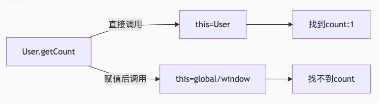

::: details 参考答案
::: code-group

```js [JavaScript]
console.log("Hello, JavaScript!");
```

```python [Python3]
print("Hello, Python!")
```

:::

::: details 参考答案
```bash
输出：obj1 { x: 1, y: 2 }
```
🤔️考察点：

🍎实际执行顺序：
```js

```

🚀拓展：
:::

::: details 参考答案
```js

```
:::

<!--  -->